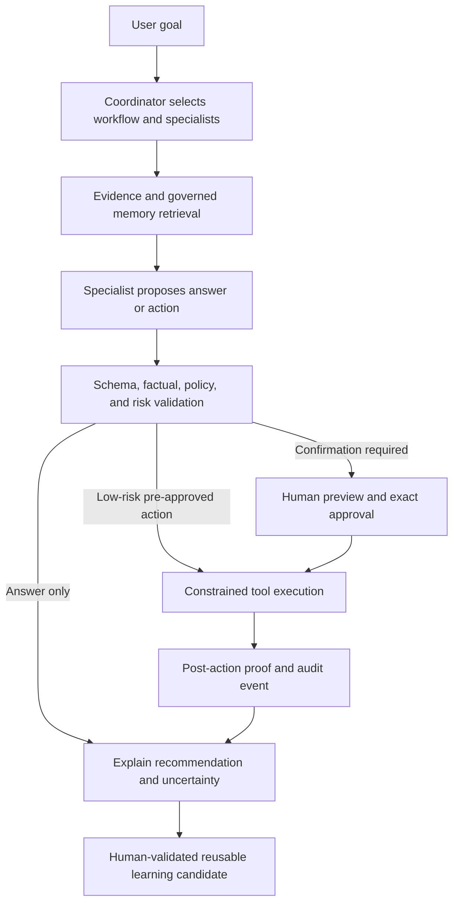

# Coding-Agent and Product-Agent Harness Review

**Project:** `qbo-escalations`
**Review date:** 2026-07-09
**Plain-language and model-catalog update:** 2026-07-10
**Scope:** Claude Code and Codex instructions, settings, hooks, skills, custom agents, memory, research documents, runtime provider harnesses, product-agent prompts, model policy, evidence capture, and action safety
**Purpose:** Provide a reusable review framework for this project and other agentic projects

## Plain-English guide to the key findings

This section translates the review's shorthand. The detailed evidence and recommendations remain below it.

1. **P0, P1, and P2 are priority labels, not model names.** `P0` means an urgent safety or trust problem. `P1` means an important reliability problem. `P2` means useful cleanup or maintenance. The number says how soon to address the finding; it does not assign blame.
2. **“Prompt-led authorization” means the AI is being told in words that it may act, and the server trusts the action it prints.** A server-enforced permission check (technical term: policy gate) is ordinary code that independently decides “allow,” “ask the user,” or “block” before email, calendar, or other data is changed. The project needs one central check instead of relying mainly on prompt wording.
3. **`bypassPermissions` means “do not pause to ask before using tools.”** The user confirmed on 2026-07-10 that this is intentional for the current local-development workflow. It remains a known, accepted risk—not an accidental misconfiguration—and this review no longer recommends changing it now.
4. **“Runtime” means what happens while software is running.** A coding-agent environment is Claude Code or Codex working on the repository. An in-app agent environment is the AI inside this application helping with QBO, email, or calendar. Keeping those environments more separate is a future hardening idea, not a current priority.
5. **The repeated PM rules are the text printed by `.claude/hooks/pm-rules.sh` and `.codex/hooks/pm-rules.ps1` after every user prompt.** They cover product framing, delegation, verification, service control, tests, commit/push, feature ideas, and communication. The user reports that this repetition fixed serious non-compliance, so the hooks should stay. Cleanup should remove contradictions and stale wording without weakening the repeated enforcement.
6. **Durable memory means saved notes that remain available in later chats.** The stale Claude memory and worker instructions said to always delegate and never test. Those statements were removed on 2026-07-10. The replacement allows sensible delegation, risk-based testing, and a complete premium outcome without unrelated scope expansion.
7. **A session is one Claude chat/work period.** Thirty-three historical session files were checked for recognizable credential patterns, removed from Git's current tracking, and retained locally on 2026-07-10. Old Git history still contains earlier copies; removing those would require a separate history rewrite.
8. **The model catalog really was inconsistent, and the active catalog was corrected on 2026-07-10.** The app now lists the current Claude choices—Fable 5, Opus 4.8, Sonnet 5, and Haiku 4.5—and the GPT-5.6 Sol, Terra, and Luna choices. Direct Anthropic requests now receive the selected effort. Gemini's stable default is 3.5 Flash. Kimi now includes K2.7 Code, its faster K2.7 Code Highspeed variant, K2.6, and K2.5. K2.6 remains the QBO app's general-purpose default; the K2.7 choices are coding-focused and always use thinking mode. Gateway stays on automatic routing, and LM Studio uses whichever local model the user has loaded.
9. **Claude Code and Codex are current, and the app's Claude Agent SDK has now been upgraded.** Fresh checks on 2026-07-10 found Claude Code `2.1.206`, Codex `0.144.1`, and Claude Agent SDK `0.3.206`, matching their published package versions at the time of the check.
10. **Native JSON schemas are for in-app AI replies that must fit an exact data shape.** Imagine the parser returning information to application code, not text for a person to read. A schema lets the app require boxes such as `caseNumber` and `severity` before accepting the reply. It catches missing or wrongly shaped data, but it cannot tell whether the AI read the source correctly. It is not a form the user fills out. This repository already uses Claude CLI's `--json-schema` for escalation parsing, but the protection is not applied consistently across every strict direct-provider and triage path.
11. **“Agent Action Permissions” is mainly for in-app agents.** It would control whether the AI inside the application may send email, alter calendars, or change stored records. Claude Code and Codex use a separate developer-tool permission system. No physical envelope and no legal contract are involved; “safety contract” was only unclear shorthand for safety rules enforced by application code.

## Executive judgment

This repository has a stronger agent foundation than most hobby projects. It has explicit product framing, concurrent-work protections, path-scoped Claude rules, custom agents and skills, provider evidence capture, redaction code, prompt versioning, and focused harness tests.

The main problem is not a lack of agent machinery. It is that the machinery has grown into overlapping control layers that no longer agree. Some instructions are repeated on every turn, some durable memory contradicts current policy, several safety hooks are present but inactive, project-local Claude settings grant broad permission before a fail-open hook tries to take some of it back, and product-agent action authority is still substantially controlled by prompt wording.

The most important conclusion is:

> Treat model prompts as proposals and explanations. Treat server-side policy as authority. A model must never be the component that decides whether its own external action is authorized.

For the broader operational-intelligence platform, the desired loop is: understand the user's goal, coordinate the right specialists, ground decisions in shared evidence and governed memory, validate the proposed action, obtain human approval when required, execute through a constrained tool, and prove what happened.

### Overall assessment

| Area                                | Assessment                                 | Short explanation                                                                                                                                                  |
| ----------------------------------- | ------------------------------------------ | ------------------------------------------------------------------------------------------------------------------------------------------------------------------ |
| Product framing                     | Strong                                     | `PRODUCT_NORTH_STAR.md`, `AGENTS.md`, and `CLAUDE.md` correctly frame QBO as the first domain module.                                                              |
| Always-on coding-agent instructions | Intentional enforcement; review periodically | PM-hook repetition is intentional because it materially improved agent compliance. Remove contradictions without discarding the enforcement layer.                 |
| Claude customization                | Capable with an accepted local risk        | Good use of rules, agents, skills, and hooks; broad permission bypass is an intentional current choice, while stale guidance has been corrected.                    |
| Codex customization                 | Underdeveloped                             | Good root instructions and one hook, but duplicate skill installation, no project agents, no project memory policy, and no enforcement hook for runtime ownership. |
| Product-agent prompts               | Uneven                                     | Evidence-aware QBO prompts are good; the workspace action prompt is extremely long and over-authorizes action.                                                     |
| Provider harnesses                  | Strong observability, incomplete isolation | Capture and provenance are thoughtful, but CLI settings, hidden flags, model drift, schemas, and permission boundaries need work.                                  |
| Memory                              | Improved; continue curation                | Stale delegation/testing instructions were corrected, and raw Claude session files are no longer tracked in current Git state.                                     |
| Evaluation                          | Partial                                    | Many useful tests exist, but there is no single cross-model harness evaluation contract or release gate.                                                           |
| Security and authorization          | Highest-priority gap                       | Prompt-level autonomy exceeds the server-enforced approval model in the workspace action loop.                                                                     |

## Reasoning-level recommendation for this review

The current `gpt-5.6-sol` with `high` reasoning is the best default for this task.

- Lower reasoning would save tokens but increases the risk of missing contradictions across instructions, hooks, memory, model behavior, and runtime code.
- `xhigh` or `max` may improve a final adversarial pass, but both vendors warn about diminishing returns and overthinking on work that is not genuinely frontier-hard.
- The better quality control is what this review used: high reasoning, current primary sources, end-to-end tracing, explicit evidence, and a separate review pass.

OpenAI's current guidance says to keep the existing effort as a baseline and test one level lower on representative work because GPT-5.6 can often maintain quality with fewer tokens. It reserves `max` for the hardest quality-first workloads. See [Using GPT-5.6](https://developers.openai.com/api/docs/guides/latest-model).

## Method and evidence rules

This review used the following source order:

1. Fresh on-disk repository state.
2. Current official OpenAI/Codex and Anthropic/Claude documentation.
3. Current local CLI help and installed-version checks.
4. Credible practitioner guidance and recent research, clearly separated from vendor requirements.

No application server, client server, browser, database, or persistent process was started or stopped. No live model request was made through the application's provider harnesses. Findings about behavior are based on code paths and configuration unless explicitly marked as locally verified.

## Inventory reviewed

### Coding-agent configuration

| Surface                                    | Current repository state                                                                            |
| ------------------------------------------ | --------------------------------------------------------------------------------------------------- |
| Codex root instructions                    | `AGENTS.md`, 89 lines                                                                               |
| Claude root instructions                   | `CLAUDE.md`, 109 lines                                                                              |
| Claude project rules                       | `.claude/rules/client.md`, `.claude/rules/server.md`                                                |
| Claude custom agents                       | `researcher`, `worker`, `implementation-reviewer`                                                   |
| Claude project skills                      | `implementation-plan`, `cto-review`, `skill-audit`                                                  |
| Claude active project hooks                | runtime guard, PM-rule injection, configuration freshness                                           |
| Claude present but not project-wired hooks | observation capture, context injection, session finalization, folder-context generation             |
| Claude memory                              | small curated index; 33 local session files are ignored and no longer tracked in current Git state |
| Codex project config                       | `.codex/config.toml` with reasoning display and one `UserPromptSubmit` hook                         |
| Codex project skills                       | duplicate `agent-browser` copies under `.agents/skills` and `.codex/skills`                         |
| Codex custom project agents                | None                                                                                                |

### Product-agent and provider surfaces

| Surface                    | Current repository state                                                                          |
| -------------------------- | ------------------------------------------------------------------------------------------------- |
| Active product prompts     | 12 agent prompt files plus their README, about 66 KB total                                        |
| Largest active prompt      | `workspace-action.md`, about 33 KB and 307 lines                                                  |
| QBO playbook system prompt | about 21 KB and 216 lines                                                                         |
| Provider catalog           | Claude CLI/API, Codex CLI/OpenAI API, gateway, Gemini, Kimi, and LM Studio entries                |
| CLI adapters               | `claude.js`, `codex.js`, and a separate Claude CLI provider harness                               |
| Direct provider adapters   | Anthropic Messages API and OpenAI-compatible Chat Completions paths                               |
| Evidence layer             | Provider-call package recorder, payload store, redaction, health logging, and user-visible events |
| Product memory             | Workspace and room memory services plus governed QBO knowledge flows                              |

## What is already good

These strengths should be preserved during cleanup.

### 1. The product hierarchy is explicit

`PRODUCT_NORTH_STAR.md` correctly separates the user's outcome from implementation components. That is especially important here because prompts, traces, provider packages, and knowledge records are not the product; they help a coordinated agent team solve difficult situations with evidence and human validation.

### 2. The repository accounts for concurrent sessions

Both root instruction files require fresh `git status`, re-reading before edits, preservation of other sessions' work, and fresh verification before reporting. This directly addresses a real prior stale-state incident.

### 3. Runtime ownership is clearly stated

The written rule that the user controls long-running services is appropriate for a solo local-development workflow. The Claude runtime guard adds a deterministic check for several common start, restart, and kill commands.

### 4. Claude path-scoped rules use the right mechanism

Client and server instructions are under `.claude/rules/` with `paths` frontmatter, so they load only for relevant work. This matches Anthropic's current recommendation to keep `CLAUDE.md` concise and use scoped rules for specialized paths. See [How Claude remembers your project](https://code.claude.com/docs/en/memory).

### 5. Product prompts distinguish extraction from reasoning

`prompts/agents/README.md` correctly keeps strict transcription agents narrow while asking reasoning and review agents to preserve evidence, uncertainty, handoffs, and human validation. This is a sound contract boundary.

### 6. Provider capture is unusually thoughtful

The provider-call package layer records source, call site, requested/effective model, timing, request and response hashes, usage, capture status, and user-visible events. Dedicated redaction code and tests show that the evidence layer is being treated as a governed subsystem rather than a debug log.

### 7. The Claude CLI adapter already uses an isolated working directory

`claude.js` and the dedicated Claude CLI harness run under a temporary isolated directory and disable auto-memory. This prevents repository-level `CLAUDE.md` from being loaded merely because the app was started in this checkout. That is a good isolation decision, although user-level configuration can still leak in.

## Priority findings

Severity means implementation priority, not blame. `P0` is a safety or trust boundary that should be addressed before increasing autonomy. `P1` materially affects reliability or maintainability. `P2` is important hardening.

### P0-1: Workspace action authorization is prompt-led instead of policy-led

Evidence:

- `prompts/agents/workspace-action.md` says broad preference or action language should trigger immediate mailbox actions, silent rule creation, and memory writes without confirmation.
- `server/src/routes/workspace/ai.js` contains a large older copy of the same aggressive instructions, including a “golden rule” to execute immediately on many action verbs. That in-code constant is currently bypassed by `getRenderedAgentPrompt('workspace-action')`, making it dead but dangerous documentation drift.
- `workspace-request-helpers.js` parses model-emitted `ACTION:` JSON, finds a handler, prepares it, and invokes it. The inspected path contains retries, logging, and post-action verification, but no general server-side policy decision that classifies the action as allowed, confirm-first, or forbidden.
- A separate auto-action subsystem has silent/notify/ask tiers, but that does not create a universal gate for the model-driven action loop.

Why it matters:

The model is being asked to interpret ambiguous human language and also decide how much authority that language grants. Prompt injection, mistaken scope, broad searches, or an over-eager newer model can turn a minor preference into bulk external changes.

Recommendation:

1. Introduce one server-side action-policy service used by every workspace tool call.
2. Classify actions by consequence, reversibility, scope, and audience.
3. Require an explicit preview and confirmation token for destructive, bulk, external-message, permanent-rule, and calendar-delete actions.
4. Allow pre-approved low-risk actions only through stored, inspectable policy records—not through a prompt saying “act immediately.”
5. Bind approval to the exact action, target set, account, and expiry so it cannot be replayed for broader scope.
6. Preserve the existing post-action verification, but treat it as proof of execution, not authorization.

Suggested tiers:

| Tier                           | Examples                                                                   | Required control                                         |
| ------------------------------ | -------------------------------------------------------------------------- | -------------------------------------------------------- |
| Observe                        | Search, list, read metadata                                                | Allowed within scoped account and data policy            |
| Suggest                        | Draft reply, propose calendar change, recommend rule                       | No mutation; show evidence and preview                   |
| Reversible low-risk            | Apply label, archive a small explicit set                                  | Pre-approved rule or one-turn confirmation; provide undo |
| High-impact                    | Send mail, trash, bulk mutation, create silent automation, delete event    | Exact preview plus explicit confirmation                 |
| Forbidden to autonomous agents | Credential changes, permission grants, hidden persistence, scope expansion | Human-only path                                          |

### Accepted local-development decision: Claude project settings grant broad authority

**Decision update, 2026-07-10:** The user intentionally keeps `bypassPermissions` enabled because interruption-free Claude behavior is currently more valuable in this local workflow. Do not change it as part of this review.

Evidence:

- `.claude/settings.local.json` is tracked even though Anthropic defines this filename as personal, project-local, and normally gitignored.
- It sets `permissions.defaultMode` to `bypassPermissions` and permits commands such as `npm run dev:*`, `git restore`, and `git checkout`.
- The written repository policy says the user controls runtime processes and that unrelated changes must not be reverted.
- `runtime-guard.mjs` blocks some lifecycle commands, but intentionally fails open on malformed input or hook errors.

Why it matters:

This is “allow broadly, then try to detect a subset of danger.” The stronger pattern is least privilege: deny or sandbox by default, add narrow permissions, and use hooks as another layer.

Current recommendation:

- Preserve `bypassPermissions` and the active guard while this remains an explicitly accepted user choice.
- Document the choice as local-development-only and revisit it before multi-user or hosted deployment.
- Keep the guard tested and visible; broad permission plus a guard is still a larger trust boundary than least-privilege permissions.
- Do not describe this accepted choice as an accidental or unresolved configuration error.

Anthropic recommends combining permissions with OS-level sandboxing because prompt-level behavior can be bypassed. See [Configure permissions](https://code.claude.com/docs/en/permissions) and [Sandboxing](https://code.claude.com/docs/en/sandboxing).

### Deferred P2 hardening: Repository coding tools and in-app agents are not fully separated while running

**Decision update, 2026-07-10:** This distinction is valid but is not a current priority. Revisit it before hosted deployment or before in-app agents receive materially broader tools.

The project has two fundamentally different uses of Claude and Codex:

1. Coding agents that inspect and modify this repository.
2. Product agents that help with QBO escalations, email, calendar, and other operational work.

Those two planes should never share ambient instructions, tools, permissions, memory, hooks, or persistence by accident.

Current state:

- Claude CLI calls use an isolated temporary working directory and disable auto-memory, which is good.
- They can still inherit user-level Claude settings, hooks, plugins, or `~/.claude/CLAUDE.md` unless explicitly disabled.
- Image flows add a temporary directory and use `bypassPermissions` so Claude can read the file.
- Codex CLI calls do not set an isolated working directory. If the server was launched from the repository, Codex can load this project's `AGENTS.md`, `.codex/config.toml`, and PM hook for a product request.
- Codex runs are persisted by default and are not explicitly read-only.

Recommendation:

- Create a documented runtime profile for each CLI provider.
- For Codex CLI product calls: use an isolated `-C` directory, `--ephemeral`, `--ignore-user-config`, `--ignore-rules`, and `--sandbox read-only` unless a narrower verified profile is required.
- For Claude CLI product calls: prefer `--safe-mode`, `--no-session-persistence`, explicit setting sources, and the narrowest tool list compatible with image reading. Verify OAuth/subscription authentication still works before adopting `--bare`, because bare mode intentionally changes credential loading.
- Pass product instructions through supported system-prompt mechanisms instead of prefixing user text with `System instructions:` where possible.
- Long-term, treat CLI subscription transports as local-development adapters. Use direct APIs or a governed gateway for web deployment, stable service authentication, concurrency control, and formal retention guarantees.

### P1-1: Repeated PM instructions must stay consistent

Both Claude and Codex have `UserPromptSubmit` hooks that print hundreds of words of stable operating rules on every turn.

Tradeoffs:

- The same rules also exist in root instructions, so contradictions can arise if only one copy is updated.
- Repetition consumes context and may reduce prompt-cache efficiency.
- The Claude version says substantive work should default to delegated teams and the coordinator should not inspect files directly. Current project policy for Codex says the opposite, and Anthropic's own agent-team docs say teams are expensive, experimental, and best for independent parallel work.
- The user reports that the repeated hooks changed agent behavior from unreliable to consistently strong. That observed benefit outweighs theoretical prompt-minimization benefits for now.

Recommendation:

- Keep both PM hooks active.
- Mirror every critical rule in the visible root instructions so the hook is reinforcement, not the only source.
- Review the duplicated copies together and remove only stale, contradictory, or ambiguous wording.
- Preserve the Claude delegation behavior that has worked well; remove the separate stale memory claim that implementation must *always* be delegated.
- Keep logs free of prompt content and document exactly what every hook injects.

OpenAI's GPT-5.6 guidance reports better internal evaluation scores and substantially lower token use after replacing long accumulated prompts with smaller prompts focused on behavior the model does not already perform. See [Using GPT-5.6](https://developers.openai.com/api/docs/guides/latest-model#prompting-best-practices). Anthropic similarly recommends a concise, specific `CLAUDE.md`, generally under 200 lines. See [Write effective instructions](https://code.claude.com/docs/en/memory#write-effective-instructions).

### Resolved P1-2: Durable instructions and memory contradicted each other

**Resolved 2026-07-10:** `.claude/memory/project-overview.md` and `.claude/agents/worker.md` now allow proportionate tests, no longer require delegation for all implementation, and define a complete premium outcome without unrelated scope expansion. Claude's active custom agents also now require plain-language lead summaries.

Original evidence before the correction:

- `.claude/memory/project-overview.md` said to always delegate implementation and never write tests.
- `.claude/agents/worker.md` said never to write or run tests and also said to “exceed the user intent.”
- Root policy says tests should be proportional to risk, and current Codex policy says to work primarily in the main thread.
- The old worker restriction could create untested implementation handoffs, while the old “exceed intent” wording could encourage scope creep.

Completed correction and ongoing recommendation:

- The stale memory was replaced with dated guidance pointing to the authoritative root rules.
- The worker now aims for the complete premium outcome while explicitly blocking unrelated scope.
- Workers may write and run focused tests when useful for risk or acceptance criteria.
- Continue adding `last_verified`, `source`, and `supersedes` metadata to curated memory topics.
- Make memory helpful recall, never the only source for mandatory policy.

Both OpenAI and Anthropic explicitly say durable team rules belong in checked-in instruction files, while memory is a recall layer that must be inspectable and curated. See [Codex memories](https://learn.chatgpt.com/docs/customization/memories) and [Claude memory](https://code.claude.com/docs/en/memory).

### Resolved for current Git state P1-3: Historical session memory was tracked despite the ignore rule

**Resolved 2026-07-10:** A targeted scan found no recognizable private-key, API-key, or quoted credential-assignment patterns. The 33 files were removed from Git's current tracking with local copies preserved. Earlier commits still contain the files; no disruptive history rewrite was performed.

The repository previously contained 33 tracked `.claude/memory/sessions/*.md` files totaling about 1.85 MB. They were removed from current Git tracking on 2026-07-10 while local copies were retained under the existing ignore rule.

Risks:

- Command history, local paths, investigation details, or personal data can remain in every clone and in Git history.
- Raw observations create noise and stale behavioral cues.
- “Generated memory” is being mixed with shared project documentation.

Recommendation:

1. Run a dedicated secret/PII review before changing history.
2. Stop tracking the files with `git rm --cached` while retaining any local copies the user wants.
3. Rotate any exposed credentials before considering history rewriting.
4. Keep only a small reviewed memory index in version control.
5. Store raw local sessions outside the repository with retention and deletion controls.

### P1-4: Current model and effort controls are inconsistent across transports

Status update, 2026-07-10: the immediate catalog and request-building problems in this finding were corrected.

The correction:

- Adds the current Claude model choices: Fable 5, Opus 4.8, Sonnet 5, and Haiku 4.5.
- Adds GPT-5.6 Sol, Terra, and Luna to both Codex and direct OpenAI model choices while preserving older GPT entries only for compatibility with saved settings.
- Uses Sonnet 5 for the direct Anthropic default, GPT-5.6 Sol for the Codex CLI default, and Gemini 3.5 Flash for Gemini.
- Adds Kimi K2.7 Code and K2.7 Code Highspeed, keeps K2.6 as this app's general-purpose default, and retains K2.5 as a previous model. The image parser omits the incompatible “disable thinking” setting for K2.7 because Kimi requires thinking mode for those models.
- Sends the selected Anthropic effort as `output_config.effort` only when that model accepts the selected level.
- Adds OpenAI `max`, current Claude `xhigh`/`max`, and Gemini `minimal`/`low`/`medium`/`high` validation where supported.
- Sends Gemini's current `thinkingLevel` field and removes the no-longer-recommended Gemini 3 sampling setting from the triage request.
- Updates current-model pricing entries and focused request-builder/catalog tests.

Important availability note: GPT-5.6 is a limited preview. Listing a model does not grant access to it. The OpenAI API organization or Codex workspace used by the app must already be approved, and failures must remain visible so the configured fallback can take over.

Remaining recommendation:

- Define one model-capability registry used by UI, validation, request builders, tests, and documentation.
- Store capability by transport and model, not merely provider family.
- Run representative QBO parsing, triage, workspace, and chat evaluations before changing every saved agent profile to a new model.
- Record requested effort, effective effort, fallback, and model version in the provider evidence package.
- Fail visibly on unsupported combinations instead of silently substituting when the user expects a particular evaluation.

Official sources: [OpenAI GPT-5.6 model guidance](https://developers.openai.com/api/docs/guides/latest-model), [Anthropic model configuration](https://code.claude.com/docs/en/model-config), [Anthropic effort API](https://platform.claude.com/docs/en/build-with-claude/effort), [Claude Sonnet 5 release notes](https://platform.claude.com/docs/en/release-notes/overview), [Kimi model list](https://platform.kimi.com/docs/models), and [Kimi K2.7 Code quickstart](https://platform.kimi.com/docs/guide/kimi-k2-7-code-quickstart).

### Resolved P1-5: Claude Code, Codex, and the Claude Agent SDK are current

Fresh local checks found:

- Claude Code installed and published: `2.1.206`
- Project Claude Agent SDK installed and published: `0.3.206` (upgraded from `0.2.74` on 2026-07-10)
- Codex CLI installed and current: `0.144.1`
- Server dependency audit after the upgrade: 0 known vulnerabilities (down from 8 before the non-breaking security refresh)

The repository's Claude CLI capture also depends on undocumented `--thinking-display summarized`, which is not shown in local `claude --help`.

Ongoing recommendation:

- Add a supported-version policy and an upgrade checklist.
- Replace hidden flags with supported output contracts where possible.
- Pin and test a known-good Claude Code range instead of relying on the latest global binary implicitly.
- Keep focused contract tests around the SDK image-parser path when upgrading.
- Verify every documented hook field against the minimum supported CLI version.

### P1-6: Product prompts are too large and too negative for current models

`workspace-action.md` contains about 41 all-caps steering words and roughly 58 negative “do not/never” rules. It repeats tool descriptions, authorization behavior, memory policy, operational examples, and safety guidance. The active prompt is about 33 KB.

Newer models generally need fewer behavioral reminders, not more. Large negative prompts can make literal compliance brittle, encourage extra exploration, and bury the true contract.

Recommendation:

- Split the workspace agent into a small role/decision contract, server-provided tool schemas, a server-enforced action policy, and on-demand domain references.
- Remove instructions that restate tool metadata or normal model behavior.
- Prefer a few positive examples of desired concise behavior.
- Keep strict negative rules only for proven failure modes that cannot yet be enforced mechanically.
- Measure prompt changes against an evaluation set before deleting or adding rules.

Claude Sonnet 5 guidance specifically favors positive examples over long negative steering for style and advises raising effort rather than prompting around under-thinking. See [Prompting Claude Sonnet 5](https://platform.claude.com/docs/en/build-with-claude/prompt-engineering/prompting-claude-sonnet-5).

### P1-7: Structured-output capabilities are underused

Extraction and triage prompts often request exact JSON or labeled output, but the CLI harnesses do not consistently use the supported schema flags:

- Claude Code supports `--json-schema`.
- Codex `exec` supports `--output-schema`.
- Direct provider APIs support native structured-output mechanisms.

Recommendation:

- Use native schemas for strict parsers, classification, triage, known-issue matching, and tool-call envelopes.
- Keep semantic validation after schema validation; a syntactically valid answer can still be factually wrong.
- Version schemas with prompts and store the schema version in evidence packages.
- Keep a repair pass only for recoverable formatting failures, not as a substitute for a contract.

### P1-8: Evidence capture needs a stricter privacy and reasoning policy

Provider packages are captured by default, including request and response bodies. This is useful for proving what happened, but it can also retain QBO case details, personal email/calendar content, image text, model summaries, and tool results.

Recommendation:

- Classify captured fields by sensitivity and purpose.
- Default to metadata plus redacted payloads; require an explicit diagnostic mode for full bodies.
- Add per-domain retention, access control, export, and deletion rules.
- Never present model chain-of-thought as factual evidence. Store concise model-provided summaries, claims, cited evidence, tool inputs/outputs, decisions, and validation results.
- Record which redaction policy version was applied.
- Extend TTL cleanup to externalized on-disk provider payloads, which the environment example currently notes are not removed with the Mongo document.

### P2-1: Codex customization is split across duplicate skill locations

The same `agent-browser` skill exists under `.agents/skills` and `.codex/skills`, and both appear in the current skill catalog. Current Codex guidance recommends `.agents/skills` for repository skills.

Recommendation: keep one canonical `.agents/skills/agent-browser` copy or install it as a plugin; remove the duplicate and make `skills-lock.json` the update record.

### P2-2: Codex has no project-scoped custom agents

This is not automatically a defect. The main Codex thread is the right default for most work. Still, two bounded project roles would improve isolation when explicitly used:

- `implementation-reviewer`: read-only, high-effort cross-layer review.
- `harness-auditor`: read-only comparison of prompt, provider, policy, evidence, and eval contracts.

Do not create many personas. A custom agent should exist only when it needs a materially different tool, model, sandbox, or context boundary. See [Codex subagents](https://learn.chatgpt.com/docs/agent-configuration/subagents).

### P2-3: Several Claude hooks exist but are not active

Observation capture, context injection, session finalization, and automatic folder-context generation are present but not wired in project settings. The installation note implies some may have been intended for user-level configuration.

Risks:

- Reviewers may assume the memory system is active when it is not.
- Automatic generation of nested `CLAUDE.md` files from usage observations can turn noisy history into durable instructions without review.
- Dead automation becomes stale and creates maintenance/security surface.

Recommendation:

- Create a hook registry documenting event, owner, scope, inputs, outputs, side effects, failure mode, minimum CLI version, and active/inactive status.
- Archive or delete inactive experimental hooks.
- Do not auto-promote observation frequency into instructions. Generate review candidates and require human acceptance.

### P2-4: Research snapshots look like current operating truth

The four `.claude/research/*.md` files total roughly 328 KB. They contain valuable experiments, but also time-bound statements such as “latest version 2.1.69,” old `Task` terminology, cost claims, marketplace counts, and February/March limitations that may now be fixed.

Recommendation:

- Move them under a clearly named archive/snapshots area.
- Add frontmatter: `status`, `retrieved_at`, `sources`, `verified_with`, `expires_after`, and `superseded_by`.
- Keep operational truth in short maintained docs; keep raw research as evidence.
- Remove or re-verify unsupported quantitative claims before using them to make policy.

### P2-5: CLI process spawning uses `shell: true`

The adapters validate model strings and pipe user content through stdin, which reduces injection risk. They still use `shell: true` for Windows command shims, increasing quoting complexity and requiring custom escaping.

Recommendation:

- Resolve the actual executable or platform shim once and spawn without a shell where possible.
- If a shell is unavoidable, centralize command construction and validate every variable argument, including paths and configuration overrides.
- Add adversarial tests for quotes, metacharacters, spaces, Unicode, and Windows paths.

### P2-6: The Codex hook command is fragile when launched from a subdirectory

The hook script changes to the Git root after it starts, but `.codex/config.toml` invokes the script through a relative path. Codex documentation warns that project hooks may run with a subdirectory as the session working directory and recommends resolving from the Git root.

Recommendation: make the configured command itself Git-root aware and use the Windows-specific command field where appropriate. See [Codex hooks](https://learn.chatgpt.com/docs/hooks).

## Official platform comparison

### Codex

| Official current guidance                                                                                | Repository state                                               | Recommendation                                                                                  |
| -------------------------------------------------------------------------------------------------------- | -------------------------------------------------------------- | ----------------------------------------------------------------------------------------------- |
| Put durable repo conventions in root/nested `AGENTS.md`.                                                 | Good root file; no nested Codex instructions.                  | Keep root short; add nested overrides only if client/server conflicts actually occur.           |
| Put reusable repo skills in `.agents/skills`.                                                            | Same skill duplicated in `.agents` and `.codex`.               | Keep `.agents` canonical.                                                                       |
| Use custom agents for different model/tool/sandbox roles.                                                | None.                                                          | Add at most two read-only roles after the core cleanup.                                         |
| Hooks are deterministic lifecycle enforcement and require trust.                                         | One large prompt-injection hook.                               | Use hooks for validation/enforcement, not stable prose repetition.                              |
| Memory is generated local state, not the source of mandatory team rules.                                 | No explicit project policy.                                    | Document whether memory is enabled and disable generation from sensitive external-context runs. |
| GPT-5.6 benefits from shorter prompts, deliberate effort, planning, progress tracking, and verification. | Strong planning/verification language but duplicated and long. | Remove repetition, keep task completion and evidence gates.                                     |
| Multi-agent work is for cleanly separable tasks.                                                         | Repo policy appropriately says rare for Codex.                 | Preserve that default.                                                                          |

Sources: [AGENTS.md](https://learn.chatgpt.com/docs/agent-configuration/agents-md), [Customization and skills](https://learn.chatgpt.com/docs/customization/overview), [Hooks](https://learn.chatgpt.com/docs/hooks), [Subagents](https://learn.chatgpt.com/docs/agent-configuration/subagents), [Memories](https://learn.chatgpt.com/docs/customization/memories), and [Models](https://learn.chatgpt.com/docs/models).

### Claude Code

| Official current guidance                                                        | Repository state                                                                           | Recommendation                                              |
| -------------------------------------------------------------------------------- | ------------------------------------------------------------------------------------------ | ----------------------------------------------------------- |
| Keep `CLAUDE.md` concise, specific, consistent, and generally under 200 lines.   | 109 lines, but duplicated by prompt hooks and memory.                                      | Make it a thin Claude-specific layer over shared guidance.  |
| Use `.claude/rules` for path-specific instructions.                              | Correctly implemented.                                                                     | Preserve and add only proven rules.                         |
| `.claude/settings.local.json` is personal and normally ignored.                  | Tracked with broad permission rules.                                                       | Split shared and personal settings; untrack local settings. |
| Use skills for on-demand workflows and agents for isolated roles.                | Three of each, generally well-structured.                                                  | Shorten bodies, constrain tools, fix contradictions.        |
| Agent teams are experimental, expensive, and best for independent parallel work. | Experimental flag is enabled in tracked project-local settings; PM rules default to teams. | Make opt-in and personal; use subagents first.              |
| Verification is the single highest-leverage practice.                            | Strong in root rules and review skill; worker forbids tests.                               | Let workers verify and require evidence before completion.  |
| Permissions plus sandboxing provide defense in depth.                            | Default bypass permissions, some fail-open hook enforcement.                               | Reverse the default.                                        |
| Current models use adaptive reasoning and effort controls.                       | Partial current-model support and inconsistent transport handling.                         | Centralize capability data and evaluate by role.            |

Sources: [Claude memory and instructions](https://code.claude.com/docs/en/memory), [Custom subagents](https://code.claude.com/docs/en/sub-agents), [Skills](https://code.claude.com/docs/en/slash-commands), [Hooks](https://code.claude.com/docs/en/hooks), [Agent teams](https://code.claude.com/docs/en/agent-teams), [Permissions](https://code.claude.com/docs/en/permissions), and [Claude Code power-user tips](https://support.claude.com/en/articles/14554000-claude-code-power-user-tips).

## Current-model strategy

Do not write a separate giant prompt for every model. Maintain one small agent contract, then add a narrow provider/model adapter only when evaluations show a repeatable behavior difference.

### OpenAI/Codex

| Model         | Best fit in this platform                                                                             | Starting effort    | Harness direction                                                                                                                                           |
| ------------- | ----------------------------------------------------------------------------------------------------- | ------------------ | ----------------------------------------------------------------------------------------------------------------------------------------------------------- |
| GPT-5.6 Sol   | Architecture, complex reviews, ambiguous research, cross-domain synthesis, difficult UI/computer work | `high`             | Short contract, explicit success criteria, progress plan, strong verification. Test `xhigh` only for measured hard cases and `max` only for frontier cases. |
| GPT-5.6 Terra | Everyday implementation, routine reviews, cost-sensitive specialist agents                            | `medium` or `high` | Use the same core prompt; compare one effort level lower than the current baseline.                                                                         |
| GPT-5.6 Luna  | High-volume classification, simple extraction, routing, formatting                                    | `low` or `medium`  | Use strict schemas, narrow tools, short prompts, deterministic validators. Escalate rather than over-prompting.                                             |

GPT-5.6-specific implications:

- Prefer the Responses API for multi-turn reasoning, tool use, and persisted reasoning.
- Use programmatic tool calling only for bounded tool-heavy steps that do not require fresh judgment after every result.
- Keep tool sets narrow and tool descriptions concise.
- Treat persisted reasoning as a capability setting, not an excuse to store raw internal reasoning in the product evidence layer.
- Preserve explicit approval boundaries even though intent understanding is better.

Source: [Using GPT-5.6](https://developers.openai.com/api/docs/guides/latest-model).

### Anthropic/Claude

| Model            | Best fit in this platform                                                                                  | Starting effort                              | Harness direction                                                                                                                               |
| ---------------- | ---------------------------------------------------------------------------------------------------------- | -------------------------------------------- | ----------------------------------------------------------------------------------------------------------------------------------------------- |
| Claude Fable 5   | Long-horizon, highly ambiguous coordination, hardest review/debugging, sustained multi-agent orchestration | `high`; `xhigh` for genuinely long hard work | Remove old over-prescription, require evidence-backed progress claims, use governed memory, and handle safety refusals explicitly.              |
| Claude Opus 4.8  | High-quality architecture, agentic coding, review, and complex reasoning                                   | `high` or `xhigh`                            | Use adaptive thinking plus `output_config.effort`; keep subagent scope explicit.                                                                |
| Claude Sonnet 5  | Recommended everyday worker/researcher candidate; near-Opus agentic performance at lower cost              | `high`; evaluate `medium`                    | Adaptive thinking is on by default; leave output-token headroom, use positive style examples, and raise effort before adding prompt complexity. |
| Claude Haiku 4.5 | Fast, narrow, low-risk classification or summarization                                                     | Model default                                | Do not assign broad autonomy. Use schemas, validators, and escalation thresholds.                                                               |

Claude model implications:

- Sonnet 5 uses a new tokenizer and can produce about 30% more tokens for the same text, so old `max_tokens` limits may truncate output.
- Fable 5, Opus 4.8, and Sonnet 5 support very long contexts, but more context is not automatically better context.
- Prompt caching benefits from stable material first and dynamic material last.
- Effort affects tool calls as well as prose; lower effort can reduce exploration and tool count.
- Current high-capability models follow instructions more literally, making contradictory or over-broad autonomy rules more dangerous.

Sources: [Claude model overview](https://platform.claude.com/docs/en/overview), [Claude Sonnet 5](https://www.anthropic.com/news/claude-sonnet-5), [Prompting Sonnet 5](https://platform.claude.com/docs/en/build-with-claude/prompt-engineering/prompting-claude-sonnet-5), [Prompting Fable 5](https://platform.claude.com/docs/en/build-with-claude/prompt-engineering/prompting-claude-fable-5), and [Effort](https://platform.claude.com/docs/en/build-with-claude/effort).

## Recommended target architecture



The model may participate in coordination, retrieval, specialist reasoning, and explanation. It must not control the validation and authorization boxes that govern its own tool use.

## Comprehensive documentation improvement plan

### Proposed document structure

```text
AGENTS.md                              Shared, vendor-neutral project contract
CLAUDE.md                              @AGENTS.md plus Claude-only behavior
docs/agent-harness/
  README.md                            Map of authoritative versus archived material
  MODEL_POLICY.md                      Role-to-model/effort policy and fallback rules
  PERMISSIONS_AND_ACTIONS.md           Action tiers, approval contracts, and prohibited actions
  PROVIDER_TRANSPORTS.md               CLI/API/gateway isolation and deployment support
  MEMORY_AND_RETENTION.md              Coding memory, product memory, evidence, TTL, deletion
  EVALUATION_AND_RELEASE_GATES.md       Datasets, metrics, thresholds, rollback
  CHANGELOG.md                         Model, prompt, hook, skill, and policy changes
docs/agent-harness/snapshots/          Dated research snapshots, never operating truth
```

### File-by-file changes

| File or area                                | Recommended change                                                                                                                                                                                                      | Acceptance check                                                                            |
| ------------------------------------------- | ----------------------------------------------------------------------------------------------------------------------------------------------------------------------------------------------------------------------- | ------------------------------------------------------------------------------------------- |
| `AGENTS.md`                                 | Remove the “Codex only” framing. Make it the shared contract: product hierarchy, concurrency, runtime ownership, key commands, verification, and scope boundaries. Remove facts easily discoverable from package files. | Claude imports it; Codex reads it directly; no conflicting shared rule remains.             |
| `CLAUDE.md`                                 | Start with `@AGENTS.md`. Keep only Claude-specific rules, source routing, and links to path rules. Move detailed architecture to normal docs.                                                                           | Under roughly 60–100 focused lines after the import; `/memory` shows expected sources.      |
| `.claude/settings.json`                     | Add shareable safe hooks, permission denies, and sandbox policy.                                                                                                                                                        | Fresh Claude session shows the settings and hooks as trusted/active.                        |
| `.claude/settings.local.json`               | Untrack; keep only personal model/UI preferences and narrowly approved local permissions.                                                                                                                               | `git ls-files` no longer returns it; `.gitignore` covers it.                                |
| `.claude/rules/*.md`                        | Preserve; reconcile the server rule that says no API keys in server code with the actual direct-provider API architecture.                                                                                              | Rules describe the real architecture and do not contradict root docs.                       |
| `.claude/agents/worker.md`                  | Remove “never test” and “exceed intent”; add bounded scope, focused verification, and conflict handling.                                                                                                                | Worker can meet a task's acceptance criteria without expanding scope.                       |
| `.claude/agents/researcher.md`              | Replace “include unreliable sources anyway” and “every detail” with a source hierarchy, evidence table, and bounded output.                                                                                             | Official and primary sources are clearly separated from practitioner opinion.               |
| `.claude/agents/implementation-reviewer.md` | Restrict to read/search and safe verification tools; choose high-capability model/effort only when explicitly invoked.                                                                                                  | Review cannot edit and reports producer/consumer contract evidence.                         |
| `.claude/skills/*`                          | Shorten `SKILL.md` bodies; move rubrics/examples into references; add supported-version metadata and lightweight evals.                                                                                                 | Skill descriptions trigger distinctly; selected skill reads only needed references.         |
| `.claude/hooks/*`                           | Maintain a registry, archive inactive experiments, test active hooks with JSON fixtures, and remove stable PM prose injection.                                                                                          | Each active hook has owner, event, failure behavior, version floor, and tests.              |
| `.codex/config.toml`                        | Fix Git-root hook resolution; consider enabling project memory only with explicit privacy settings; keep raw reasoning hidden.                                                                                          | Starting Codex from `server/` still finds the hook; no duplicate stable prompt is injected. |
| `.agents/skills` / `.codex/skills`          | Keep one canonical repo skill location.                                                                                                                                                                                 | One `agent-browser` entry is discoverable.                                                  |
| `.claude/memory`                            | Untrack raw sessions; rewrite curated overview; add provenance and last-verified dates.                                                                                                                                 | No mandatory policy exists only in memory; no contradiction with root docs.                 |
| `.claude/research`                          | Convert to dated snapshots and mark stale material.                                                                                                                                                                     | Every snapshot has retrieval date, source list, status, and successor.                      |
| `prompts/agents`                            | Add a small contract header: mission, evidence inputs, authority, output schema, refusal/escalation, validation. Reduce accumulated negative rules.                                                                     | Each prompt has a named owner, version, eval set, and allowed action class.                 |
| `workspace-action.md`                       | Replace prompt-granted authority with policy references; delete broad “act on all” and silent-rule examples.                                                                                                            | Model cannot execute a high-impact action without a server-issued authorization token.      |
| `server/src/routes/workspace/ai.js`         | Remove dead embedded prompt constant after confirming no consumer.                                                                                                                                                      | One live source of truth for workspace role instructions.                                   |
| Provider catalog                            | Add current models only through a capability registry and evaluation result.                                                                                                                                            | UI, validators, request bodies, and evidence agree on supported effort/features.            |
| Provider harness docs                       | Clearly mark CLI transports local-only and APIs/gateway web-deployable.                                                                                                                                                 | Deployment check fails visibly when a local-only transport is selected in web mode.         |

## Evaluation and release gates

Model and prompt changes should be treated like code changes.

### Minimum evaluation sets

1. **Strict transcription:** fixed screenshot corpus, byte-level field comparison, ambiguity cases, corrupted/low-resolution images.
2. **Triage:** known categories, severity boundary cases, missing deadlines, misleading INV candidates, unsafe next steps.
3. **Known-issue match:** positive, negative, and near-match cases with evidence-for/evidence-against grading.
4. **Knowledge draft:** proven versus unknown cause, draft/published policy boundaries, redaction, contradiction handling.
5. **Workspace actions:** ambiguous intent, prompt injection in email, wrong account, bulk scope, irreversible action, replayed approval, failed verification.
6. **Provider transport:** request shape, effective model/effort, schema use, timeout, cancellation, fallback, capture, redaction, retention.
7. **Coding agents:** representative plan, implementation, review, concurrent-work conflict, runtime-control request, dirty-worktree closeout.

### Metrics

- Task success, not just valid syntax.
- Factual precision and evidence coverage.
- Unauthorized-action rate: target zero.
- False “done” rate: target zero.
- Human correction rate.
- Tool-call count, latency, input/output tokens, and cost.
- Prompt-cache hit/read/write metrics where available.
- Escalation quality: whether uncertain cases are handed to the right human rather than guessed.
- Cross-model consistency on mandatory contracts.

### Release rule

No model alias, effort default, prompt, tool permission, or fallback change should become the default solely because it is newer. It must meet or beat the current baseline on the relevant evaluation set and preserve all safety gates.

## Practitioner guidance: what to adopt and what to treat cautiously

These are useful perspectives, not vendor requirements.

### Adopt

- Anthropic's Applied AI team recommends compaction, structured note-taking, and context isolation through subagents for long work. This supports keeping raw research out of the lead context. See [Effective context engineering for AI agents](https://www.anthropic.com/engineering/effective-context-engineering-for-ai-agents).
- OpenAI's harness-engineering account emphasizes making the environment legible and enforceable, then iterating through design, implementation, review, and tests. It says failures should trigger a missing-capability or missing-enforcement fix, not merely “try harder.” See [Harness engineering](https://openai.com/index/harness-engineering/).
- HumanLayer recommends WHAT/WHY/HOW onboarding but keeps its root file under 60 lines and moves detailed workflows elsewhere. See [Writing a good CLAUDE.md](https://www.humanlayer.dev/blog/writing-a-good-claude-md).
- Simon Willison recommends running the existing tests first so the agent learns the contract before editing. See [First run the tests](https://simonwillison.net/guides/agentic-engineering-patterns/first-run-the-tests/).
- Addy Osmani argues that agent files should become small routing layers and that repeated agent failures should first prompt code, tooling, test, or structure improvements. See [Stop Using `/init` for AGENTS.md](https://addyosmani.com/blog/agents-md/).

### Treat cautiously

- “Delete all AGENTS/CLAUDE files” is too absolute for this repository. Runtime ownership, concurrent-work protection, product hierarchy, and validation rules are genuinely project-specific.
- “Always use many agents” conflicts with vendor guidance on token cost, context fragmentation, and coordination overhead.
- Huge community prompt packs and unreviewed skills increase supply-chain and prompt-injection risk.
- Benchmarks or cost numbers without reproducible tasks, model versions, and prompts should not set policy.
- A recent preprint found context bloat, duplicated lint rules, skill leakage, and conflicting instructions across public agent files. It is useful as a smell catalog but should not be treated as settled causal science. See [Configuration Smells in AGENTS.md Files](https://arxiv.org/abs/2606.15828).

## Reusable blueprint for other projects

Use this sequence when creating or repairing any agent harness:

1. **Define the user outcome.** State why the system exists before naming tools or records.
2. **Separate developer agents from product agents.** Never share ambient tools, memory, permissions, or instructions.
3. **Keep always-on instructions small.** Include only surprising constraints, authoritative commands, risk boundaries, and verification.
4. **Route detail on demand.** Use path rules, skills, and normal documentation instead of one monolithic prompt.
5. **Enforce non-negotiable rules mechanically.** Permissions, sandboxes, schemas, policy services, and tests beat prose reminders.
6. **Give every agent explicit action permissions.** Define what it may read, decide, propose, change, and never do.
7. **Use governed memory.** Record source, confidence, scope, owner, last verification, retention, and deletion.
8. **Capture evidence, not private thought.** Store inputs, tool results, claims, decisions, validation, and outcomes.
9. **Evaluate by workflow and model.** Compare model/effort/prompt changes against representative tasks.
10. **Design for drift.** Pin versions, maintain a compatibility matrix, date research, and expire stale guidance.
11. **Use multiple agents selectively.** Delegate when isolation or independent challenge adds value; use teams only when workers need to coordinate.
12. **Close the loop.** Review, test, validate, record what happened, and turn only human-approved outcomes into reusable knowledge.

## Recommended implementation sequence for this project

### Phase 0: Stop authority drift

1. Add a server-side action policy and exact approval tokens to the workspace action loop.
2. Remove prompt language that creates silent or broad authority.
3. **Accepted for now:** retain Claude `bypassPermissions` for the current local workflow; revisit before hosted or multi-user deployment.
4. **Deferred:** isolate Codex product CLI calls and make both CLI transports ephemeral and least-privileged before broader in-app autonomy or hosted deployment.

### Phase 1: Establish one source of truth

1. Keep `AGENTS.md` and `CLAUDE.md` aligned as the visible contracts for their respective coding agents.
2. Keep the proven PM hooks; review hook and root copies together so repeated enforcement remains consistent.
3. **Completed 2026-07-10:** fix stale Claude memory/worker rules and stop tracking raw sessions while retaining local copies.
4. Remove the dead embedded workspace prompt after verification.
5. Consolidate model capabilities, effort validation, and provider request construction.

### Phase 2: Modernize models through evaluation

1. **Completed 2026-07-10:** add GPT-5.6 Sol/Terra/Luna, Claude Fable 5, and Claude Sonnet 5 to the relevant choices without rewriting every saved agent profile.
2. **Completed 2026-07-10:** add Anthropic `output_config.effort`, GPT-5.6 `max`, and Gemini 3 thinking-level support where accepted.
3. Run representative workflow evaluations before broader default/profile migrations.
4. Add structured-output schemas.
5. **Completed 2026-07-10:** update Claude Code and the Agent SDK to `2.1.206` and `0.3.206`, respectively, with focused compatibility checks.
6. Remove the hidden thinking flag dependency or isolate it behind a tested compatibility adapter.

### Phase 3: Create a maintained harness discipline

1. Add the proposed `docs/agent-harness` set.
2. Build cross-model evaluations and release gates.
3. Add hook and skill fixtures.
4. Add privacy/retention enforcement for provider payloads and product memory.
5. Add at most two bounded Codex agent roles and recalibrate Claude roles.

## Verification performed for this review

- Confirmed a clean `master...origin/master` worktree before the report was created.
- Inventoried tracked and ignored Claude/Codex configuration, hooks, skills, agents, memory, prompts, and provider research.
- Read the current root instructions, scoped rules, custom-agent definitions, settings, active hooks, memory indexes, provider catalog, environment example, and the relevant runtime call paths.
- Traced Claude CLI, Codex CLI, Anthropic API, OpenAI API, workspace action, effort selection, provider capture, and prompt-store paths.
- Verified current installed CLI versions using local help/version commands.
- Verified current published package versions using the package registry.
- Rechecked versions on 2026-07-10: Claude Code `2.1.206`, Codex `0.144.1`, and Claude Agent SDK `0.3.206`.
- Checked 33 historical Claude session files for recognizable credential patterns, stopped tracking them, and confirmed all 33 local copies remain.
- Compared the repository with current official OpenAI and Anthropic documentation retrieved on 2026-07-09.
- Reviewed practitioner sources from OpenAI, Anthropic, HumanLayer, Addy Osmani, and Simon Willison, plus one recent preprint.

## Limitations

- Current vendor documentation changes rapidly. Every model/version claim in this report is dated 2026-07-09 and should be refreshed before implementation.
- This was a documentation and code-path review. It did not invoke live provider models, mutate email/calendar data, or test production credentials.
- A full credential/PII history audit still requires a dedicated scanner and a careful rotation/history-rewrite plan. The 2026-07-10 cleanup used targeted content-pattern checks but did not rewrite old Git history.
- Model recommendations are starting hypotheses until this project's own evaluation sets produce results.

## Primary source list

### OpenAI and Codex

- [Using GPT-5.6](https://developers.openai.com/api/docs/guides/latest-model)
- [Codex models](https://learn.chatgpt.com/docs/models)
- [Custom instructions with AGENTS.md](https://learn.chatgpt.com/docs/agent-configuration/agents-md)
- [Codex customization and skills](https://learn.chatgpt.com/docs/customization/overview)
- [Codex hooks](https://learn.chatgpt.com/docs/hooks)
- [Codex subagents](https://learn.chatgpt.com/docs/agent-configuration/subagents)
- [Codex memories](https://learn.chatgpt.com/docs/customization/memories)
- [Harness engineering](https://openai.com/index/harness-engineering/)

### Anthropic and Claude

- [How Claude remembers your project](https://code.claude.com/docs/en/memory)
- [Claude Code hooks](https://code.claude.com/docs/en/hooks)
- [Claude Code permissions](https://code.claude.com/docs/en/permissions)
- [Claude Code subagents](https://code.claude.com/docs/en/sub-agents)
- [Claude Code agent teams](https://code.claude.com/docs/en/agent-teams)
- [Claude Code skills](https://code.claude.com/docs/en/slash-commands)
- [Claude Code model configuration](https://code.claude.com/docs/en/model-config)
- [Claude effort API](https://platform.claude.com/docs/en/build-with-claude/effort)
- [Prompting Claude Sonnet 5](https://platform.claude.com/docs/en/build-with-claude/prompt-engineering/prompting-claude-sonnet-5)
- [Prompting Claude Fable 5](https://platform.claude.com/docs/en/build-with-claude/prompt-engineering/prompting-claude-fable-5)
- [Prompt caching lessons from Claude Code](https://claude.com/blog/lessons-from-building-claude-code-prompt-caching-is-everything)
- [Effective context engineering for AI agents](https://www.anthropic.com/engineering/effective-context-engineering-for-ai-agents)

### Other provider model sources used for the 2026-07-10 correction

- [OpenAI GPT-5.6 preview availability and pricing](https://help.openai.com/en/articles/20001325-a-preview-of-gpt-5-6-sol-terra-and-luna)
- [Anthropic current model IDs](https://platform.claude.com/docs/en/about-claude/models/overview)
- [Gemini current models](https://ai.google.dev/gemini-api/docs/models)
- [Gemini 3.5 Flash migration and thinking levels](https://ai.google.dev/gemini-api/docs/generate-content/whats-new-gemini-3.5)
- [Kimi current API models](https://platform.kimi.com/docs/models)
- [Kimi K2.7 Code API quickstart](https://platform.kimi.com/docs/guide/kimi-k2-7-code-quickstart)
- [Kimi K2.6 API quickstart](https://platform.kimi.com/docs/guide/kimi-k2-6-quickstart)
- [LM Studio dynamic local model listing](https://lmstudio.ai/docs/developer/openai-compat/models)

## Final recommendation

Preserve the PM hooks because they have delivered a clear behavior improvement. Future instruction work should keep those guardrails while removing contradictions and testing wording changes before adopting them. The next high-value product investment remains server-enforced permissions for in-app agents; model capability metadata and evaluation gates follow, while coding-agent/in-app-agent isolation can wait until hosted deployment or broader autonomy makes it more important.

---

### Plain-English decision record updated after the review

## Plain-English answers

1. “Prioritized findings from P0 through P2”

These are priority labels:

- P0 means urgent: a safety or trust problem that should be addressed before giving agents more
  independence.

- P1 means important: a problem affecting reliability or maintainability.
- P2 means improvement: useful cleanup that is less urgent.

They are not model names, error codes, or a judgment about you.

2. “Workspace actions are authorized through prompt wording”

The workspace AI prompt tells the agent when it may act immediately, and the server reads the ACTION:
instructions produced by the AI.

The problem is that the AI is being trusted to help decide its own permission. Before email, calendar, or
other information is changed, ordinary server code should independently decide:

- Allowed.
- Must ask Keith first.
- Blocked.

That central permission check is what I previously called a “policy gate.” The plain name is a server-
enforced permission check.

This underlying problem is documented but not yet fixed.

3. Claude settings enable bypassPermissions

bypassPermissions means “use tools without pausing to ask for approval.”

The committed file .claude/settings.local.json turns this on broadly. This gives Claude more freedom than
the written protections alone would provide.

- Do not start or stop Keith’s servers without permission.
- Do not discard another coding session’s work.
- Do not run dangerous Git commands without permission.

A safety hook catches some prohibited commands, but it is not guaranteed to block them if the hook itself
fails. The user confirmed on 2026-07-10 that this tradeoff is intentional for now. Keep the setting and
revisit it before hosted or multi-user deployment.

4. “Runtime” and “developer coding agents”

In software, runtime means “while the program is running.” It has nothing to do with your daily run.

The report used it in several different ways, which was part of the communication failure:

- A coding-agent environment means Claude Code or Codex working on this repository.
- An in-app agent environment means the agents inside your application helping with QBO, email, calendar,
  and similar work.

- A Claude Code version means the installed Claude Code program.

“Developer coding agents” simply means Claude Code and Codex when they are reading or changing the project’s
source code.

The isolation finding means an agent answering an in-app QBO request should not accidentally inherit
permission to read or modify the application’s source code. Those two jobs should run in separate folders
with separate tools and permissions.

That separation is a valid future hardening idea, but the user has deferred it because it is not a current
priority.

5. Which PM rules are repeatedly added?

These come from:

- .claude/hooks/pm-rules.sh
- .codex/hooks/pm-rules.ps1

They repeat these instructions after every user message:

- How to describe the broader product.
- When to delegate work to another agent.
- How to verify changes.
- Who controls running servers.
- When tests are required.
- When to commit and push.
- When to add a feature suggestion.
- How to communicate with you.

The user reports that this repetition fixed repeated, damaging instruction failures and that agent behavior
has been excellent since the hooks were introduced. Keep the hooks. Review the hook and root copies together,
and remove only contradictions or stale wording without weakening the enforcement.

6. “Durable memory contradicts current policies”

Durable memory means saved notes that remain available in later chats.

The specific contradiction is:

- .claude/memory/project-overview.md says implementation should always be delegated and tests should never
  be written.

- Current project rules say Codex normally works in the main session and testing should match the risk of
  the change.

- .claude/agents/worker.md also tells workers not to test and to “exceed user intent,” which could encourage
  untested work and unwanted extra changes.

Those old instructions were corrected on 2026-07-10. Tests are now allowed in proportion to risk, delegation
is no longer mandatory in saved memory, and “exceed intent” now means delivering a complete polished result
while avoiding unrelated scope.

7. Historical Claude sessions are “tracked despite being ignored”

A session means one Claude chat/work period.

“Tracked” means 33 historical session files were previously committed to Git. Git therefore continues
copying them into every clone of the repository.

“Ignored” means .gitignore now tells the Git program not to add new files from that folder. No person is
ignoring them. The important detail is that .gitignore does not remove files that were already committed.

Raw session records normally should not be committed because they can contain:

- Local file paths.
- Commands.
- Investigation notes.
- Personal information.
- Old instructions that are no longer correct.

They were checked for recognizable credential patterns and removed from current Git tracking on 2026-07-10.
All 33 local files remain on this computer. Rewriting old Git history is larger and potentially disruptive,
so it was not done automatically.

8. Missing and outdated models

This was corrected.

The app now includes:

- Claude Fable 5
- Claude Opus 4.8
- Claude Sonnet 5
- Claude Haiku 4.5
- GPT‑5.6 Sol
- GPT‑5.6 Terra
- GPT‑5.6 Luna
- GPT‑5.5, GPT‑5.4, GPT‑5.4 Mini, and GPT‑5.4 Nano as existing generally available alternatives
- Gemini 3.5 Flash
- Gemini 3.1 Flash-Lite
- Gemini 3.1 Pro Preview
- Kimi K2.7 Code and K2.7 Code Highspeed for coding-focused work
- Kimi K2.6 as the general-purpose default, with K2.5 retained as a previous selectable model
- LLM Gateway automatic routing
- LM Studio’s currently loaded local model

The relevant defaults are now:

- Codex CLI: GPT‑5.6 Sol
- Direct Anthropic API: Claude Sonnet 5
- Direct OpenAI API: GPT‑5.6 Terra
- Gemini API: Gemini 3.5 Flash
- Kimi API: Kimi K2.6
- Gateway: automatic model selection
- LM Studio: whichever local model is loaded

The selected Anthropic effort is now actually sent to Anthropic. Gemini now receives its current thinking-
level setting. GPT‑5.6 max effort is supported where appropriate.

One important limitation: GPT‑5.6 is still a limited preview. Your Codex workspace or OpenAI API
organization must have access. Having this Codex chat set to GPT‑5.6 Sol does not necessarily prove that a
separate OpenAI API key has access. GPT‑5.5 remains available in the app if the API organization does not
have preview access. OpenAI GPT‑5.6 availability
(https://help.openai.com/en/articles/20001325-a-preview-of-gpt-5-6-sol-terra-and-luna), OpenAI GPT‑5.6 model
details (https://developers.openai.com/api/docs/models/gpt-5.6-sol)

Anthropic’s current general lineup is Fable 5, Opus 4.8, Sonnet 5, and Haiku 4.5. Anthropic model overview
(https://platform.claude.com/docs/en/about-claude/models/overview)

Gemini 3.5 Flash is now the stable Gemini default, replacing Gemini 3 Flash Preview. Gemini 3.5 Flash
migration guide (https://ai.google.dev/gemini-api/docs/generate-content/whats-new-gemini-3.5)

Kimi’s official API documentation identifies K2.7 Code as its strongest coding model and K2.6 as the
general-purpose multimodal model. K2.7 cannot disable thinking mode, so the app now omits that incompatible
setting when a K2.7 model is selected. Kimi model list
(https://platform.kimi.com/docs/models)

9. “Claude runtime and Agent SDK are behind”

The plain wording is: check whether the installed Claude software matches the newest published software.

Fresh checks on 2026-07-10 found:

- Claude Code program: 2.1.206 installed and published
- Project Claude Agent SDK package: 0.3.206 installed and published
- Codex program: 0.144.1 installed and published

The user’s Claude Code update worked. The project SDK was still old, so it was upgraded from 0.2.74 to
0.3.206 and checked with the focused parser tests.

10. “Use native JSON schemas”

A JSON schema is an exact data-shape check for an AI response that application code must read.

Prompt-only formatting means telling the model:

> Please return a case number, category, and severity in JSON.

The model can still forget a field, misspell one, or return the wrong kind of value.

A native schema tells the provider:

- caseNumber must be text.
- category must be one of the allowed categories.
- severity must be one of the allowed severity values.
- All three fields are required.

This is like requiring the AI to hand the program a completed digital form instead of a paragraph. If a box
is missing or contains the wrong kind of value, the app can reject that response immediately instead of
guessing what the AI meant.

This does **not** prove that the value is factually correct. It only proves that the reply has the required
shape. It applies to in-app parsing and triage responses, not to normal chat answers and not to forms the user
must complete. The Claude CLI escalation parser already uses a schema. The recommendation is to apply the same
protection consistently to other strict direct-provider and triage paths.

11. “Action authority envelopes” and “safety contract”

Those names were unclear metaphors. No envelope exists, and there is no legal contract for you to sign.

I renamed the feature to Agent Action Permissions. It is mainly for the agents inside this application, not
Claude Code or Codex while they edit the repository.

It means the application would show and enforce:

- What the agent may change.
- Which account or records it may touch.
- How long that permission lasts.
- Whether it must ask before acting.
- Which actions are completely prohibited.

“Safety contract” meant hard safety rules enforced by code. I replaced that phrase with “hard safety rules
in code.”

The feature entry has been renamed, but the actual central permission system has not yet been built.

## What changed

- Updated this review to record the user's accepted and deferred decisions instead of presenting them as unresolved demands.
- Preserved the PM hooks and added the premium-outcome rule without weakening scope protection.
- Corrected stale Claude project memory and worker testing/delegation rules.
- Added plain-language reporting requirements to Claude's worker, researcher, reviewer, root instructions, and active hook.
- Stopped tracking 33 historical Claude session files while preserving all local copies.
- Added Kimi K2.7 Code, K2.7 Code Highspeed, and K2.6; retained K2.5 as a previous option and handled K2.7's mandatory thinking mode.
- Confirmed Claude Code and Codex are current, upgraded the Claude Agent SDK to `0.3.206`, and applied non-breaking dependency security patches until `npm audit` reported zero known vulnerabilities.

---
