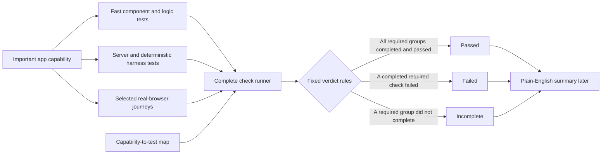

# App Testing Foundation Implementation Plan

**Status:** Proposed implementation plan

**Created:** 2026-07-21

**Decision:** Build trustworthy test coverage and test evidence before investing in a polished visual test dashboard or a dedicated test-review agent.

## 1. Purpose

The user needs a dependable answer to five practical questions:

1. Is the app working?
2. Did every required check actually finish?
3. Which important user workflows were checked?
4. Where are the known testing gaps?
5. What should be fixed or tested next?

The current visual Test Runner cannot answer those questions completely. It is useful as a server-test launcher, but a more polished interface would currently make incomplete evidence look more authoritative than it is.

This plan therefore prioritizes:

1. real protection for the main QBO workflow;
2. fast React interface tests using the newly installed client test tools;
3. a few realistic browser journeys using the existing isolated stress harness;
4. one complete check command with an honest `passed`, `failed`, or `incomplete` result;
5. a maintained capability-to-test map that exposes gaps without inventing a coverage percentage.

The visual App Check interface is reconsidered only after those foundations are stable.

## 2. Product Value And Priority

### Practical value

This work is worthwhile because the application is growing beyond one QBO screen into a coordinated operational-intelligence platform. Every new workflow, agent, evidence path, and saved decision increases the chance that a change in one area silently breaks another.

The highest-value outcome is not a developer dashboard. It is confidence that:

- critical evidence is not lost;
- important workflow stages do not silently stop;
- failures are visible and understandable;
- saved work can be recovered and resumed;
- agents and humans are working from the same preserved result;
- a green result means all required checks completed, not merely that the checks which happened to run passed.

### Priority decision

Use the current effort in this order:

| Priority | Investment | Reason |
| --- | --- | --- |
| 1 | Critical QBO workflow tests | Protects the user's real work and saved evidence. |
| 2 | Complete test execution and evidence | Makes pass/fail claims trustworthy. |
| 3 | Maintained testing-gap map | Answers what is not tested and prevents silent drift. |
| 4 | Minimal visual explanation | Useful only after the underlying evidence is dependable. |
| Deferred | Dedicated App Check agent | An agent should explain trustworthy evidence, not compensate for missing evidence. |

This plan does not pause core product hardening to build a large internal tool. Each phase must produce useful protection on its own and must be stoppable without leaving a half-integrated dashboard.

## 3. Role In The Broader Platform

### User and agent-team problem solved

The user and coding agents need a shared, evidence-backed answer about whether important product behavior still works after the app changes.

### Evidence and validation improved

This plan improves:

- repeatable evidence that critical workflows behave correctly;
- proof that the complete required check set ran;
- visible known gaps and untested capabilities;
- regression protection when source files, prompts, providers, or UI behavior change;
- clean handoffs between a coding agent that changes the app and a human who decides whether the result is acceptable.

### What this deliberately does not solve

This plan does not:

- claim that software can be proven bug-free;
- make one raw line-coverage percentage the definition of quality;
- test every visual spacing or animation detail in a simulated browser;
- make live provider calls during normal client tests;
- replace the existing deterministic image-parser and provider harnesses;
- create a dedicated in-app testing agent;
- rebuild the visual Test Runner during the foundation phases;
- start or take ownership of the user's persistent development servers.

## 4. Current Starting Point Verified On 2026-07-21

These statements must be rechecked immediately before implementation because other sessions are actively changing the worktree.

### Client test tools exist but are not wired

`client/package.json` currently includes:

- `vitest` 4.1.10;
- `@testing-library/react`;
- `@testing-library/user-event`;
- `@testing-library/jest-dom`;
- `jsdom`.

However:

- the client has no `test` or `test:watch` script;
- `client/vite.config.js` has no Vitest test configuration;
- there is no shared client test setup file;
- no current client test imports React Testing Library;
- the only client test file, `client/src/lib/providerHandoffStatus.test.js`, uses Node's built-in test runner and tests a plain helper rather than a rendered React interface.

The package and lockfile changes are currently part of a dirty, concurrently edited worktree. Implementation must not overwrite or re-stage another session's package changes. The first implementation session must confirm who owns those changes and whether they have already been committed.

### The root test command is incomplete

The current root `npm test` runs:

1. the server suite; and
2. the four test files that validate the stress-harness infrastructure.

It does not run:

- client component tests;
- the client production build;
- the bundle-size canary;
- the nine actual stress slice runners;
- the real-browser `client-surfaces` scenarios.

### The existing Test Runner is server-only

`server/src/services/test-runner.js` discovers files only under `server/test/`. The prototype's “Run All” therefore means “run all discovered server tests,” not “check the complete application.”

The prototype stores history in browser `localStorage`. That is acceptable for temporary convenience, but it is not durable proof of what ran and cannot support a trustworthy cross-suite verdict.

### Existing coverage assets should be reused

The repository already has:

- 106 server test files;
- four stress-harness infrastructure test files;
- nine stress-testing slices;
- an isolated test-server boot path with provider and connected-service stubs;
- real-browser `agent-browser` canaries for chat, shipment, and room flows;
- saved stress reports and baseline comparisons;
- mature deterministic image-parser evaluation evidence.

`stress-testing/STATUS.md` currently says `NOT AT CONFIDENCE` and explicitly puts broader browser coverage before an operator-facing test UI. This plan follows that existing decision rather than creating a competing test system.

### Test-policy documentation is stale

`.claude/rules/client.md` still says no client test framework is installed. Once the dependency installation is confirmed and committed, that statement must be replaced with the real Vitest and React Testing Library commands and boundaries.

## 5. Plain-English Test Vocabulary

| Term | Meaning in this project |
| --- | --- |
| Unit test | A fast check of one small decision, such as whether an unsaved-work guard reports risk. |
| Component test | A simulated-browser check that renders one React screen or control, clicks it, and checks what the user sees. |
| Integration test | A check that several real application pieces work together, while expensive or external systems are safely replaced with controlled responses. |
| Browser journey | A check in a real browser against the real React application and an isolated test server. |
| Regression test | A check added for a specific bug so that the same bug cannot return unnoticed. |
| Test harness | The controlled environment that starts isolated dependencies, supplies safe fake provider responses, runs a scenario, and records evidence. |
| Capability map | A maintained list of important app abilities and the tests that provide evidence for each one. |
| Flaky test | A test that sometimes passes and sometimes fails without a relevant code change. Flaky tests cannot be treated as trustworthy evidence. |

## 6. Testing Principles

1. **Protect user outcomes, not implementation details.** Prefer “the unsaved answer warning remains visible and can be copied” over “state variable X equals true.”
2. **Use accessible names.** Find buttons, fields, headings, warnings, and statuses by the words and roles the user experiences.
3. **Keep external calls controlled.** Vitest tests must not call live AI providers, Gmail, Calendar, MongoDB, or the user's running server.
4. **Test meaningful failures.** A happy path alone is insufficient for evidence loss, persistence, cancellation, and provider fallback.
5. **Do not chase a vanity percentage.** Line coverage may later help locate untested code, but it must not become the app's “sufficiently tested” verdict.
6. **Never turn an incomplete run green.** A timed-out, blocked, disconnected, or never-started required group produces `incomplete`, even if every completed group passed.
7. **Keep focused commands.** Developers and agents need quick tests for changed areas as well as the slower complete check.
8. **Reuse the existing stress harness.** Do not install a second browser-testing framework unless the existing `agent-browser` harness proves unable to meet a specific acceptance criterion.
9. **Do not approve a new baseline automatically.** A changed baseline is a review decision, not a way to silence a failure.
10. **Treat generated logs as potentially sensitive.** Do not save environment variables, credentials, raw secrets, or unlimited provider payloads in test summaries.

## 7. Risk-Based Capability Scope

The first implementation wave should protect the current QBO escalation path before expanding across every secondary surface.

### Critical capabilities: required in the first complete-confidence profile

| Capability | User harm if broken | Minimum evidence required |
| --- | --- | --- |
| QBO evidence intake | The user cannot start the workflow or uploads the wrong content. | Component test plus isolated browser journey. |
| Image parse result validation | Incorrect or empty extracted evidence flows downstream. | Existing server/harness checks plus client failure-state test. |
| Triage, known-issue search, and analyst orchestration | Workflow stages silently skip, duplicate, or finish in the wrong order. | Orchestrator integration tests plus existing server contracts plus browser journey. |
| Conversation and triage persistence | Results appear on screen but are not saved. | Server persistence tests plus client unsaved-result behavior plus browser failure journey. |
| Unsaved-result protection | The only copy of an AI result is lost during navigation or reload. | Guard/helper tests, component tests, and real-browser navigation test. |
| Saved-session resume | Returning to work loses or duplicates evidence and answers. | Route/hook component tests plus browser reload journey. |
| Evidence completeness | The app claims a complete run while required artifacts are missing. | Existing server evidence tests plus `EvidenceSummary` component states plus browser assertion. |
| Escalation lifecycle | A case cannot be created, linked, reviewed, resolved, or reopened consistently. | Existing server route tests plus focused dashboard/detail component tests plus escalation stress slice. |

### High-value capabilities: add after the critical set is stable

- Knowledge candidate review and publish boundaries.
- Agent configuration and prompt/model change feedback.
- Attention Center prioritization and bulk actions.
- Settings that materially change provider, account, or workflow behavior.
- Gmail and Calendar account selection and failure explanations.
- Provider fallback and user-visible provenance.
- Request/error diagnostics that help the user recover.

### Initially recorded as gaps rather than hidden

- Broad visual layout regression across every route.
- Large-list and long-session browser pressure beyond the current stress scenarios.
- Complete browser coverage for every Settings panel.
- Automated accessibility audit across the whole client.
- Mutation testing, which deliberately changes code in an isolated copy to verify that tests catch the mistake.
- Hosted-deployment and multi-user browser coverage.

These are not reasons to block the first foundation. They must appear as known gaps until implemented.

## 8. Target Evidence Flow



The verdict is produced by fixed code. An AI agent is not allowed to reinterpret `failed` or `incomplete` as passed.

## 9. Phase 0 — Reconcile The Baseline And Protect Concurrent Work

### Goal

Start from one known repository state without absorbing another session's unfinished work.

### Work

1. Check `git status --short --branch`.
2. Re-read every planned file immediately before editing it.
3. Confirm whether the current `client/package.json` and `client/package-lock.json` testing dependency changes have been committed by their owner.
4. Confirm the installed dependency tree with `npm --prefix client ls --depth=0`.
5. Record the current commands and outcomes separately:
   - existing client helper test;
   - server suite;
   - stress-harness infrastructure tests;
   - client production build;
   - selected stable stress slices.
6. Do not interpret an unrelated existing failure as caused by this work. Record it as a baseline issue with its exact command and output.
7. Do not start or restart persistent development services. Isolated short-lived test servers created and cleaned up by the test harness are allowed.

### Deliverable

A short baseline section added to the implementation pull request or commit notes stating:

- commit hash;
- whether the worktree was dirty;
- which checks were run;
- which checks passed, failed, or were not run;
- any concurrent file ownership risk.

### Acceptance criteria

- No unrelated dirty file is staged or modified.
- The dependency installation has one clear owner.
- Existing failures are documented before test-framework configuration begins.

## 10. Phase 1 — Complete The Client Test Foundation

### Goal

Make Vitest and React Testing Library runnable, repeatable, and easy for future coding agents to use.

### Planned file changes

#### `client/package.json`

Add scripts:

- `test`: one non-interactive Vitest run suitable for automation;
- `test:watch`: local watch mode for focused development;
- optionally `test:ui` only if a future explicit decision adds Vitest's UI package.

Do not add a coverage package in this phase. Coverage reporting is a later decision after meaningful tests exist.

#### `client/vite.config.js`

Add a `test` block that:

- uses `jsdom` as the simulated browser;
- loads one setup file;
- clears or restores mocks between tests;
- keeps tests non-global so imports show where test functions come from;
- uses a bounded timeout appropriate for component tests, not provider calls.

Do not put live server URLs, provider keys, or user-specific paths in the config.

#### `client/src/test/setup.js`

Create one shared setup file that:

- imports the Vitest-compatible `jest-dom` matchers;
- cleans up rendered React trees after each test;
- restores modified globals after each test;
- adds only the browser shims actually required by current components, such as `matchMedia` or `ResizeObserver`;
- fails visibly if a required browser API was forgotten instead of silently mocking everything.

#### `client/src/test/renderWithProviders.jsx`

Create this helper only when two or more tests require the same provider wrapper. It may wrap current app contexts, but it must not become a second fake application shell.

#### `client/src/lib/providerHandoffStatus.test.js`

Migrate the existing test from `node:test` and `node:assert` to Vitest so all client tests use one runner.

#### `.claude/rules/client.md`

Replace the stale “no framework installed” statement with:

- the actual client test commands;
- React Testing Library as the default component-test tool;
- a rule to test behavior visible to the user rather than internal state;
- the existing proportionate-testing boundary.

#### `CLAUDE.md` and `AGENTS.md`

Make only the smallest durable clarification needed:

- client behavior tests use Vitest and React Testing Library;
- material behavior changes must update or verify their mapped evidence once the capability map exists;
- passing existing tests alone must not be described as proof that the full app is sufficiently tested.

Do not add this wording to every hook. Root instructions and scoped documentation are enough unless repeated non-compliance proves a mechanical check is necessary.

### First verification commands

```powershell
npm --prefix client test
npm --prefix client run build
```

### Acceptance criteria

- `npm --prefix client test` exits successfully without watch mode.
- `npm --prefix client run test:watch` starts watch mode only when explicitly run.
- The migrated helper tests still assert the same behavior.
- A deliberately failing temporary assertion produces a non-zero exit code; remove that temporary assertion before committing.
- No client test contacts a live server or provider.
- The stale client testing rule is corrected.

## 11. Phase 2 — Add The First Critical Component Tests

### Goal

Protect high-risk user-visible behavior with fast tests before attempting broad route-level coverage.

### Test wave 2A: unsaved work and recovery

#### `client/src/lib/unsavedWorkGuard.test.js`

Cover:

- no registered guard means no unsaved work;
- one true guard reports unsaved work;
- false guards do not block;
- unregistering removes the risk;
- one stale or throwing guard does not crash navigation;
- test cleanup leaves no guard registered for the next test.

#### `client/src/components/chat-v5/UnsavedResultNotice.test.jsx`

Cover:

- the warning clearly says the result was not saved;
- a supplied save error is shown;
- Copy writes the exact visible result and reports success;
- copy failure is visible;
- Download creates the requested filename and releases its temporary object URL;
- Dismiss invokes the supplied handler but does not silently claim the result was saved.

This file is currently part of another session's active Chat V5 work. The implementation session must wait until that file is stable or coordinate ownership before editing or adding its test.

#### `client/src/hooks/useAppRouteState.test.jsx`

Use a small hook test harness to cover:

- a normal hash route change;
- blocking a route change when unsaved work exists and the user chooses to stay;
- allowing the route change after explicit confirmation;
- switching between two saved chat conversations;
- opening and closing Settings while preserving the prior route;
- removing event listeners when the hook unmounts.

### Test wave 2B: evidence-completeness explanation

#### `client/src/components/chat-v5/EvidenceSummary.test.jsx`

Cover every truthful state:

- checking;
- check failed, with a working “Check again” action;
- complete;
- incomplete, with missing items and next action;
- unknown or still settling;
- acknowledged incomplete evidence;
- acknowledgement failure.

Assertions must use the user-visible headline, warning role, buttons, and missing-item text. Do not test private state or CSS pixel values.

### Test wave 2C: image intake behavior

Test the rendered Chat V5 intake surface rather than exporting private helpers solely for tests.

Cover:

- selecting a supported image starts the intended capture callback once;
- drag-and-drop and paste accept image content;
- non-image files do not start the workflow;
- selecting multiple files uses the first valid image predictably;
- keyboard activation reaches the file picker;
- resetting removes the captured preview and returns to the initial workflow state.

If the component is too tightly coupled to test safely, first extract one reusable `ImageUploadCard` module with the same production behavior. Do not copy the component into a test-only implementation.

### Acceptance criteria

- Tests fail when the protected behavior is deliberately broken locally and pass when restored.
- Tests do not depend on execution order.
- Tests do not use arbitrary sleep calls.
- Test names describe the user outcome.
- All clipboard, URL, timer, hash, and confirmation mocks are restored after each test.

## 12. Phase 3 — Test The QBO Workflow Orchestration

### Goal

Verify that the main pipeline behaves correctly across success, failure, cancellation, persistence, and resume states without contacting live providers.

### 3A. Hook-level orchestration tests

Create `client/src/components/chat-v5/useStageOrchestrator.test.jsx` using React Testing Library's hook support and module-level API mocks.

Mock the application's API modules, not the global network in every individual test. Reuse small fixture builders for:

- valid parser result;
- parser validation failure;
- triage success/failure;
- known-issue match/no-match;
- analyst streaming and completion;
- conversation save success/failure;
- evidence completeness result;
- abort and timeout.

Required scenarios:

1. **Initial state:** no evidence captured, every stage pending, no false error.
2. **Successful escalation image:** parser result is accepted, downstream work starts, stage results settle, the conversation ID is retained, and evidence is checked.
3. **Empty parser result:** downstream triage is not presented as successfully completed.
4. **Non-escalation image:** the triage plan is skipped for the documented reason rather than silently failing.
5. **Parser validation failure:** untrusted parsed data is not sent downstream and the user receives a recoverable error.
6. **Triage persistence failure:** the visible triage result remains available, the save state is failed, and unsaved-result protection activates.
7. **Analyst persistence failure:** the visible answer remains available and is marked unsaved.
8. **Provider fallback:** the effective provider result and visible fallback state remain truthful.
9. **Cancellation/reset:** active work is aborted, timers are cleared, late events cannot repopulate reset state, and no state update occurs after unmount.
10. **Saved-session resume:** saved evidence hydrates once, a live run is not overwritten by stale resume data, and switching conversations does not duplicate results.
11. **Evidence settling:** an unknown evidence result rechecks at the bounded settling time and stops rechecking after a terminal result.

Before writing these assertions, re-read the current Chat V5 and server event contracts. The main Chat V5 files are actively changing in another session and the plan must follow the settled production behavior rather than freezing today's intermediate implementation.

### 3B. Rendered workflow integration tests

Create a focused `ChatV5Container.test.jsx` suite with the orchestration hook and app APIs controlled at stable boundaries.

Protect these user-visible journeys:

- the initial screen makes evidence upload the obvious first action;
- capture reveals the workflow without falsely showing completed stages;
- stage failures remain associated with the correct stage;
- parsed evidence, triage, known-issue findings, and analyst output appear in the correct areas;
- unsaved warnings prevent accidental loss but still allow explicit navigation;
- a saved conversation route resumes the expected result;
- complete and incomplete evidence summaries are visibly different;
- reset starts a clean new workflow without leaking prior results.

Do not assert animation frame timing or exact layout pixels. Assert state classes, accessible visibility, focus behavior, and reduced-motion behavior where it affects usability.

### 3C. Focused escalation and knowledge surface tests

After the Chat V5 critical tests are stable, add a small second wave:

- `EscalationDashboard`: attention status and one representative bulk action;
- `EscalationDetail`: resolution requirements and linked knowledge visibility;
- `KnowledgebaseView`: draft versus published/approved state and denial feedback;
- navigation from a linked Chat V5 case to its escalation and knowledge record.

Do not attempt to cover every table column or filter. Server tests remain the authority for route permissions and persistence rules; these client tests protect the user's ability to see and perform the critical action.

### Acceptance criteria

- The critical success path is covered at hook and rendered-component levels.
- Parser, persistence, cancellation, and resume failures have explicit regression tests.
- Provider/model calls are fully stubbed.
- No component test requires the user's dev server, MongoDB, or browser to be running.
- Slow or broad scenarios are moved to the existing stress harness instead of making the component suite slow.

## 13. Phase 4 — Expand The Existing Real-Browser Confidence

### Goal

Catch failures that a simulated browser cannot detect: real navigation, focus, file input, streaming, reload, layout presence, and client/server wiring.

### Existing harness to extend

Use:

- `stress-testing/slices/client-surfaces/harness/run.js`;
- `stress-testing/slices/image-intake-and-parse/`;
- `stress-testing/slices/escalation-domain/`;
- existing `agent-browser` batch utilities;
- the isolated harness server and deterministic provider stubs.

Do not point these scenarios at the user's live app data or real providers.

### New browser scenarios

#### 1. QBO workflow happy path

- Open the real Chat V5 page.
- Upload a deterministic QBO image fixture.
- Observe parser, known-issue, triage, and analyst stages.
- Confirm the visible outputs use the expected saved fixture evidence.
- Confirm the final conversation route exists.
- Confirm evidence completeness reaches its expected terminal state.
- Reload the saved route and verify one copy of each result appears.

#### 2. Parser failure and recovery

- Force a controlled parser failure.
- Verify later stages are not shown as successfully complete.
- Verify the error tells the user what failed and provides an appropriate retry/reset path.
- Retry with a successful stub and verify stale failure state is cleared.

#### 3. Unsaved result navigation protection

- Force triage or analyst persistence to fail after a visible result exists.
- Verify the “Not saved” warning.
- Attempt to navigate away and verify the confirmation.
- Choose to remain and verify the result is still present.
- Exercise Copy or Download as the recovery path.
- Then explicitly leave and verify the action is honored.

#### 4. Session resume and evidence integrity

- Complete a controlled run.
- Navigate to another route and return.
- Hard-reload the saved conversation route.
- Verify saved evidence, stage status, and final answer are neither lost nor duplicated.

#### 5. Escalation lifecycle handoff

- Open the linked escalation from the completed workflow.
- Verify the expected case/evidence identity.
- Exercise one controlled lifecycle action in the isolated database.
- Verify the updated state remains after reload.

### Artifacts

Each browser scenario should produce:

- structured assertions;
- duration and pass/fail state;
- a screenshot on failure and, where useful, one final success screenshot;
- the isolated report path;
- no credentials or real customer data.

### Baseline rules

- Update `stress-testing/baselines/client-surfaces.json` or another affected baseline only after reviewing why the expected result changed.
- Never promote a failed current result merely to restore green.
- Mark a flaky scenario as untrusted and fix or quarantine it; do not count it toward full confidence while quarantined.

### Acceptance criteria

- All five QBO browser scenarios are isolated from live providers and live user data.
- Every started server/client helper is stopped by the harness in `finally` cleanup.
- Failure screenshots and reports identify the scenario and run ID.
- The browser scenarios pass repeatedly without an unchanged-code intermittent failure before they become required gates.

## 14. Phase 5 — Add One Trustworthy Complete Check Runner

### Goal

Provide one command that runs the required groups, continues far enough to identify all independent failures, and records an honest complete result.

### Proposed new files

#### `testing/check-profiles.json`

Define commands as data rather than hardcoding a second list in the future UI.

Initial profiles:

- `core`: fast client tests, server suite, and stress-harness infrastructure tests;
- `full`: core plus client build/bundle canary and all nine registered stress slices; a quarantined or unavailable required slice remains visible and prevents a full passed verdict;
- `focused-qbo`: critical QBO client tests plus the escalation, image-intake, main-chat, and client-surface slices.

Each group should declare:

- stable ID and plain-English label;
- exact command and working directory;
- whether it is required for the profile;
- bounded timeout;
- why the group matters;
- the capability IDs it supports;
- requirements such as `agent-browser` availability.

#### `scripts/run-app-checks.js`

Implement a cross-platform Node runner that:

1. selects a named profile;
2. validates every configured command before the run;
3. records the current commit and whether the worktree is dirty;
4. runs groups in a predictable order;
5. keeps independent groups running after another group fails;
6. kills only its own timed-out child process tree;
7. caps captured output and saves detailed logs separately;
8. produces a versioned JSON summary;
9. exits non-zero for `failed` or `incomplete`;
10. never starts or controls the user's persistent dev services.

On Windows, resolve `npm.cmd` explicitly rather than relying on a broad shell command. Keep command arguments as arrays and avoid `shell: true` where possible.

#### `server/scripts/run-tests.js`

The current server runner stops after the first failing or timed-out file. That is useful for fast development feedback, but it cannot prove that the rest of the server suite ran.

Add a structured full-verification mode that:

- preserves the existing fail-first default for focused development;
- accepts an explicit `--continue` mode for the complete check;
- records discovered, started, completed, passed, failed, timed-out, and not-run file counts;
- continues with the next independent file after an ordinary assertion failure;
- safely cleans up its own timed-out file process before continuing;
- writes a versioned JSON summary when given a result path;
- reports `incomplete` if any discovered file timed out or never produced a terminal result;
- reports `failed` only when every discovered file completed without a timeout but one or more assertion/process results failed.

Refactor the runner behind a `require.main === module` guard so pure discovery and summary logic can be tested without recursively starting the full suite.

#### `stress-testing/scripts/run-slices.js`

The stress runner already continues across selected slices and prints a per-slice summary. Extend it to optionally write that summary as versioned JSON so the complete check runner does not have to scrape terminal text.

The full profile must select all nine registered slices. If a slice is quarantined because it is flaky or not yet trustworthy, record it as a visible incomplete requirement and known gap; do not silently remove it from the profile.

### Fixed verdict rules

| Verdict | Rule |
| --- | --- |
| `passed` | Every required group started, completed, and exited successfully. |
| `failed` | Every required group completed, but one or more completed checks failed. |
| `incomplete` | One or more required groups never started, timed out, disconnected, was blocked by a missing dependency, or produced no valid completion record. |

If both a failure and incomplete group exist, the overall verdict is `incomplete`, with failures still listed. A group is also incomplete when its internal runner discovered more required files or slices than reached a terminal result. The user must never be told that the full app passed when some required evidence is missing.

### Summary contract

Write generated results under a Gitignored path such as `test-results/app-check/`:

```json
{
  "schemaVersion": 1,
  "runId": "...",
  "profile": "full",
  "repository": {
    "commit": "...",
    "dirty": true
  },
  "startedAt": "...",
  "finishedAt": "...",
  "verdict": "incomplete",
  "groups": [
    {
      "id": "client-components",
      "required": true,
      "status": "passed",
      "durationMs": 0,
      "exitCode": 0,
      "logPath": "..."
    }
  ],
  "failedGroups": [],
  "incompleteGroups": [],
  "capabilitySummary": {},
  "limitations": []
}
```

Do not store environment variables or unrestricted terminal output in the summary.

### Root commands

Add focused commands without removing existing useful commands:

- `test:client`;
- `test:server`;
- `test:stress-harness`;
- `verify:core`;
- `verify:qbo`;
- `verify:full`.

Once Phase 1 is stable, update root `npm test` so it includes client tests as well as server and stress-harness infrastructure tests. Keep the longer real-browser and stress slices under `verify:full` so normal focused development remains practical.

### Runner tests

Create deterministic tests for the runner itself:

- all groups pass;
- one group fails but later independent groups still run;
- timeout produces `incomplete`;
- missing executable produces `incomplete`;
- malformed profile fails before starting children;
- disconnect/interruption is recorded honestly;
- generated summary follows its versioned contract;
- only child processes created by the runner are eligible for cleanup.

Also add focused tests for the adapted server and stress runners:

- server fail-first mode preserves current behavior;
- server continue mode records later files after an earlier failure;
- a timed-out server file is cleaned up and the remaining files continue in full mode;
- discovered versus terminal server file counts control failed versus incomplete;
- stress summary JSON contains one terminal entry for every selected slice;
- a harness boot failure marks selected slices not run instead of passing them.

### Acceptance criteria

- `npm run verify:core` produces a complete JSON summary.
- `npm run verify:full` cannot report passed if a required browser or build group was skipped.
- The command exit code agrees with the summary verdict.
- A failed server test file does not hide later server test results in full mode and does not prevent independent client results from being recorded.
- A deliberately timed-out fixture produces `incomplete`, not `passed` or ordinary `failed`.

## 15. Phase 6 — Create And Enforce The Capability-To-Test Map

### Goal

Answer “what is tested and what is missing?” without relying on raw test counts or a fabricated percentage.

### Proposed files

#### `testing/app-capabilities.json`

Each capability should include:

- stable ID;
- plain-English label;
- user outcome protected;
- risk level: critical, high, normal, or currently out of scope;
- product source paths or path patterns;
- required check types;
- test or harness evidence paths;
- known gaps;
- owning product area;
- last human review date.

Do not store `strong`, `partial`, or `weak` as a manually editable truth. Derive the current assessment from the map plus the latest complete run.

#### `scripts/validate-testing-map.js`

Validate that:

- every referenced source/test file exists;
- every capability has a user outcome and risk level;
- critical capabilities declare all required check types;
- mapped test files belong to a configured check group;
- newly added client/server test files are mapped or explicitly categorized as test infrastructure;
- duplicate IDs and unknown group IDs fail validation;
- known gaps remain visible rather than being treated as passing evidence.

#### `docs/testing/README.md`

Explain in plain language:

- what each test type proves and does not prove;
- how to run focused, QBO, and full checks;
- how to add a capability;
- how to add or map a test;
- how to review a baseline change;
- how `passed`, `failed`, and `incomplete` are determined;
- why there is no single “95% tested” claim.

### Derived assessments

| Assessment | Meaning |
| --- | --- |
| Strongly tested | Every required check type is mapped and passed in the latest complete relevant run. |
| Partially tested | Some required evidence exists, but at least one required check type is missing or not current. |
| Weakly tested | Only narrow helper tests exist for a capability whose user workflow is not exercised. |
| Unknown | The capability is not mapped or has never completed its required checks. |

These labels describe evidence strength, not a guarantee that no bug exists.

### Coding-agent maintenance rule

After the validator exists and has tests, add a concise rule to the authoritative coding-agent instructions:

> When a material user capability or mapped source path changes, update or run its mapped tests and keep the capability map honest. If coverage is intentionally deferred, record the gap instead of claiming the feature is fully tested.

Mirror the shared rule in `AGENTS.md` and `CLAUDE.md`. Keep detailed instructions in `docs/testing/README.md`; do not duplicate the entire map or workflow in prompts, hooks, or memory.

### Acceptance criteria

- The first map covers every critical capability listed in Section 7.
- Validation fails for a missing referenced test file.
- Validation reports an unmapped new test file.
- A critical capability with no browser evidence is shown as partial or weak when browser evidence is required.
- The latest complete run can be joined to the map without an AI model.
- The user's answer includes explicit known gaps and the date/commit of the evidence.

## 16. Phase 7 — Reliability Gate Before Any Visual App Check Work

### Goal

Decide with evidence whether the foundation is stable enough to justify a user-facing visual surface.

### Required gate

Do not rebuild the visual dashboard until all of the following are true:

1. Every critical capability is present in the capability map.
2. The critical QBO component tests pass reliably.
3. The required QBO browser journeys pass repeatedly without unchanged-code flakiness.
4. `verify:full` distinguishes passed, failed, and incomplete through tested fixed rules.
5. At least five consecutive representative full runs completed and produced valid summaries; this verifies runner stability, not product perfection.
6. Known gaps and quarantined tests appear in the summary.
7. The test-run duration and local resource use are acceptable for the user.
8. The structured result format is stable enough that a UI will not need to parse terminal text.

### Decision checkpoint

At this point, review:

- whether the command-line summary is already understandable enough;
- which questions still require a visual presentation;
- whether run history needs durable app storage or only local generated files;
- whether the current prototype should be replaced, reduced, or removed;
- whether the Test Suite header button should remain visible before the new surface exists.

If the visual surface is approved, its first version must remain intentionally small:

- one **Check Everything** action;
- one plain verdict: Passed, Needs attention, or Check incomplete;
- “What failed,” “What was not checked,” and “What should happen next” sections;
- critical capability evidence and known gaps;
- technical logs hidden behind optional details;
- no misleading percentage;
- no AI dependency for the verdict;
- local/developer access first.

That UI is a separate approved implementation plan, not part of Phases 0–6.

## 17. Phase 8 — Dedicated App Check Agent Decision, Deferred

Do not create a dedicated App Check Reviewer during the foundation work.

Reconsider it only if:

- the structured facts are trustworthy;
- users still need help interpreting failures or deciding which gap matters most;
- the agent can operate on demand rather than continuously;
- its read/run permissions can be narrow;
- it cannot change a fixed verdict;
- test-writing remains a separate coding responsibility with human approval.

If eventually approved, the agent may:

- translate technical failures into plain English;
- compare the current run with the last complete good run;
- rank known gaps by user impact;
- propose missing tests;
- hand approved implementation work to a coding agent.

It must never:

- mark its own test work sufficient;
- turn incomplete evidence green;
- silently ignore a failed required check;
- modify tests or product code without approval;
- run paid models after every routine green check.

## 18. File Plan

### Existing files expected to change

| File | Planned responsibility |
| --- | --- |
| `client/package.json` | Client test scripts. |
| `client/package-lock.json` | Only dependency/lock changes owned by this implementation. |
| `client/vite.config.js` | Vitest/jsdom configuration. |
| `client/src/lib/providerHandoffStatus.test.js` | Migrate existing client test to Vitest. |
| `.claude/rules/client.md` | Replace stale client testing guidance. |
| `AGENTS.md` | One concise capability-map maintenance rule after enforcement exists. |
| `CLAUDE.md` | Matching shared rule and current client test commands. |
| `package.json` | Client and complete verification commands. |
| `server/scripts/run-tests.js` | Preserve fail-first development mode and add structured continue/summary mode for complete verification. |
| `stress-testing/scripts/run-slices.js` | Write a structured per-slice summary for selected/all stress slices. |
| `stress-testing/slices/client-surfaces/harness/run.js` | Critical QBO real-browser journeys. |
| `stress-testing/baselines/client-surfaces.json` | Human-reviewed baseline update if scenario contract changes. |
| `stress-testing/STATUS.md` | Current confidence and remaining gaps after verified progress. |
| `.gitignore` | Ignore generated app-check results/logs if not already covered. |

### New files expected

| File | Planned responsibility |
| --- | --- |
| `client/src/test/setup.js` | Shared client test environment. |
| `client/src/test/renderWithProviders.jsx` | Shared provider wrapper only if repeated need is proven. |
| `client/src/lib/unsavedWorkGuard.test.js` | Unsaved-work guard contract. |
| `client/src/hooks/useAppRouteState.test.jsx` | Navigation and unsaved-work protection. |
| `client/src/components/chat-v5/UnsavedResultNotice.test.jsx` | Visible recovery behavior. |
| `client/src/components/chat-v5/EvidenceSummary.test.jsx` | Complete/incomplete evidence explanation. |
| `client/src/components/chat-v5/useStageOrchestrator.test.jsx` | Pipeline state, failure, persistence, reset, and resume. |
| `client/src/components/chat-v5/ChatV5Container.test.jsx` | Rendered critical QBO workflow states. |
| `scripts/run-app-checks.js` | Cross-suite complete check runner. |
| `server/test/server-test-runner.test.js` | Pure runner discovery, continuation, timeout, and completeness rules without recursive suite execution. |
| `stress-testing/scripts/test/run-slices-summary.test.js` | Per-slice structured summary and incomplete-run rules. |
| `scripts/validate-testing-map.js` | Capability-map validation. |
| `testing/check-profiles.json` | Machine-readable check groups and profiles. |
| `testing/app-capabilities.json` | Important app abilities and required evidence. |
| `docs/testing/README.md` | Plain-English testing and maintenance guide. |
| `test-results/app-check/*` | Generated, Gitignored local evidence only. |

The exact component test filenames may change if active concurrent work extracts or renames components. Re-read the settled implementation before creating tests.

## 19. Recommended Commit Sequence

Keep the work reviewable and independently reversible:

1. `test(client): configure Vitest and migrate existing client tests`
2. `test(client): protect unsaved results and evidence states`
3. `test(qbo): cover critical Chat V5 orchestration`
4. `test(stress): add isolated QBO browser journeys`
5. `build(test): add complete check profiles and structured summaries`
6. `docs(test): add capability map and maintenance contract`

Do not mix unrelated in-progress application changes into these commits. Before every commit:

- inspect `git status`;
- stage only owned files;
- run `git diff --cached --check`;
- inspect the staged file list;
- run the phase's focused verification;
- push the completed commit according to repository policy.

## 20. Verification Matrix

| Phase | Required verification |
| --- | --- |
| 0 | Baseline commands recorded; no unrelated files staged. |
| 1 | Client tests and production build pass. |
| 2 | Focused component tests pass; deliberate temporary break proves each high-risk assertion is meaningful. |
| 3 | Critical orchestration and rendered QBO tests pass without live services. |
| 4 | Isolated browser QBO scenarios pass repeatedly and clean up their processes. |
| 5 | Runner self-tests pass; core/QBO/full summaries and exit codes agree. |
| 6 | Capability-map validator passes; deliberate missing mapping fails. |
| 7 | Five representative full summaries are structurally valid and expose known gaps. |

### Final foundation verification commands

The exact commands will be created by the implementation, but the intended closeout is:

```powershell
npm --prefix client test
npm --prefix client run build
npm run test:server
npm run test:stress-harness
npm run verify:qbo
npm run verify:full
node scripts/validate-testing-map.js
git diff --check
git status --short --branch
```

If `verify:full` is too slow for every implementation commit, use focused tests during development and run the complete profile as the explicit final verification step. Never claim the full profile passed when it was not run.

## 21. Overall Acceptance Criteria

The testing foundation is complete when:

1. Client interface tests run through a documented command.
2. The critical QBO user workflow has meaningful success and failure protection.
3. Unsaved results, persistence failure, cancellation, resume, and evidence completeness have regression tests.
4. Selected critical journeys run in a real browser against an isolated server with controlled provider responses.
5. One complete command records every required check group and every required file/slice within those groups.
6. The result distinguishes passed, failed, and incomplete mechanically.
7. A failure in one independent group does not erase evidence from later groups.
8. Every critical capability has a required-evidence definition and current assessment.
9. Known gaps and quarantined/flaky tests are visible.
10. Coding-agent guidance accurately describes the installed client framework and map-maintenance responsibility.
11. No result uses a fabricated “percent tested” score.
12. No dedicated test agent or polished dashboard was built before the evidence gate.

## 22. Risks And Controls

### Risk: testing the implementation instead of user behavior

**Control:** Use visible roles, labels, warnings, outcomes, and API boundaries. Avoid assertions on private hook variables unless the hook itself is the public contract.

### Risk: a large Chat V5 component makes tests brittle

**Control:** Start with small high-risk components and the orchestration hook. Extract production boundaries only when the same boundary improves the real code; do not split files solely to satisfy a test framework.

### Risk: concurrent changes invalidate planned tests

**Control:** Re-read files before editing, coordinate overlapping ownership, and implement tests against the settled behavior rather than today's intermediate dirty state.

### Risk: too many mocks create false confidence

**Control:** Use component tests for fast state/behavior checks and the existing real-browser hermetic harness for actual client/server wiring.

### Risk: full checks become too slow to use

**Control:** Keep core, focused-QBO, and full profiles. Optimize or parallelize only after measuring. Do not drop required checks merely to make the dashboard feel fast.

### Risk: flaky browser scenarios train users to ignore red results

**Control:** Require repeated stable runs before promotion to a required gate. Quarantine visibly, preserve the gap, and fix the cause.

### Risk: test output captures sensitive information

**Control:** Use synthetic fixtures, cap logs, never serialize environment variables, reuse redaction helpers, and keep generated test results Gitignored.

### Risk: the capability map becomes stale paperwork

**Control:** Validate file references and unmapped tests mechanically, connect groups to capability IDs, and keep detailed maintenance instructions in one testing document.

### Risk: visual-dashboard scope returns early

**Control:** Treat Section 16 as a hard decision gate. Foundation phases contain no visual dashboard or agent implementation.

## 23. Stop Points And Budget Protection

Each stop point leaves useful value:

- **After Phase 1:** the client can finally run component tests.
- **After Phase 2:** evidence-loss and navigation risks have fast protection.
- **After Phase 3:** the main QBO React workflow has meaningful regression coverage.
- **After Phase 4:** real-browser confidence covers the most important user journeys.
- **After Phase 5:** one complete command produces trustworthy structured evidence.
- **After Phase 6:** the app can state what is strongly, partially, weakly, or not yet tested.

If budget becomes constrained, stop after the highest completed phase and preserve the remaining gaps. Do not spend the remaining budget on visual polish while a higher-priority evidence phase is incomplete.

## 24. Recommended First Implementation Slice

The first approved implementation should contain only:

1. reconcile the concurrent package installation;
2. configure Vitest and React Testing Library;
3. migrate the existing client helper test;
4. test `unsavedWorkGuard`;
5. test `UnsavedResultNotice` and `EvidenceSummary` after the active Chat V5 work settles;
6. add `test:client` to the root scripts;
7. update the stale client testing documentation;
8. verify the client tests and production build;
9. commit and push only the owned files.

Do not begin the visual App Check interface, complete runner, capability map, or dedicated agent in that first slice. Review the first slice's stability and maintainability before proceeding to orchestration and browser coverage.
