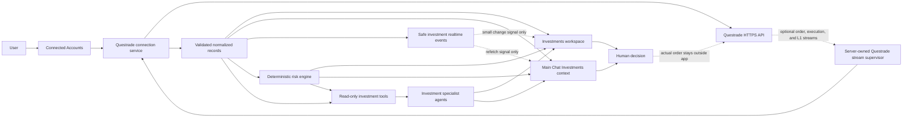
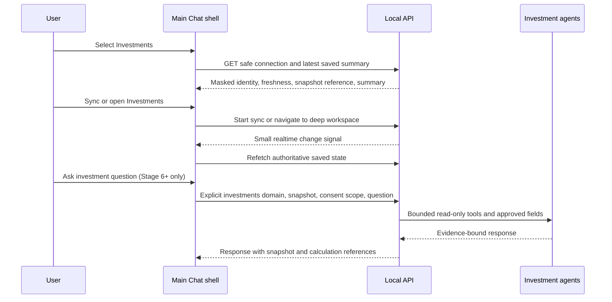
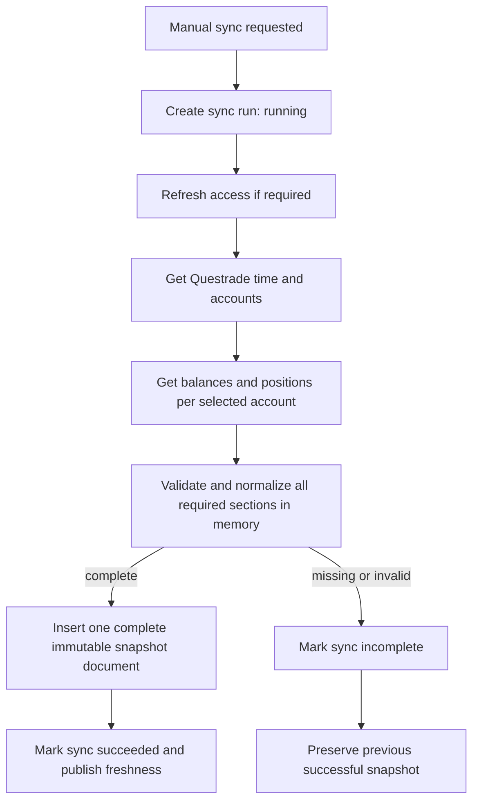
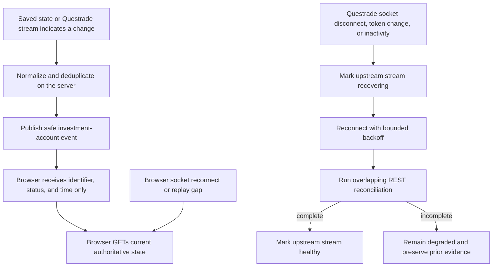

# Questrade Investments Integration Implementation Plan

**Status:** Proposed; no implementation has started

**Created:** 2026-08-14

**Revised:** 2026-08-14 after independent critical review, socket-hardening review, the product-owner requirement that Investments have first-class Main Chat and development-startup representation, Gate 0 account-readiness confirmation, the extraction-ready module decision, and the clarification that read-only/local/no-trade/AI limits are initial-stage boundaries while credential encryption is app-managed and accepted order-notification/monitoring preferences may persist; documentation revision only, with no Questrade implementation started

**Primary decision:** Add Questrade as a separate Investments domain whose first implementation is read-only. This plan contains no trade placement, modification, cancellation, or autonomous financial action, but it does not permanently prohibit a separately planned and explicitly approved future trading capability.

**Stage rule:** Every implementation stage ends in a working, testable increment in the user's development app. No later stage may begin until the user completes the stage's hands-on acceptance script and explicitly accepts that gate.

**Review disposition:** The revision accepts the local-server, encryption, identity-lifecycle, snapshot-publication, browser-evidence, provider-card, stage-sizing, dependency, token-recovery, and deletion findings. It does not carry forward the proposed `getSymbol` scope ambiguity because Questrade's current official scope table explicitly assigns `GET symbols/:id` to `read_acc`; Activities remains the one documented account endpoint whose published scope mapping is unclear. The socket-hardening revision adds a minimal browser event channel, server-only Questrade streams, REST gap reconciliation, deduplication/generation fencing, TLS and destination controls, session maintenance, bounded backoff/circuit breaking, quote staleness, and snapshot-before-alert rules. The platform-surface revision keeps a full Investments workspace, adds a separately gated cross-domain Main Chat redesign, prevents QBO and portfolio context from leaking into each other, and makes the friendly development launcher report Investments capability without contacting Questrade or printing financial data during normal startup.

## 1. Practical outcome

The user should be able to connect a personal Questrade margin account and answer six questions confidently:

1. Is Questrade connected, and what read permissions actually work?
2. What does the account currently contain?
3. What changed through trades, dividends, interest, commissions, deposits, withdrawals, and orders?
4. What concentration, currency, and margin risks can be calculated from the latest verified account snapshot?
5. What do specialist agents conclude, which exact snapshot supports that conclusion, and what still needs human judgment?
6. From the main Chat page, which work domain am I in, what investment evidence is currently available, and where do I go for deeper portfolio work?

The first release deliberately stops before trade execution. The app may inspect, calculate, compare, explain, and propose. The user continues placing or changing orders in Questrade during the stages covered by this plan. Any future in-app trading capability is a new high-risk project with its own Questrade-permission, preview, confirmation, failure-recovery, and hands-on acceptance gates.

## 2. Role in the broader platform

### User goal

Help the user understand a real investment account and make better-informed decisions without handing financial authority to an AI agent.

### Product workflow

1. Connect Questrade in **Settings > Connected Accounts**.
2. Verify the connection, permissions, account identity, and last successful access.
3. See Investments beside QBO as a first-class domain on the main Chat page, with explicit domain selection and a concise trustworthy account summary.
4. Open **Investments** to review balances, positions, activity, orders, and data freshness in depth.
5. Create a deterministic risk assessment from one immutable portfolio snapshot.
6. Optionally ask specialist agents to analyze that already-verified evidence from either the Investments workspace or the Investments context in Main Chat.
7. Review the agent team's facts, calculations, assumptions, risks, and possible next actions.
8. Take any actual brokerage action in Questrade, outside this app.

### Agent-team responsibility

- The Questrade adapter retrieves and validates data. It does not reason.
- The deterministic risk engine performs reproducible calculations. It does not recommend trades.
- The Investment Risk Analyst explains risk using one identified snapshot.
- The Investment Research Analyst may research securities using current external sources, while keeping portfolio facts separate from public research.
- The Investment Coordinator synthesizes observed facts, calculations, assumptions, unresolved questions, and options.
- The human user validates financial truth and makes every investment decision.

### Evidence, memory, and validation improved

- Every displayed account state names its retrieval time and freshness.
- Every risk assessment identifies its input snapshot and calculation version.
- Every agent response identifies the portfolio snapshot it used.
- Failed refreshes preserve the last successful evidence instead of replacing it with partial data.
- Historical imports are repeatable and deduplicated.
- Real-time socket messages act only as change notifications. Complete saved snapshots and REST reconciliation remain the evidence used by calculations and agents.
- Connection changes, refresh attempts, and user acceptance gates create bounded, secret-free evidence.

### What this implementation plan deliberately does not solve

- It does not place, replace, or cancel orders.
- It does not request Questrade's `trade` scope.
- It does not guarantee real-time market data.
- It does not treat a WebSocket connection as proof that balances, positions, activities, orders, or executions are complete.
- It does not create an unrestricted tick-by-tick market-data archive.
- It does not calculate Questrade's proprietary margin requirements.
- It does not provide tax, legal, or fiduciary advice.
- It does not expose this local single-user app safely to the public internet.
- It does not treat Questrade as the only future brokerage; normalized investment records remain provider-neutral.
- It does not turn Main Chat into a compressed copy of the Investments workspace. Chat supplies domain selection, concise context, safe actions, and agent conversation; detailed tables, history, calculations, and controls remain in Investments.
- It does not remove or weaken the accepted QBO escalation workflow. That workflow becomes one explicit domain within the broader platform rather than the identity of the whole Chat surface.
- These are boundaries for the implementation covered by this plan, not claims that the personal application can never add trading, remote access, different storage, or broader AI use through later separately approved work.

## 3. Current starting point verified on 2026-08-14

These claims must be rechecked immediately before each implementation stage because concurrent sessions can change the worktree.

### Existing pieces to reuse

- `client/src/components/SettingsAccountsSection.jsx` provides a useful visual reference, but its implementation is Google-specific. Stage 1 must extract only a provider-neutral card frame and re-verify the existing Google flow rather than treating the current component as directly reusable.
- `client/src/components/Settings.jsx` already loads connected-account status and owns the Settings account workflow.
- `server/src/models/GmailAuth.js` demonstrates `select: false` for token fields so ordinary queries do not return them. This is not encryption and is insufficient by itself for brokerage credentials.
- `server/src/services/gmail.js` demonstrates token refresh, permission projection, account health, and connection repair patterns.
- `server/src/app.js` mounts provider-specific server routes under `/api/*`.
- `server/src/services/realtime-server.js` and `client/src/api/realtime.js` already provide one shared browser-to-server WebSocket with named channels, reconnect backoff, event deduplication, bounded replay, and an authoritative-resync signal. Investment events should extend this shared transport instead of opening a second browser socket.
- `stress-testing/slices/connected-services/` and `server/test/connected-services-harness.test.js` provide a controlled external-service-stub pattern.
- `testing/app-capabilities.json`, `testing/check-profiles.json`, and `scripts/run-app-checks.js` provide honest `passed`, `failed`, and `incomplete` verification contracts.
- `server/src/services/agent-tool-capabilities.js` provides server-owned maximum tool permissions for agents. Prompt text alone is not authority.
- `server/src/services/provider-capture-policy.js` defaults normal provider calls to manifest capture, which omits raw request and response bodies.
- `DESIGN.md` requires a compact operational UI and rendered desktop/mobile verification.
- `client/src/components/chat-v5/ChatV5Container.jsx` currently mounts an explicitly named `QBO Escalation Workflow`, preserves a QBO-specific four-stage workbench, and owns substantial unsaved-work/recovery behavior that must remain intact when it is placed behind a domain choice.
- `client/src/components/chat-v5/Widget4MainChat.jsx` currently identifies the analyst as `QBO Assistant`, and `PipelineSidebar.jsx` is built around QBO parser, prior-INV, triage, and analyst stages. These are evidence that Main Chat needs a platform shell around domain work, not superficial investment copy inserted into the existing escalation pipeline.
- `scripts/dev-launcher.js` already has the concise tagged startup grammar shown by `npm run dev`, including early core readiness, late background checks, and core/operational/optional totals. Investments should extend this grammar rather than creating raw provider log noise.

### Current gaps

- No Questrade service, route, model, test fixture, client screen, or agent tool exists.
- No Investments route exists in `client/src/lib/appRoute.js`, `client/src/App.jsx`, or `client/src/components/Sidebar.jsx`.
- Main Chat currently defaults directly into the QBO-specific workflow; it has no explicit domain selection, Investments summary, investment-agent entry point, or isolation boundary preventing one domain's evidence from being supplied to another.
- User-facing identity is inconsistent with the app's expanding role: the sidebar says `QBO Assist`, the startup banner says `QBO Operations Platform`, and the boot overlay still names a QBO Escalation Assistant. The owner clarified on 2026-08-14 that this is a personal application that will grow with tools built for them, not a commercial product that needs a corporate platform name. Visible personal-workspace wording may be reconsidered during Stage 3C, but naming is not a Gate 0 or Stage 1 dependency. `Operational Intelligence Platform` was explicitly rejected as visible copy and must not be used provisionally.
- The app has no general login layer protecting all APIs. CORS, which is the browser's cross-origin request control, is not authentication and currently does not validate the incoming `Host` name. Stage 1 must harden the entire local HTTP and WebSocket boundary before adding the first Questrade route. The first Questrade release must remain loopback-only unless a separate authentication project is approved.
- Stored Gmail tokens are excluded from normal reads but are not an acceptable encryption precedent for brokerage tokens.
- The current testing capability map has no investments capability or focused Investments verification profile.
- No server-owned Questrade notification or Level 1 quote-stream supervisor exists.

### Concurrent-work boundary

At planning time, unrelated Apple design research artifacts are untracked under `docs/research/apple-design-systems/`. Questrade work must not modify, delete, stage, or claim ownership of them.

## 4. Current Questrade contract to freeze before implementation

Official Questrade documentation was checked on 2026-08-14. Stage 0 must recheck it because API contracts, permissions, and licensing can change.

### Authorization and security facts

- Questrade uses OAuth 2.0 and documents an authorization-code flow for server-backed applications.
- Questrade also documents a personal-application flow in which the account holder registers an app, generates a refresh token, and redeems it for an access token.
- A token response includes an access token, another refresh token, an expiry duration, and the API server URL that the client must use.
- Authenticated API traffic must use HTTPS.
- Questrade documents a revoke endpoint and manual revocation in API Centre.
- `read_acc` covers account information such as accounts, positions, balances, executions, and orders.
- Questrade's current scope table explicitly includes `GET symbols/:id`, `GET symbols/:id/options`, and `GET markets` under `read_acc`; security classification does not require `read_md` under the current contract.
- `read_md` covers quotes and candles.
- Questrade documents `trade` as partner-only. This project will not request or implement it even if it later becomes available.
- Questrade supports RawSocket and WebSocket streaming. This plan chooses WebSocket only.
- Questrade's notification stream can send order-status changes and executions. It does not stream balances, positions, or Activities, so normal REST synchronization remains required.
- Questrade supports Level 1 quote streaming when `stream=true`; quote access belongs to `read_md` and remains separately permission-gated.
- Questrade returns a stream port from an authenticated request. The port may vary by API server and day, so it must be validated from a trusted response rather than hard-coded or accepted from the browser.
- Questrade says a second RawSocket/WebSocket connection replaces the previous connection, and that an access token must be sent promptly after WebSocket connection without the `Bearer` prefix. The app therefore needs one server-owned supervisor per stream kind and must never expose that handshake to the browser.
- Keeping the socket open does not keep the Questrade session active. Questrade requires authenticated requests at least every 30 minutes, so an enabled stream needs bounded session maintenance plus normal token-expiry handling.
- Questrade warns that Level 1 API streaming can freeze market data in another IQ Platform used at the same time. Live quote streaming must therefore be separately opt-in, session-scoped, and preceded by a plain-language warning.

Official references:

- [Authorization](https://www.questrade.com/api/documentation/authorization)
- [Security, token exchange, revocation, and scopes](https://www.questrade.com/api/documentation/security)
- [Streaming](https://www.questrade.com/api/documentation/streaming)
- [Current market-data packages and pricing](https://www.questrade.com/pricing/self-directed-commissions-plans-fees/market-data/)

### Data facts

- Accounts identify the account type, such as Margin, account status, and client account type.
- Balances include per-currency and combined values such as cash, market value, total equity, buying power, maintenance excess, and a real-time flag.
- Positions include quantity, price, market value, average entry price, open and closed profit/loss, total cost, real-time status, and reorganization status.
- Activities include trades, dividends, interest, commissions, and other cash movements. A single activity request may span no more than 31 days.
- The current scope table does not explicitly list the Activities endpoint even though Questrade documents the endpoint. Preflight records Activities as the remaining external-contract ambiguity, and Stage 4A requires a safe live `read_acc` probe before promising activity import.
- Orders and executions expose their own status and timestamps and must not be inferred from position changes.
- Questrade returns rate-limit headers and documents different limits for account and market-data calls.

Official references:

- [Accounts](https://www.questrade.com/api/documentation/rest-operations/account-calls/accounts)
- [Balances](https://www.questrade.com/api/documentation/rest-operations/account-calls/accounts-id-balances)
- [Positions](https://www.questrade.com/api/documentation/rest-operations/account-calls/accounts-id-positions)
- [Activities](https://www.questrade.com/api/documentation/rest-operations/account-calls/accounts-id-activities)
- [Orders](https://www.questrade.com/api/documentation/rest-operations/account-calls/accounts-id-orders)
- [Executions](https://www.questrade.com/api/documentation/rest-operations/account-calls/accounts-id-executions)
- [Rate limiting](https://www.questrade.com/api/documentation/rate-limiting)

### Contract uncertainty rule

If live Questrade behavior disagrees with the documentation:

1. preserve the raw status code and safe structural metadata;
2. do not store or display raw tokens or authorization headers;
3. mark the operation `incomplete`, not successful;
4. preserve the prior successful snapshot;
5. add a focused contract test using a sanitized fixture;
6. update this plan or the implementation documentation before continuing.

## 5. Locked decisions for this implementation plan

“Locked” means the implementation stages below may rely on these choices. It does not make them permanent limits on the owner's personal application. Anything listed in Section 26 may be reconsidered through a separate plan and explicit approval.

| Decision | Chosen direction | Why |
| --- | --- | --- |
| Initial connection | Personal-application refresh token entered once through **Settings > Connected Accounts > Questrade** | It uses the same understandable in-app settings pattern as other provider credentials while keeping the token out of chat, source code, browser storage, and documentation. |
| Browser OAuth implicit flow | Do not use | It exposes tokens in browser URL fragments and is unnecessary for this server-backed app. |
| Brokerage authority | Read-only for every stage in this plan | A margin account makes accidental writes materially dangerous. Future trading is allowed only through a separate approved project rather than being smuggled into this read-only integration. |
| Credential encryption | Automatic app-managed encryption in the normal local flow | The user pastes the token once in Questrade settings; the server obtains or creates its protected encryption key through a reviewed key-provider abstraction and never asks the user to encrypt the token manually. |
| Encryption-key override | `QUESTRADE_TOKEN_ENCRYPTION_KEY` is an optional deployment/recovery override, not a normal local setup requirement | A future headless or deployed environment may need administrator-supplied key material, while the current personal Windows app should handle its own protected key lifecycle. |
| Refresh behavior | Server-owned, single-flight token refresh | Prevents two requests from racing with the same refresh credential. |
| Data architecture | Questrade-specific connection adapter plus provider-neutral investment records | Supports another brokerage later without pretending all broker APIs are identical. |
| Application architecture | Extraction-ready Investments module inside the existing application (a modular monolith) | Keeps one simple personal app while allowing Investments and other future features to be developed by separate coding-agent groups with minimal shared-file edits. |
| Hard isolation ceiling | Do not create a separate repository, process, port, deployment, or database yet | Process-level separation adds disproportionate local operational cost; the module contract preserves a future extraction path if public deployment, independent scaling, or a stronger security boundary later justifies it. |
| Module API namespace | Keep every provider connection and investment operation under `/api/investments/*`; Questrade lives under `/api/investments/providers/questrade/*` | One domain namespace makes ownership, security review, testing, removal, and future provider additions explicit. |
| Coding-agent ownership | Domain teams own disjoint Investments or QBO paths; one integration owner handles the small allowlist of shared shell/runtime files | Parallel agents can work without routinely editing the same central files or silently crossing domain boundaries. |
| Personal workspace identity | No permanent whole-app name is required before implementation | `Keith Stocks` is only the Questrade personal-app label. Broader visible wording is optional and can be decided with the Stage 3C Main Chat/navigation design. |
| Storage and deployment scope | Local storage and loopback-only access for the stages in this plan | That matches the app as it exists today. Remote access or hosted storage remains possible later after authentication, encrypted transport, data migration, backup, and deletion behavior are separately designed and accepted. |
| Main Chat role | Cross-domain personal-workspace front door with explicit, equally weighted QBO and Investments choices | Investments may be as important as QBO and must not appear as a small integration card inside a QBO-branded workflow. |
| Deep investment work | Keep the dedicated `#/investments` workspace | Dense balances, positions, history, orders, risk, and stream controls need a purpose-built working surface rather than an overloaded chat transcript. |
| Chat rollout | Stage 3C adds Investments summary/navigation/sync context; Stage 6 enables investment-agent conversation | The user can validate product hierarchy and data isolation before any portfolio data is sent to an AI provider. |
| Chat domain isolation | Every conversation, message, agent run, tool request, and evidence reference carries one explicit domain; domain switching never silently reuses the other domain's context | QBO cases and private portfolio evidence must not leak into each other through a shared Chat shell. |
| Startup representation | Extend the existing friendly launcher with a privacy-safe `INVEST` lane; keep the current banner until the owner chooses different personal-workspace wording in Stage 3C | Startup should show what is configured and active without making naming a development blocker, delaying the core app, consuming API allowance, exposing financial data, or claiming broker reachability it did not test. |
| Initial refresh cadence | Manual refresh only | Makes data provenance and rate use easy to test before background monitoring exists. |
| Browser real-time updates | Reuse `/api/realtime` with an `investment-account` channel; each investment `data` payload contains only `accountKey`, an allowlisted event type, event time, and nullable snapshot ID | The existing shared transport already has reconnect/resync behavior, and the browser must refetch authoritative data after every event or replay gap. |
| Questrade order/execution stream | Off when Stage 4B first arrives; after one explicit enable, the saved preference may resume after core startup until the user disables it | This avoids activating an untested connection during upgrade while allowing the completed personal tool to keep useful live notifications enabled. |
| Questrade Level 1 quote stream | Separate session-scoped opt-in in Stage 7B; never starts automatically | It needs `read_md`, may affect another IQ Platform, and must not silently become a permanent background side effect. |
| Scheduled monitoring | Off when Stage 7A first arrives; an explicitly enabled policy persists and resumes on its approved schedule after core startup | Monitoring should become dependable once the user configures it, without being silently enabled merely because Questrade connected. |
| Market-data cost/entitlement | Use only the user's existing Questrade entitlement; never purchase or change a market-data plan | Stage 7B rechecks current pricing/entitlement and displays Questrade's real-time/delayed result before promising freshness. |
| Socket authority | Notification only; REST records and complete snapshots remain authoritative | A socket can disconnect or omit messages, and Questrade does not stream the complete account state. |
| Missed-message recovery | Assume every upstream disconnect creates a gap and run bounded overlapping REST reconciliation before calling the stream healthy | Questrade does not document a replay cursor or sequence that proves no order/execution notification was missed. |
| Historical storage | Normalized, deduplicated data; no unrestricted raw brokerage payload archive | Preserves useful evidence while reducing sensitive-data spread. |
| Monetary values | Decimal-safe representation; never binary floating-point for stored calculations | Avoids rounding drift in financial calculations. |
| Cross-currency totals | Use Questrade's explicitly reported combined balance or show currencies separately | The app must not silently add CAD and USD as if they are the same unit. |
| Risk analysis | Deterministic engine before AI | Reproducible calculations must pass before an LLM explains them. |
| AI portfolio access | Disabled through Stage 5; Stage 6 may enable approved agents/providers through explicit consent | Portfolio values sent to a model are a separate privacy decision from connecting Questrade, but the plan does not require AI access to remain disabled forever. |
| Trade tools | No route, adapter method, handler, prompt tool, or UI control in this plan | A missing code path is a stronger first-release safety boundary than a disabled button; Section 26 preserves a separately approved future expansion path. |
| Stage progress | User acceptance is a blocking dependency | Tests and builds cannot substitute for the user's rendered dev-app judgment. |

## 6. User-interface contract

### Investments workspace primary task

Understand the latest trustworthy account state, then inspect risk and changes without losing sight of when the data was observed.

### Main Chat primary task

Start or resume work in the correct domain, see the minimum evidence needed to trust that context, and continue with the appropriate expert-agent team without accidentally mixing QBO case evidence and private portfolio evidence.

### Stable layout frame

- Add one top-level sidebar route: `#/investments`.
- Use one full-height Investments workspace inside the existing application shell.
- Keep the page header compact and begin the working surface within roughly 150px of the content top.
- Keep the overall workspace frame stable while switching Overview, Positions, Activity, Orders, and Risk views.
- On mobile, view navigation becomes a horizontally scrollable row with a persistent selected state.
- An agent panel may dock beside the workspace only after Stage 6. It must not resize the main frame unpredictably.

For Main Chat:

- Preserve the existing global application shell and a stable Chat working frame; domain changes replace the internal work surface, not the outer page size or global navigation.
- Put one compact domain selector at the top of Chat with **QBO escalations** and **Investments** as equal controls. Do not render Investments as a secondary integration, a tiny badge, or a card below a dominant QBO workflow.
- When there is no saved domain preference, open on a neutral choice state that asks what the user wants to work on. After an explicit choice, remember the last selected domain locally and restore it on reload; never infer the domain from message text alone.
- Keep the accepted QBO escalation pipeline intact behind the QBO selection, including unsaved-work protection, recovery, stage evidence, and Stop behavior.
- Use an Investments context surface—not the QBO parser/INV/triage pipeline—behind the Investments selection. Stage 3C supplies summary, freshness, synchronization, and deep-work navigation. Stage 6 adds investment-agent conversation only after consent and read-only tools exist.
- Keep the domain selector and composer position stable while messages, status, disclosures, and evidence change. Scroll internal content rather than allowing the entire application shell to jump.
- On mobile, the two domain controls remain equal, single-line, keyboard/touch accessible, and visible without horizontal page overflow.

### Initially visible

When disconnected:

- direct title;
- one sentence explaining that Questrade is not connected;
- one action leading to **Settings > Connected Accounts**;
- no fake totals or placeholder portfolio cards.

When connected but never synchronized:

- masked account identity;
- connection health;
- `Sync portfolio` as the one primary action;
- no zero values that could be mistaken for real balances.

When synchronized:

- last successful snapshot time and freshness state;
- total equity, maintenance excess, buying power, and cash by currency in one compact summary bar;
- positions table as the main first-viewport working surface;
- the previous snapshot remains visible if a refresh fails, with a clear failure notice.
- healthy browser real-time transport stays visually quiet; reconnecting, stale, reconciliation, or polling-fallback status appears only when it changes what the user can trust or when work is active.
- order/execution notification status appears near Orders only after Stage 4B, and Level 1 quote status appears near quote/monitoring controls only after Stage 7B. Neither creates another top-level navigation surface.

On Main Chat when Investments is selected before Stage 6:

- show masked account identity, last successful snapshot time, freshness/realtime state, and one compact summary row drawn from the same saved snapshot as the Investments workspace;
- give **Sync portfolio** and **Open Investments** clear action priority without duplicating positions, activity, order, or risk tables;
- preserve the last successful summary if synchronization fails and state that the attempted refresh failed;
- show disconnected and never-synchronized states with the same truthful meanings as the Investments workspace;
- do not show a fake chat composer or a disabled investment-agent card before Stage 6. A short, quiet statement may say that investment analysis will become available after its privacy-and-tools gate, but it must not dominate the task.

On Main Chat after Stage 6:

- show the active investment snapshot and provider/privacy scope immediately above the investment composer;
- make it clear whether the answer uses portfolio facts, deterministic calculations, public research, or a combination;
- offer **Open in Investments** for any response that benefits from the detailed workspace;
- keep QBO workflow state out of the Investments surface and portfolio state out of the QBO surface.

### Progressive disclosure

- Connection setup reveals the refresh-token field only after the user chooses personal-app connection.
- Technical permission identifiers stay behind a disclosure; plain-English permissions remain visible.
- Detailed calculation definitions stay behind `How this is calculated` disclosures.
- Agent provider/privacy consent appears only when the user first enables an investment agent or changes its provider.
- The Level 1 IQ Platform interference warning appears immediately before each session Start, not as a permanent large card. Stream diagnostics remain behind a health disclosure unless action is required.
- Destructive actions such as forgetting credentials or deleting history use a stable confirmation dialog and explicit consequences.
- Main Chat reveals only the selected domain. It must not create a two-dashboard overview, a grid of duplicate metrics, or simultaneous QBO and Investments work surfaces.

### Required interaction states

Every relevant control must have deliberate default, hover, focus-visible, active, selected, disabled, loading, success, warning, and error behavior. All nonessential motion must respect `prefers-reduced-motion`.

### Development startup representation

The screenshots supplied on 2026-08-14 are the visual contract: startup remains concise, color-coded, and divided into **Preflight**, **Starting services**, an early **Core app ready**, **Finishing background checks**, **Background activity**, and one final elapsed-time summary. Investments extends that contract as follows:

1. Preserve the current startup banner through Stages 1–3B. Stage 3C may replace QBO-only whole-app wording with concise personal-workspace wording if the owner wants it, but no permanent brand or corporate platform name is required and naming never blocks Investments work.
2. Add one aligned `INVEST` source tag to `scripts/dev-launcher.js`; do not intermingle raw Questrade SDK/socket output with normal `API`, `LIVE`, `JOBS`, `DATA`, or `WORK` lines.
3. Report only locally knowable state during normal startup. Allowed examples are:
   - `Questrade not configured — optional`;
   - `Questrade connection stored — live broker check deferred`;
   - `Questrade credentials locked — reauthorization required`;
   - `Portfolio snapshots ready — saved data available`;
   - `Order notifications off`, `resume pending`, `live`, `recovering`, or `circuit open` after Stage 4B;
   - `Scheduled investment monitoring off`, `ready`, `due`, or `failed` after Stage 7A;
   - `Level 1 quotes off — session-scoped` after Stage 7B.
4. Never print a token, authorization header, full or masked account number, balance, position, symbol, quote, snapshot ID, Questrade API host, stream port/URL, raw provider payload, or private alert content in normal startup output.
5. `npm run dev:preview` and `npm run dev:check` never call Questrade, consume API allowance, keep a broker session alive, or start any upstream stream. Normal `npm run dev` performs no Questrade call for readiness and starts no capability the user has not enabled. After the relevant gates are accepted, it may resume a saved user-enabled Stage 4B order/execution supervisor or run a due Stage 7A monitoring policy only after the early **Core app ready** line; this expected background access is disclosed in Settings/startup documentation and rate-budgeted. Level 1 streaming never auto-starts. A separate live contract probe remains an explicit user-owned stage test or opt-in deep check with clear cost/side-effect wording.
6. Investments is optional for core app readiness. A missing Questrade configuration is informational; a configured but locked/degraded connection needs attention; an enabled background supervisor that cannot recover is degraded. None may delay the early `Core app ready` line unless an implementation defect compromises the shared server itself.
7. The final summary continues to distinguish `core`, `operational`, `not configured`, `needs attention`, and `optional`. It must not count an intentionally disabled Investments capability as healthy or failed.
8. Any stage that adds or changes an Investments service, scheduler, socket supervisor, shutdown responsibility, or readiness state must update the real service inventory, launcher, focused launcher tests, `npm run dev:preview`, and `docs/development-startup.md` together.
9. After startup, print only meaningful Investments lifecycle transitions—enabled, reconciling, live, recovering, circuit-open, stopped, scheduler run outcome—not every socket frame, quote tick, order update, synchronization field, or polling attempt. Detailed safe evidence belongs in the app's observability surfaces.
10. `--verbose` may add sanitized request IDs, durations, failure codes, generation changes, and retry times, but redaction rules do not weaken in verbose mode. Raw Questrade payloads, destinations, account data, and financial values remain forbidden.

Illustrative privacy-safe output after all optional stages exist:

```text
🚀 <current workspace label> — development

⚙️ Starting services
INVEST ✅ Questrade connection stored — live broker check deferred
INVEST ✅ Portfolio snapshots ready — saved data available

✨ Core app ready in ...

🔄 Background activity
INVEST ℹ️ Order notifications off
INVEST ✅ Scheduled investment monitoring ready
INVEST ℹ️ Level 1 quotes off — session-scoped

✨ Ready in ... — core ... · operational ... · optional ...
```

This is a semantics example, not a promise that every line appears in every stage. Each capability is added to startup only when its implementing stage lands and must describe the actual saved/runtime state.

## 7. Target architecture



There is intentionally no app-to-Questrade order path.

Main Chat and the dedicated Investments workspace read the same normalized records and safe event channel. Main Chat is not a second portfolio store, does not perform client-side financial calculations, and does not carry QBO escalation evidence into an investment conversation. The dedicated workspace remains the authoritative deep-work presentation; Chat is the cross-domain entry and conversation surface.

### Main Chat domain-context sequence



Switching the selector to QBO changes the active domain before any new send. The server rejects a run whose conversation domain, tool family, or evidence references disagree, rather than trusting the browser to keep them separate.

### Connection sequence

```mermaid
sequenceDiagram
    participant User
    participant Client
    participant Server
    participant DB
    participant Questrade

    User->>Client: Paste personal-app refresh token
    Client->>Server: Connect intent plus token
    Server->>Questrade: Redeem refresh token over HTTPS
    Questrade-->>Server: Access token, new refresh token, API server, expiry
    Server->>Server: Validate token response and API host
    Server->>DB: Encrypt and persist rotated credentials
    Server->>Questrade: GET time and accounts
    Questrade-->>Server: Verified account metadata
    Server->>DB: Save masked account health
    Server-->>Client: Connected status only; no secret fields
    Client-->>User: Connected, permissions, masked account, last access
```

### Snapshot sequence



### Socket update and recovery sequence



For the browser socket, a missed event causes a normal API refetch. For the upstream Questrade socket, any interruption is treated as a possible data gap; the app does not call the stream healthy again until REST reconciliation succeeds.

### Browser investment event allowlist

The `investment-account` channel may publish only these event types as their stages land:

- `sync.started`
- `sync.progressed`
- `snapshot.published`
- `sync.failed`
- `connection.reauthorization-required`
- `history-import.changed`
- `order.changed`
- `execution.recorded`
- `monitoring.alert.opened`
- `monitoring.alert.updated`
- `monitoring.alert.resolved`
- `upstream-stream.status-changed`
- `quotes.changed`
- `quotes.stale`

Every investment `data` payload uses the same four-field envelope: `accountKey`, `eventType`, `occurredAt`, and nullable `snapshotId`. The existing shared transport wrapper may add its already-defined channel, subscription, event ID, sequence, and resync metadata, but no investment/provider fields. Adding another data field or event type requires a contract/test update; arbitrary provider event names or payload spreads are forbidden.

## 8. Security and privacy design

### Protected assets

- Questrade refresh and access tokens
- full brokerage account number
- positions, balances, activity, orders, and executions
- derived risk assessments
- agent prompts and outputs containing portfolio values
- encryption keys

### Required controls

#### Credential encryption

- Questrade remains an optional integration, so the app starts normally when no Questrade credential or encryption key exists.
- In the normal local Windows flow, the app automatically loads or creates the credential-encryption key through a reviewed server-side key-provider abstraction backed by operating-system-protected storage. The exact maintained Windows mechanism/dependency is selected and documented in Stage 1 before installation; the user is never asked to encrypt the token, handle ciphertext, or paste a key into ordinary Questrade settings.
- `QUESTRADE_TOKEN_ENCRYPTION_KEY` remains an optional server-side override for a future headless/deployed environment or explicit recovery procedure. It is not required for the normal local setup and is never accepted from the browser.
- A usable key from either the automatic local provider or the explicit server-side override is mandatory before establishing, reauthorizing, or using a Questrade connection and before storing a full external account number.
- Use Node's `crypto` module with AES-256-GCM, which both encrypts and detects tampering.
- Store ciphertext, initialization vector, authentication tag, and key version in separate fields.
- Mark encrypted secret fields `select: false` as a second defensive layer.
- There is no plaintext fallback in development, recovery, fixture, or error paths. If automatic key provisioning and any explicitly configured override are unavailable or invalid, refuse before the browser submits a one-time token where possible and always before any provider call, token, or full account number is written.
- Never store the encryption key in MongoDB, browser/client code, Git, test artifacts, or normal logs. Operating-system-protected key storage and the optional server-only environment override are the only approved sources.
- If credentials exist but the key is missing or wrong, return `locked` health. Do not delete or overwrite the stored record.
- Tests use a fixed synthetic key. Live keys never enter test fixtures.

#### Account identity protection

- Store the full external account number only in an encrypted field.
- Generate a random opaque `accountKey` when the account is first discovered. This identifier is permanent for the local record and is never derived from an encryption key.
- Reconnect matching may decrypt and compare the small bounded set of stored account identities inside the server, or use a separate versioned keyed fingerprint. Any fingerprint is a lookup aid only; it is never the join key for snapshots, history, assessments, or alerts.
- Encryption-key or fingerprint-key rotation must leave `accountKey` unchanged and must prove that all existing financial history remains reachable.
- Return only the internal key, account type, status, and masked last four digits to the browser.
- Never put a raw account number in a route URL, log line, agent prompt, audit summary, screenshot name, or export filename.

#### Network destination control

- Token and revoke requests use fixed Questrade login endpoints.
- The API server returned by Questrade must use `https:` and match an exact approved Questrade API hostname pattern.
- Reject credentials in URLs, unexpected ports, redirects to another host, IP literals, localhost, and private-network addresses.
- Disable automatic cross-host redirects for authenticated brokerage requests.
- Use the access token only in the `Authorization: Bearer` header, never a query string.
- Define an explicit allowlist of Questrade paths and HTTP methods. Authenticated account data permits `GET` only.
- The upstream Questrade WebSocket is created only by the server. The browser never receives the Questrade stream host, port, access token, or raw stream message.
- Derive the stream host only from the already validated `api_server` origin. Accept a stream port only from the expected authenticated Questrade REST operation, require an integer from `1` through `65535`, and never accept a complete socket URL from Questrade data, the database, a fixture, or the browser.
- Require a TLS-protected `wss:` connection with normal certificate verification before sending an access token. Because Questrade's public streaming page does not state the WebSocket TLS URL explicitly, Stage 4B must prove the secure live handshake; if Questrade supports only plaintext for the applicable endpoint, live streaming remains disabled rather than sending a token over an unencrypted socket.
- Send the access token only as Questrade's first WebSocket authentication message, without `Bearer`, inside the documented five-second window. Redact it from errors, close reasons, traces, fixtures, and packet-level diagnostic output.

#### Browser-to-local-server protection

- Add one shared incoming-host policy that parses and allows only the configured local server port with `localhost`, `127.0.0.1`, or `[::1]` as appropriate. Reject malformed, missing where required, external, rebinding, and unexpected-port hosts before protected request handling.
- Apply the same policy to Express HTTP requests, realtime WebSocket upgrades, and Live Call Assist WebSocket upgrades. Express middleware alone is not sufficient.
- Continue origin checks as a supporting browser control, but do not treat CORS or a missing `Origin` header as authentication.
- Add explicit DNS-rebinding tests, which simulate a visited website trying to address the local server through an attacker-controlled hostname, for both HTTP and WebSocket paths.
- Sensitive mutations require JSON, a custom intent header, and a short-lived server-issued action intent.
- Connect, reauthorize, disconnect, forget-local-credentials, and delete-history intents are action-specific and expire quickly.
- The strengthened local boundary blocks ordinary cross-site and DNS-rebinding browser access, but it does not protect against malware already running as the same Windows user or a local process able to forge allowed request headers. State this plainly in documentation.
- Public or LAN deployment is blocked until a separate application-authentication design is approved and tested.

#### Secret-safe errors and observability

- Never interpolate a token, authorization header, response body, account number, or encryption error detail into user-visible or console errors.
- Central logs may record request ID, operation, status code, duration, safe provider error code, retry decision, and rate-limit metadata.
- Sanitization tests must search serialized API responses, logs, sync evidence, and agent evidence for fixture secrets.
- Questrade HTTP payloads are not model-provider packages and must not enter the provider payload store.
- Questrade stream payloads follow the same rule. Persist only normalized order/execution records, bounded stream-health evidence, and separately approved quote observations; never archive raw frames.
- Friendly startup reads only allowlisted local status fields. It never decrypts credentials for display or prints account/snapshot/financial/order/quote/alert/destination data. Preview/check modes never invoke Questrade; a normal start may resume only a previously user-enabled Stage 4B notification supervisor or a due Stage 7A monitoring policy after core readiness, never as a hidden readiness probe.

#### Socket authority, recovery, and lifecycle

- The shared browser WebSocket carries notification metadata only. Its investment `data` payload contains exactly a safe `accountKey`, an allowlisted event type, event time, and nullable snapshot ID; only the existing generic transport wrapper may add channel/subscription/sequence/resync metadata. It carries no progress values, run/order/execution/alert identifiers, financial values, raw broker IDs, account number, token, status/error detail, provider frame, or agent prompt; the browser obtains those through the relevant REST endpoint.
- The browser refetches the relevant REST resource after an event. On reconnect, sequence gap, process-generation change, or `resyncRequired`, it refetches current connection, active run, latest snapshot, and visible alerts before clearing the stale indicator.
- If the browser socket is unavailable during an active synchronization or history import, use bounded fallback polling of the run-status endpoint. Stop polling immediately when the operation completes, the view unmounts, or the user cancels.
- Run at most one upstream Questrade notification socket and one Level 1 socket per connection. A single-flight supervisor rejects duplicate starts and uses a generation/fencing value so events from a closing old socket cannot update current state.
- Treat every upstream close, error, authentication rejection, token rotation, server restart, inactivity deadline, and network transition as a possible message gap. Mark the stream `recovering` or `degraded`; never leave it visibly `live`.
- Reconnect with exponential backoff and random jitter, a maximum delay, and a consecutive-failure circuit breaker. Respect Questrade rate-limit reset metadata and provide a manual retry; do not create a tight reconnect/reconciliation loop.
- Before first connection and after every reconnect, refresh, or process restart, establish a REST baseline. Reconcile orders/executions from the last durable checkpoint with a bounded overlap window, upsert by provider identity, ignore stale state regressions, and only then mark notifications healthy.
- Since Questrade does not document a replay sequence for upstream notifications, no amount of socket uptime proves completeness. Periodic REST reconciliation continues while streaming is enabled and on clean disable/shutdown when a final bounded read is safe.
- While an upstream stream is enabled, complete a lightweight authenticated REST session-maintenance call no later than 20 minutes after the previous successful authenticated call. This provides margin under Questrade's 30-minute rule, is counted against the account-call rate budget, and does not replace expiry-based single-flight token refresh.
- Coordinate token rotation with the supervisor: stop accepting old-generation frames, durably save the new token pair, authenticate a new socket, run overlap reconciliation, and only then retire the recovering state.
- On graceful server shutdown, stop new reconnects, close upstream sockets, persist safe final status/checkpoint evidence, and drain already-normalized writes. Startup never silently enables Level 1 streaming.
- For Level 1 quotes, keep only a bounded in-memory latest-quote cache unless a normalized snapshot explicitly records a value. Mark quotes stale after the configured inactivity threshold, clear them on account/symbol deselection, and do not retain an unrestricted tick history.
- A streamed quote may raise a threshold candidate, but it cannot open or resolve a durable risk alert directly. Debounce the candidate, run a complete rate-budgeted REST snapshot plus deterministic assessment, and create or resolve an alert only from that evidence.

#### Agent privacy

- Investment data sharing with AI providers is disabled by default.
- Enabling it names the provider, model, fields shared, storage policy, and whether the provider is local or remote.
- Agent context excludes credentials, full account number, usernames, Questrade user IDs, order IDs unless specifically needed, and unrestricted activity descriptions.
- Main Chat domain selection is not consent. Investment context can enter a provider request only in an immutable investment conversation whose server-validated snapshot, tool authority, provider/model, field scope, and Stage 6 consent all agree.
- QBO conversations and runs receive no investment context merely because the user viewed Investments earlier in the same browser session.
- Live financial data must never use diagnostic/evaluation rich capture. Evaluations use synthetic fixtures only.
- Normal calls use manifest capture. The validated agent response may be retained as product evidence, but raw model request bodies and unrestricted response bodies remain omitted.

### Threat and control matrix

| Threat | Required behavior | Proof |
| --- | --- | --- |
| Token returned to browser | Response serializer has no secret field | Route and secret-scan tests |
| Token stored in plaintext | AES-GCM ciphertext differs from input; decryption requires server key | Crypto and Mongo model tests |
| Automatic local key provisioning and any explicit override are unavailable | Refuse before any provider call, credential, or full account number is written; explain that secure credential storage is unavailable without asking the user to encrypt anything | Key-provider failure, route, and database no-write tests |
| Two simultaneous refreshes | One refresh request runs; waiters reuse the result | Concurrency test |
| Malicious `api_server` response | Connection is rejected before an outbound request | Host-validation test |
| Visited website targets the local server through DNS rebinding | HTTP request and WebSocket upgrade are rejected on incoming Host mismatch | Express and upgrade-handler host-policy tests |
| Refresh succeeds but DB save fails | Retry the bounded DB write; then show reauthorization required without claiming success | Failure-injection test |
| Partial balance/position response | New snapshot is not inserted or selected as latest | Complete single-document snapshot publication test |
| Encryption or lookup-fingerprint key rotates | Stable `accountKey` and all related history remain reachable | Key-rotation identity-stability test |
| Rate limit | Preserve prior snapshot and show exact safe retry time | 429 fixture and UI test |
| Stale data mistaken as current | Exact age and `isRealTime` state remain visible | Component and browser gate |
| Multiple currencies silently combined | Currency remains attached to every value | Normalizer and UI tests |
| Browser misses an investment event | Client receives replay or `resyncRequired`, then refetches authoritative REST state; active work has bounded polling fallback | Reconnect, replay-gap, process-generation, and socket-disabled tests |
| Questrade stream drops silently | Inactivity deadline marks it degraded and triggers bounded reconnect plus REST overlap reconciliation | Fake-clock inactivity and missed-event recovery tests |
| Questrade disconnects the prior duplicate stream | Single-flight supervisor and generation fencing permit one owner per stream kind | Concurrent-start and stale-generation tests |
| Order/execution frame is duplicated or out of order | Stable upsert keys deduplicate; older updates cannot regress current order state | Duplicate, reordering, and stale-frame fixtures |
| Token rotates while a stream is open | Old generation is fenced, new socket authenticates, and REST reconciliation completes before healthy status | Refresh-during-stream fixture |
| Malicious or plaintext stream destination | Host derives from validated API origin, port is bounded, and `wss:` with certificate verification is mandatory | Invalid-port, host-swap, redirect, and TLS-downgrade tests |
| Questrade session expires despite open socket | Rate-budgeted authenticated call completes within 20 minutes and failure degrades the stream | Fake-clock session-maintenance and 401/429 tests |
| Quote stream stops updating | Quote becomes stale/unknown; it cannot support a new assessment or alert until verified | Inactivity, closed-market, and reconnect tests |
| Streamed quote alone triggers a risk alert | Quote only creates a candidate; complete snapshot and deterministic assessment are required | Candidate debounce and evidence-reference tests |
| Agent invents portfolio facts | Output validator requires snapshot references and separates facts from assumptions | Agent harness tests |
| Main Chat leaks portfolio context into QBO work or QBO case evidence into Investments | Immutable conversation domain plus server-owned route, agent, tool, consent, and evidence-reference validation | Cross-domain route/message/run/tool tests and paired rendered conversations |
| QBO or another feature imports Investments internals | Reject imports outside the public module surface; extract only genuinely neutral shared contracts | Deterministic dependency-boundary test |
| Importing Investments unexpectedly starts work | Module import is side-effect free; lifecycle starts only through an explicit reviewed call | Import test with network, timer, socket, decryption, and database spies |
| Parallel coding-agent groups overwrite a shared integration file | Separate path ownership and worktrees; one integration owner applies the small reviewed shared change | Stage handoff file inventory, fresh Git checks, and isolated/shared commit review |
| Startup output exposes financial/provider detail or performs a hidden broker probe | Allowlisted local-state projection only; forbidden-field scan; no Questrade transport in normal launcher/check paths | Launcher unit/integration tests with transport spies and secret/value canaries |
| Trade path accidentally appears | Source inventory rejects write methods and forbidden tool names | Static contract test |
| Development fixture enabled in production | App refuses startup or omits the fixture routes | Environment gate test |

## 9. Data model

All collection names and exact field lengths must be finalized against current repository conventions immediately before implementation.

### `QuestradeConnection`

Purpose: one local owner's provider-specific connection and safe health metadata.

Key fields:

- `schemaVersion`
- `ownerKey` with initial value `local-owner`
- `provider` fixed to `questrade`
- `status`: `disconnected`, `connecting`, `connected`, `degraded`, `reauthorization-required`, `revocation-pending`, or `locked`
- encrypted access token fields: ciphertext, IV, tag, key version
- encrypted refresh token fields: ciphertext, IV, tag, key version
- `accessTokenExpiresAt`
- validated `apiServerOrigin` and API base path
- evidence-backed granted scopes
- `connectedAt`, `lastTokenRefreshAt`, `lastSuccessfulAccessAt`
- `lastFailureAt`, sanitized `lastFailureCode`
- `revocationRequestedAt`, `revocationConfirmedAt`
- optimistic `credentialVersion`

Indexes:

- unique `{ ownerKey, provider }`
- status and last-success index only if a future health monitor needs it

Rules:

- secret fields are never returned by default;
- connection serializers are allowlists, not object spreads;
- a credential update writes access token, refresh token, expiry, API host, and version together;
- no token history is retained.

### `InvestmentAccount`

Purpose: provider-neutral account identity and selection without exposing the external account number.

Key fields:

- `schemaVersion`
- `provider`
- `ownerKey`
- random opaque `accountKey`, generated once and stable across reconnects and key rotation
- encrypted external account number
- optional versioned account-match fingerprint used only for server-side reconnect lookup, never as a cross-collection identity
- `maskedNumber`
- `accountType`, such as Margin
- `clientAccountType`
- `status`
- `isPrimary`, `isBilling`
- `selectedForSync`
- `firstSeenAt`, `lastSeenAt`, `lastSuccessfulSyncAt`

Indexes:

- unique `{ provider, ownerKey, accountKey }`
- `{ ownerKey, selectedForSync }`

### `InvestmentSyncRun`

Purpose: prove what each refresh attempted and whether it was complete.

Key fields:

- `runId`, `requestId`, `provider`, `accountKey`
- `trigger`: `manual`, `history-backfill`, later `scheduled`, `stream-reconciliation`, or `quote-threshold-candidate`
- `status`: `running`, `succeeded`, `failed`, `incomplete`, `cancelled`
- start and completion timestamps
- safe operation steps with status and count, never payload bodies
- Questrade server time when available
- rate-limit remaining/reset metadata
- sanitized failure code and recovery action
- published snapshot ID and hash when successful
- prior snapshot ID preserved on failure
- originating stream generation/candidate ID when applicable, using opaque internal values only

### `PortfolioSnapshot`

Purpose: immutable account state used by the UI, calculations, and agents.

Key fields:

- `snapshotId`, `syncRunId`, `schemaVersion`, `provider`, `accountKey`
- `observedAt` from Questrade time and `fetchedAt` from this server
- `sourceIsRealTime` plus per-section/per-position flags when they disagree
- `sourceResponseHash` over canonical normalized data, not raw secret-bearing traffic
- per-currency balances
- Questrade-provided combined balances, clearly identified as provider values
- positions with symbol, symbol ID, quantities, price, entry price, value, cost, P/L, real-time state, and reorganization state
- normalization version
- `complete: true`; incomplete snapshots are never published

Publication contract:

- Retrieve, normalize, and validate every required section in memory before writing the snapshot.
- Insert one complete immutable snapshot document. A single-document insert is the atomic publication boundary; Stage 3A does not require a multi-document MongoDB transaction or replica-set test harness.
- Determine the latest snapshot by querying complete snapshots through the descending account/time index. Do not create a separately updated `latest` pointer that could disagree with the snapshot insert.
- Update the associated sync-run result after insertion using a retryable, idempotent finalization step. If that secondary update fails, reconciliation must repair the run evidence without duplicating or hiding the already-complete snapshot.

Money representation:

- Persist financial values with Mongo `Decimal128` or canonical decimal strings.
- Use one reviewed decimal arithmetic library for calculations.
- Serialize values as decimal strings at the server boundary and format them in the client.
- Do not convert missing values to zero.

Indexes:

- unique `snapshotId`
- unique `{ accountKey, observedAt, sourceResponseHash }`
- descending `{ accountKey, observedAt }`

Retention:

- No automatic deletion in the first release.
- Stage 3A adds a minimal user-facing deletion action when local snapshots first exist. Each later data-producing stage extends the same bounded deletion service to the records that stage introduces.
- Stage 8 adds polished export, complete record-count previews, recovery reporting, and final deletion audit rather than delaying all removal capability until the end.
- Do not add a silent TTL to financial history.

### `BrokerageActivity`

Purpose: normalized trades, dividends, interest, commissions, deposits, withdrawals, and other activity.

Key fields:

- `activityKey` derived from a canonical provider/account/date/type/symbol/amount identity
- provider and account key
- trade, transaction, and settlement timestamps in UTC while preserving source offset metadata
- action, type, symbol, symbol ID, sanitized description
- currency, quantity, price, gross amount, commission, net amount
- import run ID and source window
- first and last observed timestamps

Indexes:

- unique `{ provider, accountKey, activityKey }`
- `{ accountKey, transactionDate }`
- `{ accountKey, symbol, transactionDate }`

### `BrokerageOrder` and `BrokerageExecution`

Purpose: preserve order intent/status separately from actual executions.

Rules:

- Use provider IDs only inside the server; return opaque internal IDs to the browser unless the user explicitly asks to inspect a broker ID.
- Upsert orders by provider order identity and update time.
- Upsert executions by provider execution identity.
- Apply the same upsert contract to REST and streamed observations. A duplicate is harmless, and an older streamed observation cannot regress a newer saved order state.
- Record first/last observed time and the normalized source kind (`rest-import`, `rest-reconciliation`, or `stream-notification`) without storing raw frames.
- Never derive an execution from an order status or position delta.

### `InvestmentStreamState` (Stages 4B and 7B)

Purpose: retain the user's stream choice, a safe recovery checkpoint, and enough health evidence to explain whether live updates can be trusted.

Key fields:

- `provider`, `ownerKey`, `accountKey`, and stream kind: `order-notifications` or `l1-quotes`
- `enabled` for order notifications; Level 1 activation is session-scoped and therefore is never restored as active after process startup
- status: `disabled`, `connecting`, `authenticating`, `reconciling`, `live`, `stale`, `cooldown`, `circuit-open`, `reauthorization-required`, or `unsupported`
- opaque stream generation and safe supervisor owner identity; never socket URL, port, or token
- `lastConnectedAt`, `lastMessageAt`, `lastDisconnectedAt`, and `lastSuccessfulRestReconciliationAt`
- durable order/execution reconciliation checkpoint plus bounded overlap policy version
- next retry time, consecutive safe failure count, and sanitized last failure code
- latest session-maintenance success time and rate-limit reset metadata

Rules:

- runtime socket objects and raw frames are never persisted;
- only a completed REST reconciliation advances the durable completeness checkpoint;
- a process restart always begins `reconciling`, never `live`;
- Level 1 latest quotes stay in a bounded runtime cache and are not written here;
- deletion disables the stream before removing this record and its related investment data.

### `InvestmentRiskAssessment`

Purpose: a reproducible calculation package, not an AI opinion.

Key fields:

- `assessmentId`
- referenced snapshot ID and hash
- risk-engine version and calculation timestamp
- per-currency exposure metrics
- concentration metrics
- Questrade-reported buying power and maintenance excess
- app-calculated ratios, each with a formula identifier
- scenario inputs, excluded positions, warnings, and outputs
- completeness state

### `InvestmentAlert` (Stage 7A only)

Purpose: durable, deduplicated attention item for a user-defined threshold or connection failure.

Key fields:

- alert type, account key, threshold policy version
- triggering snapshot/assessment IDs
- observed value, threshold, first/last seen
- status: open, acknowledged, resolved
- dedupe key and resolution evidence

### Main Chat domain contract (Stages 3C and 6)

Purpose: make one visual Chat shell safe for multiple kinds of work without turning a domain selector into an evidence-mixing switch.

Rules:

- Extend the existing `Conversation` contract with an allowlisted `domain`: initially `qbo-escalations` or `investments`. Existing conversations are migrated or interpreted as `qbo-escalations` because the current production Chat workflow is QBO-specific.
- A conversation's domain becomes immutable when its first domain-specific message or evidence reference is saved. Switching the visible Main Chat selector loads or creates the last conversation for the other domain; it never relabels the current conversation.
- `#/chat?domain=investments` may open the Investments choice safely. `#/chat/:conversationId` derives its domain from the saved conversation; a query parameter cannot override it.
- Before Stage 6, the Investments Chat context may read only the same safe connection/summary endpoints used by the workspace and may start a manual synchronization. It does not create AI messages or provider requests.
- At Stage 6, an investment conversation stores safe internal references to the selected `accountKey`, snapshot ID/hash, optional assessment ID/version, and approved consent scope. It does not embed a full portfolio snapshot into the general conversation record.
- Extend durable `AgentRun` evidence with an explicit domain and bounded investment references. The server verifies that conversation domain, surface/use case, agent identity, tool family, account, snapshot, and consent agree before executing.
- QBO escalation runs cannot call `investments.*` tools. Investment runs cannot call QBO parser, triage, escalation, or knowledge-publication tools. A mismatch is a rejected request with durable safe evidence, not a prompt-level warning.
- Session/history UI labels each conversation's domain and does not combine QBO and investment summaries into one row. Deleting investment-agent data never deletes QBO conversations; deletion reports any retained neutral conversation text separately and requires explicit scope.
- Main Chat realtime events remain notifications. They may select no domain, create no message, and attach no financial value to a conversation.

## 9A. Investments module isolation and parallel-agent contract

### Recommended isolation level

Build Investments as an **extraction-ready module inside the existing application**. This is a modular monolith: one application remains simple to start, test, and use, while each major domain owns its implementation and communicates through small documented interfaces. Nearly all routine Investments work should stay inside Investments-owned paths.

This is strong source-code, data, workflow, and agent-authority isolation, but it is not an operating-system security sandbox. Investments and QBO still run inside the same Node server and browser application, so a separate process, database identity, and deployment would be required for a hard security boundary. That extra architecture is deferred unless one of the extraction triggers below becomes true.

### Investments-owned paths

| Area | Investments team owns | Boundary |
| --- | --- | --- |
| Server entry point | `server/src/modules/investments/index.js` | The only server module imported by shared registration code; importing it performs no network call, job start, socket start, decryption, or database write. |
| Provider adapters | `server/src/services/investments/providers/questrade/` and future provider sibling folders | Provider code implements the Investments adapter contract and cannot register routes or call QBO services directly. |
| Domain services | `server/src/services/investments/` | Synchronization, history, calculations, deletion, monitoring, and module-owned realtime publication stay here. |
| Routes | `server/src/routes/investments/` | Every route is under `/api/investments/*`; provider connection routes are under `/api/investments/providers/:provider/*`. |
| Models | the prefixed Investments/Questrade models in `server/src/models/` required by the current server convention | Models remain in the project-required folder but are listed in the module contract and cannot be queried directly by QBO code. |
| Server tests | `server/test/investments/` plus the Investments connected-service fixture slice | Tests can run without QBO fixtures or a live provider. |
| Client feature | `client/src/components/investments/`, `client/src/api/investments.js`, and `client/src/hooks/investments/` | Shared UI imports only the public Investments component/API surface, never child internals. |
| Client tests | Investments-colocated component tests and the Investments browser/stress slice | Fixture scenarios are unmistakably simulated and independent of QBO test data. |
| Agent assets | Investments agent identities, prompts, read-only tool handlers, behavior cases, and consent surfaces | Tools use the `investments.*` namespace and are unavailable to non-Investments runs. |
| Documentation | `docs/investments/` including `module-contract.md` | Records owned paths, public interfaces, allowed shared dependencies, lifecycle owners, storage types, and extraction assumptions. |

The module contract created in Stage 1 is updated whenever an accepted stage adds a route, model, event, job, stream, tool, shared dependency, or integration file.

### Public module interfaces

`server/src/modules/investments/index.js` may expose only reviewed lifecycle and registration functions such as:

- `createInvestmentsRouter()`;
- `registerInvestmentRealtimeChannel()`;
- `getInvestmentHealthProjection()`;
- `startInvestmentBackgroundOwners()` and `stopInvestmentBackgroundOwners()` only in stages that actually add background work;
- `getInvestmentAgentToolDefinitions()` only after Stage 6.

The entry point does not expose tokens, provider payloads, Mongoose models, mutable caches, or direct Questrade transport. Shared code receives safe serializers, lifecycle functions, and allowlisted event/tool definitions only.

The client module exposes the Investments route component, Connected Accounts provider body, safe Chat-context component, and narrow API functions. Main Chat does not import portfolio tables, provider adapters, calculation code, or local Investment state stores.

The server-side provider adapter grows stage by stage and returns validated provider-neutral results. Its allowed read capabilities are account discovery, balances, positions, activities, orders, executions, time, approved market data, and the two optional read streams. Provider-specific response shapes and raw frames do not escape the provider folder. The fixture and live Questrade adapters must pass the same contract suite. The interface contains no place, modify, replace, or cancel-order method, so a future domain service cannot gain trading authority by calling a hidden provider function.

### Allowed shared dependencies

Investments may use reviewed app-wide utilities for:

- request IDs and standard API errors;
- MongoDB connection and the project-required model conventions;
- field encryption and local-host protection;
- the shared browser realtime transport as a notification carrier;
- agent-run execution, provider capture, and consent enforcement;
- the application shell, design tokens, accessibility helpers, and Attention integration;
- friendly startup registration and clean shutdown reporting.

It may not import QBO parser, prior-INV search, triage, escalation, case evidence, QBO knowledge-publication, or QBO-specific UI modules. QBO code may not import Investments routes, services, models, provider adapters, calculations, prompts, or tools. When both domains need a genuinely neutral capability, extract the smallest reviewed shared contract rather than importing one domain from the other.

### Shared integration allowlist

The following are deliberate integration points, not Investments-owned implementation paths:

- `server/src/app.js` for one explicit module mount;
- the shared realtime channel registry and shutdown coordinator;
- server-owned agent capability/policy registration;
- `client/src/App.jsx`, `client/src/lib/appRoute.js`, and `client/src/components/Sidebar.jsx` for route/navigation registration;
- the provider-neutral Connected Accounts frame;
- `client/src/components/platform-chat/`, Sessions/history, and safe conversation/run contracts for Stage 3C/6 integration;
- `scripts/dev-launcher.js`, startup documentation, testing capability maps, and accepted design-system documentation.

Only the designated integration owner edits these shared files during a stage. An Investments coding-agent group prepares the module-side adapter and contract first; the integration owner then performs the small shared registration change and runs both Investments and core/QBO regression checks. Parallel feature groups must not independently redesign or broadly reformat shared integration files.

### Data and failure isolation

- Investment records use dedicated prefixed models/collections and safe internal keys. QBO records never embed balances, positions, orders, executions, quotes, or raw provider identifiers.
- Shared `Conversation` and `AgentRun` records may contain only reviewed domain labels and bounded opaque evidence references; they do not duplicate portfolio payloads.
- Questrade being absent, disconnected, rate-limited, locked, degraded, or circuit-open cannot prevent core application readiness.
- No Questrade job, REST request, decryption, or upstream socket begins as an import side effect or normal startup probe.
- Every module-owned scheduler, timer, retry loop, import, and stream has one named owner plus an idempotent stop path. Removing or disabling Investments leaves no background owner running.
- Investment deletion uses an explicit collection allowlist and cannot delete QBO conversations, escalations, knowledge, Gmail, Calendar, Workspace, or unrelated agent data.
- A failed Investments refresh preserves the prior complete Investments snapshot and does not alter QBO state.

### Automated module-boundary enforcement

Stage 1 adds a deterministic boundary suite using existing project tooling unless a new dependency is separately reviewed. The suite must prove:

1. Investments-owned server and client files do not import QBO-specific internals.
2. QBO-owned files do not import Investments internals; reviewed shared integration files may import only the public Investments entry points.
3. All Investments and Questrade HTTP routes stay under `/api/investments/*`.
4. No module import starts provider traffic, a timer, a scheduler, a socket, decryption, or a database mutation.
5. Investments services can run against fixture adapters without loading the QBO workflow.
6. Questrade absent/failing fixtures leave core/QBO health and deterministic checks unchanged.
7. Investment deletion and export inventories contain only allowlisted Investments records.
8. QBO and Investments agent tool/evidence permissions remain mutually exclusive.

`npm run verify:investments` owns Investments behavior. `npm run verify:core` protects the shared shell and existing domains. A narrow module-boundary group runs in both profiles so neither team can merge an accidental cross-domain dependency unnoticed.

### Parallel coding-agent workflow

1. Give each feature group a separate Git branch or worktree and a written path-ownership assignment.
2. Require the group to read `docs/investments/module-contract.md` before changing Investments.
3. Keep provider, domain-service, UI, agent, and test changes inside the owned paths whenever possible.
4. Record any requested shared-file change as a small integration handoff with the exact export, route, event, or UI slot required.
5. Assign one integration owner to apply shared-shell changes after rereading current files and checking for concurrent edits.
6. Run the feature profile, boundary suite, and affected core/QBO regression checks before user testing.
7. Selectively stage and commit only the accepted stage; preserve unrelated worktree changes.

### Future extraction triggers

Reconsider a separate Investments service/repository/database only if at least one concrete need appears:

- the application becomes public or multi-user and brokerage data needs a separate security identity;
- Investments requires independent deployment, uptime, scaling, or resource limits;
- provider streams or calculations materially threaten the responsiveness of the core app;
- separate teams routinely cannot work without conflicting in the reviewed shared integration files;
- an audit or deployment target requires process-level or database-level separation.

Until then, a separate service would add ports, startup/shutdown work, authentication between services, duplicate observability, more failure modes, and harder local testing without improving the user's current workflow enough to justify it.

## 10. Server boundaries and API contracts

### Planned server modules

- `server/src/modules/investments/index.js` as the side-effect-free public module entry point
- `server/src/models/QuestradeConnection.js`
- `server/src/models/InvestmentAccount.js`
- `server/src/models/InvestmentSyncRun.js`
- `server/src/models/PortfolioSnapshot.js`
- `server/src/models/BrokerageActivity.js`
- `server/src/models/BrokerageOrder.js`
- `server/src/models/BrokerageExecution.js`
- `server/src/models/InvestmentRiskAssessment.js`
- `server/src/models/InvestmentAlert.js` in Stage 7A
- `server/src/models/InvestmentStreamState.js` in Stages 4B and 7B
- `server/src/lib/field-encryption.js`
- `server/src/lib/local-request-host-policy.js` for the app-wide incoming HTTP and WebSocket boundary
- `server/src/services/investments/providers/questrade/api-host-policy.js` for Questrade's outbound `api_server` destination
- `server/src/services/investments/providers/questrade/transport.js`
- `server/src/services/investments/providers/questrade/token-service.js`
- `server/src/services/investments/providers/questrade/normalizers.js`
- `server/src/services/investments/providers/questrade/fixture-adapter.js`
- `server/src/services/investments/providers/questrade/stream-supervisor.js` in Stage 4B
- `server/src/services/investments/provider-adapter-contract.js` plus fixture/live adapter contract tests
- `server/src/services/investments/sync-service.js`
- `server/src/services/investments/history-service.js`
- `server/src/services/investments/risk-engine.js`
- `server/src/services/investments/realtime-events.js` and module-side channel registration
- `server/src/services/chat-domain-policy.js` in Stage 3C for immutable conversation-domain and route/use-case validation
- `server/src/routes/investments/index.js` plus domain-owned child routers, including `providers/questrade.js`
- existing `server/src/models/Conversation.js`, `server/src/models/AgentRun.js`, and Chat/agent execution routes extended only with the reviewed domain and bounded evidence-reference fields in Stages 3C/6
- `server/test/investments/` for provider, domain, route, lifecycle, and module-boundary tests
- `docs/investments/module-contract.md` as the maintained ownership and public-interface record

Use CommonJS throughout the server.

### Planned client and developer-experience modules

- `client/src/components/investments/index.js` as the reviewed public client feature surface
- `client/src/components/investments/InvestmentsWorkspace.jsx`, `InvestmentChatContext.jsx`, agent surfaces, and domain-specific child views/styles/tests beginning in Stages 3B/3C/6
- `client/src/api/investments.js` and `client/src/hooks/investments/` for narrow domain-owned API/state behavior
- `client/src/components/platform-chat/PlatformChatShell.jsx`, domain selector, styles, and tests in Stage 3C; this shared shell imports only the public Investments surface
- existing `client/src/components/chat-v5/ChatV5Container.jsx` retained as the QBO domain work surface rather than rewritten as generic Chat
- `client/src/lib/appRoute.js`, `client/src/App.jsx`, and `client/src/components/Sidebar.jsx` extended only for Investments route, Chat domain deep link, and any Stage 3C user-approved personal-workspace wording
- existing Sessions/history components extended with explicit domain labels and filters, without displaying portfolio values in general list rows
- Stage 6 investment composer/evidence strip components remain Investments-owned; the shared Chat shell receives them through the public feature surface
- `scripts/dev-launcher.js`, `scripts/dev-launcher.test.js`, and `docs/development-startup.md` updated at the exact stages named in Section 6's startup contract

### Connection endpoints

| Method and path | Purpose | Important response fields |
| --- | --- | --- |
| `GET /api/investments/providers/questrade/connection` | Connection and permission health | Status, configured, permissions, masked accounts, last success/failure; never tokens |
| `POST /api/investments/providers/questrade/connection/intent` | Create short-lived intent for a sensitive action | Intent ID, action, expiry |
| `POST /api/investments/providers/questrade/connection` | Redeem a newly generated personal refresh token and verify accounts | Connected status and masked accounts |
| `POST /api/investments/providers/questrade/connection/reauthorize` | Replace a revoked/broken credential without deleting history | Repaired status and masked accounts |
| `POST /api/investments/providers/questrade/connection/disconnect` | Revoke Questrade authorization and disable local use | Revocation-confirmed or truthful revocation-pending result |
| `POST /api/investments/providers/questrade/connection/forget-local` | Remove local credentials after explicit warning when remote revocation cannot be confirmed | Local removal result plus manual Questrade revocation instruction |

Do not use a generic `/proxy` endpoint.

### Investment endpoints

| Method and path | Purpose |
| --- | --- |
| `GET /api/investments/accounts` | List masked connected investment accounts and selection state |
| `POST /api/investments/accounts/:accountKey/sync` | Start one manual, read-only complete snapshot sync and return `202` with its opaque run ID; a duplicate active request returns the existing run |
| `GET /api/investments/sync-runs/:runId` | Read durable synchronization progress/outcome for socket resync and bounded polling fallback |
| `GET /api/investments/accounts/:accountKey/snapshots/latest` | Return latest complete snapshot and freshness |
| `GET /api/investments/accounts/:accountKey/snapshots` | Return bounded historical snapshot summaries |
| `POST /api/investments/accounts/:accountKey/history-imports` | Start bounded 31-day-chunk activity/order/execution import |
| `GET /api/investments/history-imports/:runId` | Read import progress and outcome |
| `POST /api/investments/history-imports/:runId/cancel` | Stop after the current safe read completes |
| `GET /api/investments/accounts/:accountKey/activities` | Filter normalized activity |
| `GET /api/investments/accounts/:accountKey/orders` | Filter orders by date/status |
| `GET /api/investments/accounts/:accountKey/executions` | Filter actual executions |
| `GET /api/investments/accounts/:accountKey/streams` | Return safe notification/quote stream status, staleness, and last reconciliation time |
| `POST /api/investments/accounts/:accountKey/order-stream/intent` | Create a short-lived intent to enable, disable, or retry order/execution notifications |
| `POST /api/investments/accounts/:accountKey/order-stream/enable` | Enable the optional server-owned notification stream after a REST baseline |
| `POST /api/investments/accounts/:accountKey/order-stream/disable` | Stop reconnects, perform a final safe reconciliation when possible, and close the stream |
| `POST /api/investments/accounts/:accountKey/order-stream/retry` | Manually retry after circuit-open or degraded state without bypassing backoff/rate limits |
| `POST /api/investments/accounts/:accountKey/quote-stream/intent` | Create a short-lived, warning-bound intent for one session-scoped Level 1 stream |
| `POST /api/investments/accounts/:accountKey/quote-stream/start` | Start an explicitly approved Level 1 session for selected position symbols |
| `POST /api/investments/accounts/:accountKey/quote-stream/stop` | Stop the Level 1 session and clear its volatile quote cache |
| `GET /api/investments/accounts/:accountKey/quotes/latest` | Return the bounded volatile latest-quote view with source/freshness labels after a safe browser event |
| `POST /api/investments/accounts/:accountKey/risk-assessments` | Calculate a deterministic assessment from an exact snapshot |
| `GET /api/investments/risk-assessments/:assessmentId` | Read the immutable assessment and formulas |
| `POST /api/investments/local-data/deletion-intent` | Create an exact, short-lived intent for the currently implemented local investment record types |
| `POST /api/investments/local-data/delete` | Delete only the confirmed local investment-domain records and report exact deleted/remaining counts |

### Forbidden endpoint and method contract

A focused test must fail if any Questrade integration code contains or registers:

- authenticated `POST`, `PUT`, `PATCH`, or `DELETE` calls to `/accounts/*/orders*`;
- `trade` in requested scopes;
- tool names such as `investments.placeOrder`, `investments.cancelOrder`, or equivalent aliases;
- a generic user-controlled Questrade URL or path;
- a client control whose accessible name implies order execution.

Token redemption and revocation are the only Questrade-hosted POST operations permitted.

### Standard error codes

- `QUESTRADE_NOT_CONFIGURED`
- `QUESTRADE_CREDENTIAL_STORAGE_UNAVAILABLE`
- `QUESTRADE_NOT_CONNECTED`
- `QUESTRADE_CONNECTION_LOCKED`
- `QUESTRADE_REAUTHORIZATION_REQUIRED`
- `QUESTRADE_PERMISSION_MISSING`
- `QUESTRADE_INVALID_API_SERVER`
- `QUESTRADE_INVALID_RESPONSE`
- `QUESTRADE_RATE_LIMITED`
- `QUESTRADE_SERVICE_UNAVAILABLE`
- `QUESTRADE_REVOCATION_UNCONFIRMED`
- `INVESTMENT_ACCOUNT_NOT_FOUND`
- `INVESTMENT_SYNC_INCOMPLETE`
- `INVESTMENT_SNAPSHOT_STALE`
- `INVESTMENT_HISTORY_IMPORT_INCOMPLETE`
- `QUESTRADE_STREAM_UNSUPPORTED`
- `QUESTRADE_STREAM_AUTHENTICATION_FAILED`
- `QUESTRADE_STREAM_RECONCILING`
- `QUESTRADE_STREAM_STALE`
- `QUESTRADE_STREAM_CIRCUIT_OPEN`
- `QUESTRADE_STREAM_TLS_REQUIRED`
- `INVESTMENT_CHAT_DOMAIN_MISMATCH`
- `INVESTMENT_AGENTS_NOT_ENABLED`
- `INVESTMENT_AI_CONSENT_REQUIRED`

All failures use the project's `{ ok: false, code, error }` response shape. Messages explain what happened, what was preserved, and what the user should do next.

## 11. Questrade transport contract

### Allowed operations

The transport exports named operations rather than a general request method:

- `redeemRefreshToken`
- `revokeToken`
- `getServerTime`
- `getAccounts`
- `getBalances`
- `getPositions`
- `getSymbol` for risk-safe security classification under Questrade's currently documented `read_acc` mapping
- `getActivities`
- `getOrders`
- `getExecutions`
- `requestOrderNotificationStream` in Stage 4B, returning validated connection metadata only to the server-owned supervisor
- later `getQuote`, `getCandles`, and `requestL1QuoteStream` only if `read_md` and Stage 7B are approved

### Timeouts and retry behavior

- Every outbound call uses `AbortController` with a bounded timeout.
- Retry an idempotent GET at most once for a short transient network failure or selected 5xx response.
- Do not blindly retry 401/403, validation errors, or revocation.
- For 429, honor Questrade's reset metadata. If the safe wait is short, one delayed retry may occur; otherwise return the exact retry time.
- The complete sync has one total deadline so multiple endpoint calls cannot each consume a full independent timeout.
- Cancellation stops before the next outbound call; it does not pretend to undo a completed read.

### Token refresh concurrency

- Use a per-connection single-flight promise so simultaneous callers share one refresh.
- Use optimistic credential versioning when storing the returned token pair.
- Persist the new refresh token immediately with the access token, expiry, and API server.
- If the remote exchange succeeds but durable storage repeatedly fails, disable further calls and require reauthorization. Do not claim the old refresh token is still usable.
- Questrade refresh tokens are single-use. A process or machine crash in the unavoidable interval after Questrade accepts the old token but before the replacement is durably saved can break the connection and require the user to generate a new token. Stage 2 must document and simulate this recovery path rather than claiming it can be eliminated.

### Response validation

- Validate required top-level arrays/objects and primitive field types before normalization.
- Preserve unknown harmless fields only in a field-name inventory, not as a raw payload archive.
- Reject impossible currency identifiers, invalid dates, non-finite numbers, or missing account identities.
- Allow legitimate zero, negative cash, negative position quantity, and negative P/L values.
- Treat missing as unknown, not zero.

### Streaming operations and hardening

- The REST transport obtains and validates Questrade stream connection metadata. Only the dedicated supervisor may create a WebSocket; the general REST transport does not expose a user-controlled request or socket method.
- Authenticate inside five seconds, require Questrade's explicit success response, and reject any order/execution/quote frame received before successful authentication.
- Validate every frame's top-level shape, account match, identifiers, timestamps, symbol IDs, and numeric values before normalization. Match the provider account number only inside the server against known encrypted identities; ignore a known but unselected account, while an unknown account identity degrades the stream and triggers an account/REST reconciliation. One invalid frame is not partially applied.
- Use a bounded message size, bounded parse time, bounded in-memory pre-baseline buffer, and per-connection event-rate ceiling to prevent memory exhaustion. Buffer overflow closes/degrades the stream and falls back to REST reconciliation.
- Establish baseline REST state before applying live frames. Frames that arrive during baseline creation may be buffered only within the strict bound, then normalized and deduplicated after baseline publication.
- Use an inactivity deadline based on the stream kind and market state. Do not confuse a quiet order stream or a closed market with proof of failure; session-maintenance failure, socket close/error, or an exceeded documented/tested inactivity policy changes health.
- Reconnect backoff uses randomized delays and opens a circuit after the configured consecutive failures. The circuit remains visible and requires the next scheduled window or explicit retry; it never loops indefinitely.
- REST reconciliation uses the last successful checkpoint minus a documented overlap, current open orders, and recent executions. It advances the checkpoint only after every required page/window succeeds.
- The order/execution socket is a freshness accelerator, not the history importer. Activities always use Stage 4A REST imports.
- The Level 1 stream updates only a volatile latest-quote view. It never mutates a saved `PortfolioSnapshot`; a complete explicit/scheduled sync remains the publication boundary.

## 12. Development fixture system

The user must be able to test dangerous and rare states without manipulating the real brokerage account.

### Isolation

- Extend the existing connected-services harness gate instead of creating an unrelated stub framework.
- Fixture mode requires all of:
  - non-production environment;
  - `ENABLE_DEV_MODE=true`;
  - explicit `QUESTRADE_DEV_FIXTURES=1`;
  - registered harness fixture adapter.
- Production startup must refuse fixture mode.
- Fixture controls are rendered only in Developer Tools when the server reports fixture availability.
- A visible `Simulated Questrade data` label appears on every Investments screen in fixture mode.
- Fixture records use unmistakable account masks and symbols and can never coexist with live credentials in one connection record.

### Required fixture scenarios

1. `not-configured`
2. `disconnected`
3. `healthy-margin-cad-usd`
4. `two-accounts-one-selected`
5. `empty-portfolio`
6. `short-position-and-negative-cash`
7. `not-real-time`
8. `permission-missing-read-md`
9. `token-expired-refresh-success`
10. `token-expired-refresh-failure`
11. `refresh-accepted-crash-before-save`
12. `credential-key-mismatch`
13. `malicious-api-server`
14. `revocation-unavailable`
15. `rate-limited`
16. `service-unavailable-preserve-prior`
17. `partial-balances-response`
18. `partial-positions-response`
19. `history-with-duplicates`
20. `history-import-cancel-resume`
21. `high-concentration`
22. `margin-pressure`
23. `resolved-alert`
24. `browser-realtime-replay-gap`
25. `order-stream-duplicate-out-of-order`
26. `order-stream-drop-missed-execution`
27. `order-stream-token-rotation`
28. `order-stream-session-expired`
29. `order-stream-circuit-open`
30. `malicious-stream-port-or-tls-downgrade`
31. `stream-reconciliation-rate-limited`
32. `quote-stream-live-then-stale`
33. `quote-stream-threshold-candidate`
34. `quote-stream-read-md-missing`
35. `credential-key-store-unavailable`

Each fixture has a version, expected normalized counts, expected socket/reconciliation state where applicable, and a safe secret canary used by leakage tests. Socket fixtures use an isolated fake WebSocket server and fake clock; they never contact Questrade. Relevant fixtures may carry hand-calculated risk expectations from the beginning as test-first reference data, but those expectations are marked `pending-stage-5` and do not count as passing evidence for Stages 1 through 4B. Stage 5 reviews, versions, and activates them against the approved formula contract.

## 13. Testing and verification strategy

### Testing vocabulary

- **Unit test:** checks one calculation or security decision.
- **Server integration test:** checks real server routes/models together while Questrade is replaced with controlled fixtures.
- **Component test:** renders React UI in a simulated browser and checks visible behavior.
- **Stress slice:** checks the complete connected-service path in an isolated app instance.
- **Rendered browser gate:** checks the actual dev app on desktop and mobile.
- **Live contract check:** a user-authorized call to the user's Questrade account. It is never part of normal automated tests.

### Capability map additions

Add the following capabilities to `testing/app-capabilities.json` as their stages land:

- `investment-module-boundary`
- `questrade-connection-safety`
- `investment-portfolio-snapshot`
- `main-chat-domain-selection`
- `investment-history`
- `investment-realtime-notifications`
- `investment-margin-risk`
- `investment-agent-analysis`
- `investment-monitoring`
- `investment-market-streaming`

Each capability names its source paths, required evidence types, current evidence, and known gaps. A static map may prove evidence is mapped, but only a completed run may claim it passed.

### Focused check profile

Add an `investments` profile to `testing/check-profiles.json` and `npm run verify:investments` to the root package scripts. The profile grows stage by stage but never drops a previously required group.

Expected final groups:

- deterministic Investments module-boundary tests covering imports, route namespace, side-effect-free registration, provider failure isolation, data deletion scope, and agent tool separation;
- focused Questrade server tests;
- focused Investments client tests;
- Main Chat domain-selection/isolation tests plus existing QBO Chat regression suites;
- focused friendly-launcher tests proving local-only, privacy-safe Investments status and clean optional shutdown semantics;
- connected-services harness contracts;
- deterministic browser-channel and upstream-stream supervisor suites using fake WebSocket servers, fake clocks, and no live Questrade traffic;
- deterministic Investments service/snapshot stress slice that does not depend on a real browser;
- a separately reported automated Investments browser journey when the transport is available;
- testing-map validation;
- client production build;
- automated browser evidence reported as `incomplete` with the exact inherited transport reason if it cannot run.

`verify:investments` must report the deterministic and automated-browser lanes separately. A stage may advance to manual user acceptance when every stage-owned deterministic group passes and the only incomplete automated item is the named pre-existing browser-transport problem. That exception does not convert the automated browser result to passed, does not excuse a Questrade-specific browser failure, and does not replace the user's required rendered acceptance.

### Core server tests

- side-effect-free Investments module registration and allowed dependency/import boundaries;
- all provider and domain routes remain under `/api/investments/*` and shared registration imports only the public module entry point;
- Questrade absent/provider-failure fixtures do not alter core/QBO health or behavior;
- encryption/decryption and tamper rejection;
- secret fields excluded by default;
- API host and redirect validation;
- token rotation single-flight and optimistic versioning;
- response normalization for zero, negative, missing, and multiple-currency values;
- decimal-safe calculations;
- complete single-document snapshot publication, sync-run reconciliation, and prior-snapshot preservation;
- activity 31-day chunk boundaries and idempotent deduplication;
- order/execution separation;
- browser investment-channel replay, deduplication, authoritative resync, and fallback polling;
- upstream single-owner/generation fencing, bounded frame parsing, session maintenance, reconnect backoff, circuit breaking, and graceful shutdown;
- order/execution stream gap recovery through overlapping REST reconciliation;
- Level 1 quote staleness, volatile-cache bounds, and snapshot-before-alert enforcement;
- rate-limit and timeout mapping;
- disconnect and revocation-pending behavior;
- API serializers never expose secrets or raw account numbers;
- immutable Chat conversation domain, route/use-case/tool/evidence matching, and pre-Stage-6 investment-message rejection;
- QBO and Investments durable runs cannot cross-read the other domain's tools or evidence;
- normal launcher paths never invoke Questrade transport and never serialize investment-private fields;
- forbidden trade path inventory;
- fixture mode cannot activate in production.

### Core client tests

- disconnected, configuring, connected, degraded, locked, and reauthorization states;
- secret field clears after submission and never displays a stored value;
- permission labels are based on server evidence;
- stable prior snapshot remains visible after refresh failure;
- currency formatting and unknown-value behavior;
- loading, empty, warning, error, and success states;
- history import progress/cancel/resume;
- real-time status that distinguishes connecting, reconciling, live, stale, cooldown, circuit-open, disabled, and unsupported;
- browser socket reconnect/resync that refetches canonical state instead of trusting a missed event stream;
- deterministic risk formula disclosures;
- stale and non-real-time warnings;
- agent consent and snapshot-reference display;
- neutral first-visit Main Chat, equal domain selector, remembered safe preference, deep-link behavior, and explicit Sessions domain labels;
- QBO Chat resume/unsaved/active-run regression plus Investments summary/sync/workspace-link behavior;
- domain switching, transcript isolation, evidence strip, consent renewal, explicit Stop, and exact investment deep links in Stage 6;
- keyboard, focus-visible, accessible names, and reduced-motion behavior.

### Rendered acceptance and automated browser evidence

Every user-facing stage has two separate evidence lanes.

#### Manual rendered acceptance — always gating

The user completes the numbered dev-app script and:

- checks a typical laptop viewport;
- checks a 390px mobile viewport;
- keyboard-navigates the changed flow;
- checks horizontal overflow and clipped content;
- checks the browser console;
- checks Network response previews for secret-free responses;
- records the exact fixture scenario or masked live account state;
- explicitly accepts or rejects the rendered result.

This is the required product gate. Source review, component tests, a production build, or an automated browser failure cannot substitute for it.

#### Automated browser evidence — attempted and reported separately

- Recheck `agent-browser` availability and a static known-good page at Gate 1 instead of copying the existing repository gap forward without a fresh attempt.
- When available, capture laptop/mobile screenshots and run the automated Investments journey.
- If the existing transport problem recurs, record the exact `incomplete` result in the capability map and stage handoff as an inherited automation gap.
- An inherited transport gap may be covered for stage progression by the user's completed equivalent manual script. A failure that reaches the Questrade UI and finds incorrect behavior is a stage failure, not an inherited gap.
- Final release still requires accepted manual desktop/mobile rendering even if automated browser evidence remains incomplete.

## 14. Blocking stage protocol

### Statuses

Each implementation stage uses exactly these statuses:

1. `not-started`
2. `implementation-in-progress`
3. `technical-verification-passed`
4. `ready-for-user-test`
5. `user-rejected`
6. `user-accepted`

Only `user-accepted` unlocks the next stage.

`technical-verification-passed` means every deterministic check owned by that stage passed. An automated browser group may remain separately `incomplete` only for the freshly reproduced repository-level transport problem described above; the stage cannot reach `user-accepted` until the user completes the equivalent rendered dev-app script. Any Questrade-specific browser failure keeps the stage in progress or rejected.

### Visible stage ledger

This table is updated immediately when a gate changes state so the plan never appears stuck on an already completed stage.

| Gate | Increment | Current status | Acceptance evidence |
| --- | --- | --- | --- |
| 0 | Account, scope, retention, privacy, and no-trade decisions | `implementation-in-progress` | User decision record; no live secret captured |
| 1 | Development fixtures and Connected Accounts shell | `not-started` | Automated checks plus desktop/mobile dev-app script |
| 2 | Live connection, token refresh, repair, and revoke | `not-started` | Live connect/reload/reauthorize/revoke/reconnect script |
| 3A | Snapshot engine and visible reconciliation workbench | `not-started` | Fixture/partial-failure reconciliation, live comparison, and local-data deletion in the dev app |
| 3B | Investments workspace | `not-started` | Accepted desktop/mobile portfolio workspace using the Stage 3A snapshot contract |
| 3C | Cross-domain Main Chat and personal-workspace shell | `not-started` | Equal QBO/Investments entry, summary/sync/deep-link behavior, domain isolation, QBO regression, optional whole-app wording decision, and desktop/mobile acceptance |
| 4A | Activities, orders, executions, and REST history import | `not-started` | Duplicate/resume fixtures plus live activity comparison |
| 4B | Optional Questrade order/execution notifications | `not-started` | Drop/gap/reconnect/token fixtures plus secure live handshake and REST reconciliation |
| 5 | Deterministic margin and risk calculations | `not-started` | Hand-calculated fixtures plus selected live arithmetic |
| 6 | Read-only investment agent team | `not-started` | Privacy consent, behavior harness, and one controlled live analysis |
| 7A | Opt-in scheduled monitoring and Attention integration | `not-started` | Threshold lifecycle, disable proof, and user-owned startup/shutdown |
| 7B | Session-scoped Level 1 quote streaming | `not-started` | Permission/warning, stale/reconnect/candidate fixtures, secure live quote comparison, and clean stop |
| 8 | Recovery, export, deletion, and release | `not-started` | Complete desktop/mobile workflow and final release decision |

### Required stage handoff

Before asking the user to test, the implementation agent supplies:

- the stage goal in one sentence;
- the exact commit and branch;
- Investments-owned files and shared integration files listed separately, with the integration owner named when shared files changed;
- the current `docs/investments/module-contract.md` change and module-boundary result when the stage adds or changes an interface;
- changed user-visible behavior;
- automated commands and outcomes;
- the exact dev-app route;
- any user-owned restart or environment change required;
- a numbered manual test script;
- expected result after every action;
- desktop and mobile screenshots when browser automation is available, or the user's manual rendered observations when it is not;
- deterministic verification and automated-browser status reported as separate evidence lanes;
- browser console result;
- known limitations that remain intentionally deferred;
- a clear statement that no later stage work has started.

### User acceptance format

The user responds with either:

- `Gate N accepted`, or
- `Gate N rejected: <what failed or felt wrong>`.

A rejection keeps work inside the same stage. Fixes are tested and the same gate is presented again. The visible plan status is updated immediately after every accepted gate.

### Git boundary

- Each stage is independently reviewable.
- Investments implementation and shared-shell integration are kept in separable commits when practical so another domain team can review or rebase without taking unrelated feature internals.
- Parallel coding-agent groups use separate branches/worktrees and explicit path ownership. One integration owner resolves the allowlisted shared files; domain groups do not overwrite or broadly reformat them.
- Stage files are selectively staged; unrelated worktree changes are preserved.
- The accepted stage is committed and pushed before the next stage begins.
- Rejected work is not hidden by starting later-stage code.

## 15. Preflight Gate 0 — Decisions and account readiness

This is the only gate that is not an implementation increment. It prevents coding against the wrong account or privacy contract. Every numbered implementation stage after it is fully testable in the dev app.

### Goal

Confirm that the user has the credentials and accepts the storage/privacy boundaries.

### Current Gate 0 evidence — 2026-08-14

- The user confirmed that the Questrade account is a Margin account.
- The personal application `Keith Stocks` is registered in Questrade's API Centre.
- The account-data permission for balances, positions, orders, and executions is selected; the delayed/real-time market-data permission is not selected.
- The personal app has a manual authorization and shows **Generate new token**. No token has been generated, copied into chat, or stored in this repository; generation is deliberately deferred until the Stage 2 live-connection test needs it.
- No callback URL was added, which is consistent with the planned manual local authorization flow.
- `Keith Stocks` is the Questrade personal-app label only. It does not establish the website, shared application shell, or development-startup name.
- The owner clarified that this is a personal application that will grow with tools built specifically for them. A whole-app name is optional and deferred to the Stage 3C Main Chat/navigation design; it does not block Gate 0 or Stage 1.
- The owner clarified that read-only brokerage access, no trade actions, local storage, and no AI data sharing are the boundaries of this implementation plan, not permanent limitations on the personal app. Any expansion still requires a separately reviewed stage or plan before it is built or enabled.
- The owner confirmed that the Questrade token belongs in **Settings > Connected Accounts > Questrade**, like other provider credentials. The app—not the user—must create/load the encryption key and encrypt the token before storage; neither a token nor an encryption key is entered into chat or source code.
- The owner wants explicitly enabled order/execution notifications and scheduled monitoring to remain useful after restart. Each capability therefore starts disabled when first introduced, persists only after explicit enablement, and may resume after core startup until disabled. Level 1 quotes remain a separate session-only stream because of their market-data scope and IQ Platform side effect.
- The owner confirmed the app is currently local. Loopback-only is therefore the truthful first-release boundary and an accidental-exposure safeguard, not a claim that remote access can never be added.
- The remaining official-documentation, Activities-scope, pricing/entitlement, secure-stream, and any required license checks are still open, so Gate 0 remains `implementation-in-progress`.

### Work

1. Recheck official Questrade authorization, security, scopes, streaming, activity window, rate limits, and license links. Confirm that `GET symbols/:id` remains under `read_acc`; treat Activities—not symbol lookup—as the current scope ambiguity.
2. Confirm the user can see **API Centre > Personal applications**, the registered personal app, its manual authorization, and the **Generate new token** control. Do not generate the live token until the Stage 2 connection test is ready to receive it directly in the local app.
3. Confirm the account type displayed by Questrade is Margin.
4. Confirm recommended scope choice: `read_acc`; `read_md` remains optional and deferred until needed.
5. Confirm with Questrade documentation/support or a bounded live probe whether `read_acc` permits the Activities endpoint; do not infer this from the endpoint's existence.
6. Confirm that, for the stages in this plan, normalized snapshots and history remain on the user's computer until explicitly deleted. Treat hosted or remote storage as a separately approved future change.
7. Confirm that this plan adds no trade placement, modification, or cancellation. Preserve the option to design trading later as a separate high-risk project with its own Questrade permission, preview, confirmation, recovery, and acceptance gates.
8. Confirm that investment data is not sent to any AI provider through Stage 5. Stage 6 may enable it only through separate, explicit, revocable consent.
9. Confirm that this implementation remains loopback-only because the app currently runs only on the user's computer. Any later LAN, tunnel, hosted, or remote access requires a separate authentication, TLS, authorization, and storage review.
10. Confirm that the user enters the one-time Questrade refresh token only in **Settings > Connected Accounts > Questrade**, never chat, source code, documentation, browser storage, or an issue.
11. Confirm that the app automatically creates or loads its encryption key from reviewed operating-system-protected storage and encrypts the token before saving it. The user is never asked to encrypt the token or manage a key during normal local setup; a server environment variable is only an optional deployment/recovery override.
12. Confirm that order/execution notifications remain off until Stage 4B is accepted and the user explicitly enables them. After that choice, the saved preference may resume after core startup until the user disables it.
13. Confirm that scheduled monitoring remains off until Stage 7A is accepted and the user explicitly configures and enables a policy. The policy may then persist and resume on its approved schedule after core startup until paused or disabled.
14. Confirm `read_md` is deferred to Stage 7B and is required only for market quotes/candles/Level 1 streaming, not the core account snapshot.
15. Confirm Level 1 streaming is session-scoped, never auto-starts, stores no unrestricted tick history, and will show Questrade's warning that it can freeze market data in another IQ Platform used simultaneously.
16. Confirm the app will disable live streaming rather than send a token through a plaintext or otherwise unverified WebSocket endpoint.
17. Recheck current Questrade API and market-data pricing/entitlement before Stage 7B. Record whether the user's existing access produces real-time or delayed Level 1 data; any paid subscription change requires a separate user decision outside this app.
18. Record the personal-workspace identity decision: no permanent whole-app or launcher name is required before implementation. `Operational Intelligence Platform` must not be used as visible or provisional copy. `Keith Stocks` remains the Questrade personal-app label. Revisit broader visible wording only with the Stage 3C Main Chat/navigation design if the owner wants a change.

### Gate 0 acceptance criteria

- Personal application access is available.
- The user accepts read-only access, local retention, no trading, and no AI data sharing as the boundaries of this implementation plan while preserving separately approved future expansion.
- The user accepts the in-app token-entry and app-managed encryption workflow; normal setup requires no manual encryption or user-managed key.
- The user accepts that order/execution notifications and scheduled monitoring are initially off, then persist and may resume only after explicit enablement; REST remains authoritative and Level 1 remains session-scoped with the IQ Platform warning.
- The user accepts loopback-only as the current deployment boundary and understands that remote access is a separately secured future change.
- Any required license agreement is reviewed by the user.
- No live token is copied into a planning document, issue, commit, or chat.

## 16. Stage 1 — Safe fixture foundation and Connected Accounts shell

### User-visible outcome

The dev app can show and safely exercise all Questrade connection states using simulated data. It cannot contact live Questrade yet, and a simulated Questrade failure leaves the existing QBO and Google-connected-account experiences usable.

### Implementation

1. Add a server-side credential-key provider, select and document a maintained Windows operating-system-protected storage mechanism, automatically create/load the local key without exposing it to the browser, support an optional server-only environment override for deployment/recovery, and add AES-256-GCM encryption/tamper tests.
2. Add the shared incoming local-host policy and enforce it across Express, realtime WebSocket upgrades, and Live Call Assist WebSocket upgrades before the first Questrade route is registered.
3. Add the separate outbound Questrade API-host policy; do not reuse incoming-host rules for provider destinations.
4. Create the side-effect-free Investments module entry point and `docs/investments/module-contract.md` with the owned paths, public exports, allowed shared dependencies, data types, lifecycle owners, and shared integration allowlist from Section 9A.
5. Add the minimal `QuestradeConnection` model and safe serializer.
6. Add the provider-adapter contract and extend connected-service harness stubs with Questrade fixtures inside the Investments-owned provider path.
7. Add `GET /api/investments/providers/questrade/connection` using the fixture adapter only.
8. Add dev-only scenario selection in Settings > Developer Tools.
9. Extract a small provider-neutral connected-account card frame from `SettingsAccountsSection.jsx`. Keep Google and Questrade bodies provider-specific and re-verify Google behavior and rendering.
10. Add the Investments-owned Questrade card body and show configured, disconnected, connected, degraded, locked, permission, last-access, and simulated-data states.
11. Add secret-leak canaries and a forbidden-production-fixture test.
12. Add the deterministic import/route/side-effect/module-ownership boundary suite defined in Section 9A.
13. Add `questrade-connection-safety` and the module-boundary group to the testing capability map.
14. Introduce `verify:investments` with Stage 1 deterministic checks plus a separately reported automated-browser attempt.
15. Add the `INVEST` launcher source tag and a local-only Investments readiness summary without changing the current startup banner. At this stage the truthful states are `not configured — optional`, `fixture mode available — live provider disabled`, or a safe local configuration error; the launcher must not contact Questrade.
16. Update focused launcher tests, `npm run dev:preview`, and `docs/development-startup.md` together. Preserve early core readiness, late checks, final core/operational/optional totals, color/no-color/quiet behavior, and one-stop shutdown wording.

### Automated verification

- automatic local key creation/loading, optional server-only override, AES-256-GCM, and tamper tests pass without exposing the key;
- importing or merely reporting status does not create a key; the app initializes secure credential storage only when the user enters the Questrade connection flow, and a key-store failure occurs before token entry where possible and always before a provider call or database write;
- incoming Host policy rejects DNS-rebinding, external-host, malformed-host, unexpected-port, and no-Host protected requests across HTTP and both WebSocket upgrade paths while accepting the configured IPv4/IPv6/localhost development paths;
- outbound Questrade host policy rejects malicious provider destinations;
- importing the Investments entry point starts no provider call, decryption, timer, scheduler, socket, database write, or other lifecycle side effect;
- the provider fixture satisfies the same read-only adapter contract planned for the live Questrade adapter;
- module-boundary checks reject QBO/Investments internal cross-imports and any Questrade route outside `/api/investments/*`;
- serializers exclude all fixture secret canaries;
- fixture route contract passes;
- Questrade settings component tests pass;
- existing Google Connected Accounts component tests pass after the shared-frame extraction;
- existing core HTTP, realtime WebSocket, and Live Call Assist WebSocket tests pass with explicit accepted local hosts because the incoming-host policy changes an app-wide boundary;
- testing-map validation passes;
- client build passes;
- `npm run verify:investments` reaches a truthful deterministic verdict and reports the automated-browser lane separately;
- focused launcher tests prove the unchanged banner plus new `INVEST` tag/status wording, optional classification, no-Questrade-call behavior, secret/value redaction, and existing output modes;
- `npm run dev:preview` shows the same privacy-safe Investments grammar without starting a service;
- Questrade absent and provider-failure fixtures leave core/QBO health and deterministic behavior unchanged;
- `npm run verify:core` passes before Gate 1 is offered to the user.

### User dev-app acceptance script — Gate 1

Prerequisite: the user enables the documented development fixture flags and restarts their own server.

1. Open **Settings > Connected Accounts** and review Google before testing Questrade.
   - Expected: Google retains its prior identity, connection state, account defaults, permission health, and actions; Questrade appears as a separate provider without duplicating Google-specific controls.
2. Select the `disconnected` fixture in Developer Tools.
   - Expected: Questrade says not connected and provides one clear next action.
3. Select `healthy-margin-cad-usd`.
   - Expected: status becomes Connected, account number is masked, and plain-English read permissions are visible.
4. Select `token-expired-refresh-failure`.
   - Expected: status says reauthorization is required; it does not claim the account is disconnected or erase prior health metadata.
5. Select `malicious-api-server`.
   - Expected: connection is blocked with a safe error and no outbound request to the supplied host.
6. Select `locked` by using the provided wrong-key fixture.
   - Expected: credentials are described as locked; the UI does not delete them or expose decryption details.
7. Select `credential-key-store-unavailable`.
   - Expected: the app explains that secure credential storage is unavailable, blocks Connect, and does not ask the user to encrypt anything, paste an encryption key, or enter a token.
8. Select `service-unavailable-preserve-prior`, then open the existing QBO Chat workflow and review the Google connected-account card.
   - Expected: Questrade is safely degraded, while QBO and Google remain usable and contain no Investments error, account context, or controls.
9. Reload the page after each state.
   - Expected: the selected fixture state is stable and never flickers through a false Connected claim.
10. Repeat at 390px width and keyboard-navigate all Questrade controls.
   - Expected: no horizontal overflow, clipped controls, hover dependency, or missing focus indicator.
11. Open browser console and Network response previews.
   - Expected: no console errors, token canary, raw account number, or authorization header.
12. Stop only the user-owned development stack using its normal `Ctrl+C` flow, then run `npm run dev:preview`.
    - Expected: the existing banner remains unchanged; an aligned `INVEST` line describes Questrade as optional/fixture-only; core and optional totals remain distinct; no server starts and no live Questrade request occurs.
13. Start the stack with the normal user-owned `npm run dev` command and capture the early-ready and background-check sections in the terminal.
    - Expected: output follows the supplied screenshot grammar, the core app becomes ready without waiting on Investments, no balance/account/symbol/provider destination is printed, and `Ctrl+C` still stops only launcher-owned API and web processes cleanly.

### Gate 1 blocks Stage 2 until

- the user accepts every connection state and the desktop/mobile presentation;
- all Stage 1 deterministic checks pass;
- the automated browser attempt has either passed or has one freshly reproduced inherited transport gap covered by the completed manual rendered script;
- Google Connected Accounts behavior is proven unchanged;
- fixture mode is proven unavailable in production;
- the user accepts that the app owns automatic local key management and that secure-storage failure blocks connection without asking them to handle encryption;
- the module contract and boundary suite prove that Investments can be developed without importing QBO internals and that provider failure does not change core/QBO readiness;
- the user accepts the privacy-safe `INVEST` status in both preview and real user-owned startup output; whole-app naming remains deferred.

## 17. Stage 2 — Live personal-app connection, refresh, repair, and revoke

### User-visible outcome

The user can connect the real Questrade personal application, verify the Margin account, survive token refresh, reauthorize, and disconnect without exposing credentials.

### Implementation

1. Add the live token and revoke transport with fixed endpoints.
2. Add single-flight token refresh and atomic credential rotation.
3. Add short-lived sensitive-action intents.
4. Add live connect, reauthorize, disconnect, retry-revocation, and forget-local routes.
5. Add one-time refresh-token entry with progressive disclosure under **Settings > Connected Accounts > Questrade**. Reveal the masked field only after the server reports that app-managed secure credential storage is ready.
6. Load or create the local operating-system-protected key through the Stage 1 key provider, with the optional server environment override available only for deployment/recovery. If neither source is usable, refuse connection or reauthorization before any provider call or database write; there is no plaintext fallback and no prompt asking the user to encrypt or manage a key.
7. Clear the client input immediately after submission.
8. Fetch Questrade time and accounts after durable token storage.
9. Generate a random stable `accountKey` for each newly discovered account, then save the full account number encrypted and expose only masked metadata. Reauthorization and reconnect must reuse the existing stable key.
10. Translate returned scopes into plain-English permissions without hard-coding a successful grant.
11. Handle 401/403, locked credentials, invalid server, invalid response, timeout, revocation-pending, and refresh-accepted-before-save crash-recovery states.
12. Add secret-safe connection audit summaries.
13. Document `QUESTRADE_TOKEN_ENCRYPTION_KEY` in `server/.env.example` without a real value as an optional headless/deployment/recovery override. State explicitly that normal local Windows setup creates/loads its protected key automatically and needs no user-managed environment value.
14. Document the single-use refresh-token crash window in the Stage 2 user handoff, with exact manual reauthorization steps.
15. Extend the local startup summary to distinguish `not configured`, `connection stored — live broker check deferred`, `locked`, and `reauthorization required` from local database state only. Normal startup and `dev:check` still make no Questrade call, refresh no token, and claim no live broker health.

### Automated verification

- token response validation and host allowlist pass;
- normal local setup creates or loads the same protected key through the app without returning it to the browser, while the server-only environment override has documented precedence for deployment/recovery;
- an unavailable or invalid key source returns `QUESTRADE_CREDENTIAL_STORAGE_UNAVAILABLE` before any token exchange, provider request, or database write and never asks the user for an encryption key;
- simultaneous access requests cause one refresh;
- rotated tokens are written together;
- persistence failure never returns Connected;
- the crash-after-remote-acceptance fixture requires reauthorization and never claims the old refresh token remains valid;
- reauthorization and encryption-key rotation preparation preserve the random `accountKey` and existing account references;
- every connection endpoint passes secret-scanning tests;
- disconnect truthfully distinguishes confirmed, already revoked, and unconfirmed revocation;
- no account number appears in URLs or API responses;
- fixture and live adapters cannot be active simultaneously.
- launcher tests prove that stored/locked/repair states are classified truthfully without decrypting or printing secrets and without a network call to Questrade.

### User dev-app acceptance script — Gate 2

The user performs all live Questrade actions. The implementation agent never asks for or handles the token.

1. Generate a new personal-application refresh token in Questrade API Centre.
2. Open **Settings > Connected Accounts > Questrade > Connect personal app**.
3. Paste the token into the masked field and choose Connect.
   - Expected: the app handles encryption automatically, never asks for an encryption key, clears the token field immediately, and moves through Connecting to Connected.
4. Verify the displayed account type is Margin and the last four digits match the intended account.
5. Verify the permissions shown are read-only.
6. Reload Settings and then restart the user-owned server.
   - Expected: the app loads the same operating-system-protected key automatically and the connection persists without re-entering either the token or an encryption key.
7. Trigger multiple read-status requests using the provided dev test action after token expiry is simulated.
   - Expected: one refresh occurs and all requests recover.
8. Exercise `refresh-accepted-crash-before-save`.
   - Expected: the UI explains that Questrade accepted the one-time token but the replacement was not safely stored, and instructs the user to generate a new token; it does not retry the invalid old token or call the connection healthy.
9. Reauthorize using a newly generated token without disconnecting first.
   - Expected: account identity remains stable and connection health updates.
10. Exercise fixture `revocation-unavailable`.
   - Expected: the UI says revocation is unconfirmed and offers Retry or Forget locally; it does not claim Questrade access was revoked.
11. Perform one real Disconnect, verify revocation in Questrade API Centre, generate a new token, and reconnect.
    - Expected: remote authorization is revoked, local history is preserved, and reconnect restores account access.
12. Inspect browser console and Network responses throughout.
    - Expected: no token, raw account number, or raw Questrade payload appears in responses or console output.
13. Repeat the repair and warning states at mobile width.
14. During the user-owned restart in step 6, inspect the `INVEST` startup line.
    - Expected: it says the connection is stored and that a live broker check was deferred; it does not print account identity, financial values, host/port, token state detail, or claim that Questrade answered during startup.

### Gate 2 blocks Stage 3A until

- the user confirms the real intended Margin account connected;
- persistence, reauthorization, and one live revoke/reconnect pass;
- the user confirms that token entry occurred only in the in-app Questrade settings and that the app-managed encryption lifecycle required no manual key setup;
- live access is proven read-only;
- secret-safe deterministic checks pass and the user accepts the manual rendered browser checks; automated browser status remains separately reported.
- the user accepts the truthful local-only startup wording for a real saved connection.

## 18A. Stage 3A — Complete snapshot engine and visible reconciliation workbench

### User-visible outcome

The user can trigger and inspect a complete simulated or live portfolio synchronization inside a development-only reconciliation workbench before the production Investments workspace is built.

### Implementation

1. Add provider-neutral account, sync-run, and snapshot models using the stable random `accountKey` contract.
2. Review and explicitly approve one direct decimal-arithmetic dependency before installation; record why it was chosen, its license, maintenance state, and the exact server paths allowed to use it.
3. Add decimal-safe normalizers for accounts, balances, and positions.
4. Implement complete snapshot synchronization with one total deadline.
5. Make manual synchronization a server-owned run: return `202` with its opaque run ID, allow only one active snapshot run per account, and reconcile an interrupted `running` record on the next startup/status read.
6. Validate every required section in memory and insert one complete immutable snapshot document only after validation succeeds.
7. Query the latest complete snapshot through the account/time index; do not maintain a separate latest pointer.
8. Add idempotent sync-run finalization and reconciliation for a snapshot inserted immediately before a secondary evidence-write failure.
9. Preserve the prior successful snapshot after any failed or incomplete refresh.
10. Add `GET /api/investments/sync-runs/:runId` so progress and completion can be recovered independently of a browser socket.
11. Extend the existing shared `/api/realtime` service with an `investment-account` channel and server event source. Publish only the four-field event envelope after the corresponding durable sync/snapshot or connection-reauthorization state transition commits.
12. Implement bounded replay, process-generation/resync handling, event deduplication, and active-run polling fallback using the existing shared real-time client. A socket event causes a normal REST refetch; it never supplies authoritative financial values.
13. Add development controls that can drop the browser socket, force an event replay gap, and disable WebSocket transport while a fixture sync is running.
14. Add a development-only **Questrade snapshot reconciliation** panel under Settings > Developer Tools. It exposes normalized field labels, counts, currency, observed/fetched time, real-time state, snapshot ID/hash, sync steps, browser real-time health, and safe failure status—never raw payloads or account numbers.
15. Add the first bounded local-investment-data deletion service and a user-facing **Delete local investment data** action under Questrade data/privacy settings. At this stage it deletes only account metadata, sync runs, and snapshots; credentials remain a separate forget/disconnect decision.
16. Add `investment-portfolio-snapshot` capability evidence for the Stage 3A source, real-time channel, and workbench paths.
17. Extend local startup state to say only whether saved portfolio snapshots are available. Do not print their ID, time, account identity, balances, position count, symbols, freshness, or values, and do not synchronize at startup.

### Automated verification

- the selected decimal library is direct, pinned by the lockfile, and used through a reviewed money helper rather than ad hoc imports;
- decimals round-trip exactly;
- zero, negative, missing, and multi-currency values normalize correctly;
- partial responses insert no snapshot and preserve the prior latest snapshot;
- repeated identical sync does not create conflicting latest state;
- simultaneous manual sync requests reuse one active run, and an interrupted `running` run becomes accurately reconciled rather than remaining permanently active;
- a snapshot insert followed by sync-run finalization failure is reconciled without duplication or hidden data;
- the investment channel publishes no event before its durable state exists, contains no values or external account identity, deduplicates replayed events, and sends `resyncRequired` when replay cannot prove continuity;
- a durable connection transition to reauthorization-required publishes the allowlisted small event and makes subscribed clients refetch safe connection health;
- browser reconnect, forced replay gap, and server process-generation change refetch the active run/latest snapshot and reach the same final UI state;
- disabling the browser socket during an active fixture run uses bounded polling and stops polling when the run completes;
- tests pass with the existing standalone `MongoMemoryServer`; no replica-set transaction is required;
- the reconciliation panel renders safe counts, values, times, and failure states without fixture canaries;
- deletion requires an exact action intent and confirmation, deletes only Stage 3A investment records, reports deleted/remaining counts, and leaves non-investment data and Questrade credentials untouched;
- the deterministic service/snapshot stress slice passes without requiring browser transport;
- client build and the deterministic `verify:investments` lane pass.
- launcher tests prove snapshot availability is derived locally, adds no sync/Questrade call, and does not expose snapshot/account/financial detail.

### User dev-app acceptance script — Gate 3A

1. Open **Settings > Developer Tools > Questrade snapshot reconciliation** while disconnected.
   - Expected: the panel explains that no snapshot can be created and links to Connected Accounts; it shows no zero-value portfolio.
2. Connect/select fixture `healthy-margin-cad-usd` and choose `Run snapshot verification`.
   - Expected: the panel shows a complete snapshot, exact normalized counts, CAD and USD separately, safe timestamps, and no raw Questrade response.
3. Select `short-position-and-negative-cash` and synchronize.
   - Expected: negative quantities and cash remain negative and missing values remain unknown.
4. Create a successful snapshot, then select `partial-positions-response` and synchronize.
   - Expected: the failed run is marked incomplete, no partial snapshot appears, and the prior successful snapshot remains identified as latest.
5. Exercise the sync-run-finalization failure fixture and reload.
   - Expected: reconciliation retains one complete snapshot, repairs or accurately reports the run evidence, and creates no duplicate.
6. Switch to the live account, manually synchronize, and compare at approximately the same time:
   - account type;
   - CAD and USD cash;
   - total equity;
   - buying power;
   - maintenance excess;
   - three representative positions, including quantity and average price.
7. Record expected timing differences when Questrade marks values non-real-time; do not force equality for values observed at different times.
8. Start a fixture sync, use the development control to drop the browser investment socket, and allow it to reconnect.
   - Expected: the workbench says reconnecting/stale, then refetches the durable run and latest snapshot; no progress or completed snapshot is lost or duplicated.
9. Force a replay gap, then repeat with WebSocket transport disabled.
   - Expected: the first case performs an authoritative resync; the second uses bounded polling until completion. Both end on the same saved snapshot and stop background polling afterward.
10. Inspect the browser's WebSocket frames in Developer Tools.
    - Expected: each investment `data` payload contains only `accountKey`, allowlisted event type, event time, and nullable snapshot ID; the generic wrapper contains only its existing channel/subscription/sequence/resync metadata, with no progress/status detail, other investment identifiers, financial values, raw Questrade identifiers, account numbers, or secret canary.
11. With two tabs subscribed, select `token-expired-refresh-failure` and request a fixture sync.
    - Expected: the durable connection becomes reauthorization-required, both tabs refetch safe connection health after the small event, and neither the token nor provider error detail appears in the event.
12. In fixture mode, choose **Delete local investment data**, review the exact record counts, enter the required confirmation, and proceed.
   - Expected: Stage 3A investment records are removed, unrelated app data remains, and the Questrade connection remains until separately disconnected or forgotten.
13. Synchronize the fixture again.
   - Expected: because explicit deletion removed the prior local account record and all of its history, the app creates one new internal account identity and one complete snapshot with no stale cross-references. Reauthorization or key rotation without deletion must still preserve identity.
14. Repeat the reconciliation and deletion surfaces at desktop/mobile widths; check keyboard access, focus, overflow, console, WebSocket frames, and Network previews.
15. Run `npm run dev:preview`, then inspect the next user-owned normal startup after one fixture/live snapshot exists.
    - Expected: the `INVEST` lane says saved portfolio data is available without printing when, which account, which holdings, or how much; startup does not create a sync run or alter the latest snapshot.

### Gate 3A blocks Stage 3B until

- fixture values and completeness rules match their exact expected contract;
- the live snapshot materially reconciles with Questrade;
- partial refresh and sync-run reconciliation preserve trustworthy evidence;
- socket reconnect, replay-gap resync, and polling fallback converge on the same durable state without exposing financial values in events;
- the user proves bounded local-data deletion in fixture mode;
- Stage 3A deterministic checks pass and the user accepts the rendered reconciliation workbench.

## 18B. Stage 3B — Investments workspace

### User-visible outcome

The user can review the accepted Stage 3A snapshot contract in a polished, responsive Investments workspace with trustworthy balances, positions, and freshness.

### Implementation

1. Add the `#/investments` route, sidebar item, lazy-loaded workspace, and responsive view navigation.
2. Add disconnected, never-synced, loading, success, stale, non-real-time, partial-failure, and empty-portfolio states.
3. Show CAD and USD separately and label Questrade-provided combined balances.
4. Add position sorting/filtering without altering source values.
5. Add exact data age, observed time, fetched time, real-time labels, snapshot ID, and incomplete-refresh evidence.
6. Subscribe the workspace to the Stage 3A `investment-account` channel. Healthy transport stays visually quiet; reconnecting, stale, and polling-fallback states appear only when they affect trust or an active operation.
7. Keep the stable workspace frame defined in Section 6 while internal views and states change.
8. Extend `investment-portfolio-snapshot` capability evidence with the route, sidebar, workspace, component, stress, real-time, and rendered-acceptance paths.

### Automated verification

- client behavior tests cover every visible state;
- route and sidebar tests pass;
- displayed values serialize from the exact accepted snapshot without client-side money arithmetic;
- failed refresh keeps the prior accepted snapshot visible with the correct warning;
- sorting and filtering never mutate source values;
- two open Investments clients converge after one sync, and a missed event forces a canonical refetch rather than leaving different snapshots visible;
- Investments stress coverage proves fixture sync through the rendered portfolio when automated browser transport is available and reports that lane separately when it is not;
- client build and deterministic `verify:investments` groups pass.

### User dev-app acceptance script — Gate 3B

1. Open `#/investments` while disconnected.
   - Expected: one direct action leads to Connected Accounts; no zero-value portfolio is shown.
2. Connect/select fixture `healthy-margin-cad-usd` and choose `Sync portfolio`.
   - Expected: a stable loading state becomes a complete summary and positions table matching the accepted Stage 3A fixture values.
3. Confirm CAD and USD are distinct and no unlabelled total adds them together.
4. Select `empty-portfolio` and synchronize.
   - Expected: an honest empty state appears, not an error.
5. Select `short-position-and-negative-cash`.
   - Expected: negative quantities and cash remain negative and are clearly formatted.
6. Select `not-real-time`.
   - Expected: data is visibly labelled delayed/not real-time.
7. Create a successful fixture snapshot, then switch to `partial-positions-response` and refresh.
   - Expected: the prior successful snapshot remains visible with an actionable incomplete-refresh warning.
8. Switch to the live account, synchronize, and compare the displayed summary and three representative positions with the Gate 3A reconciliation evidence and Questrade.
9. Sort/filter positions, reload, and revisit the route.
   - Expected: source data remains unchanged and the latest snapshot restores correctly.
10. Open Investments in two browser tabs, synchronize in one tab, and observe the other.
    - Expected: the second tab receives a safe change event, fetches the completed snapshot normally, and shows the same snapshot ID without a page reload.
11. Drop the browser socket in the second tab and synchronize again.
    - Expected: the tab shows a concise reconnect/stale state, then resynchronizes or uses bounded polling; it never silently presents the old snapshot as current.
12. Repeat desktop/mobile, keyboard, overflow, console, WebSocket-frame, and Network secret checks.

### Gate 3B blocks Stage 3C until

- displayed fixture and live values match the accepted Stage 3A contract;
- partial refresh demonstrably preserves prior evidence in the production workspace;
- multi-tab updates and browser-socket recovery converge on the latest durable snapshot;
- all Stage 3B deterministic checks pass;
- the user accepts the rendered desktop and mobile workspace.

## 18C. Stage 3C — Cross-domain Main Chat and personal-workspace shell

### User-visible outcome

The main Chat page becomes the starting point for the user's personal workspace, where QBO escalations and Investments have equal prominence. The user can select Investments, see the latest trustworthy portfolio context, synchronize it, and open the full Investments workspace without entering an AI conversation or mixing it with QBO evidence.

### Stable interaction design

- **Primary task:** choose the kind of work, confirm the active evidence context, and continue without losing work from the other domain.
- **Stable frame:** the global header/sidebar and Chat frame remain in place. A compact two-option domain selector stays at the top; only the selected domain's internal surface changes.
- **Initially visible:** on a first visit with no saved choice, show two equal choices—**QBO escalations** and **Investments**—plus no dashboard grid, fake metrics, large hero, or preselected QBO workflow.
- **After QBO selection:** reveal the existing QBO escalation pipeline and evidence dock unchanged in function.
- **After Investments selection:** reveal the compact saved-account/snapshot summary, `Sync portfolio`, and `Open Investments`; do not render the QBO parser, prior-INV search, triage stages, or a fake/disabled AI composer.
- **Motion and feedback:** use one 160–220ms content transition, preserve focus deliberately, and remove nonessential motion under reduced-motion preferences. Domain controls have equal height plus hover, focus-visible, active, selected, loading, and disabled treatment where applicable.
- **Unsafe switch protection:** if QBO has unsaved analyst/triage work or a user action needs confirmation, domain switching uses the existing unsaved-navigation guard. An active server-owned run may continue, but the shell must say so and restore its durable state when QBO is reopened.

### Implementation

1. Add a shared Main Chat shell around the existing QBO-specific `ChatV5Container`; do not rename QBO stage internals into generic terms or rewrite the accepted pipeline.
2. Add the two-option accessible domain selector and the neutral first-visit state described in Section 6.
3. Extend hash parsing with the allowlisted `#/chat?domain=investments` deep link. Saved `#/chat/:conversationId` routes derive domain from the server and reject a conflicting query override.
4. Add the immutable conversation-domain contract. Backfill or safely interpret existing conversations as `qbo-escalations`, and label domain in Sessions/history so old QBO work remains recognizable.
5. Store only the last selected domain as a local UI preference. Do not store financial values or use browser storage as the authoritative account/snapshot source.
6. Add an Investments Chat-context component that consumes the same safe connection/latest-snapshot API and decimal strings as `#/investments`; it performs no client-side money calculation and creates no duplicate portfolio cache.
7. Subscribe the selected Investments context to the existing `investment-account` channel. Every event causes an authoritative refetch; reconnect/replay-gap/polling behavior matches the accepted Stage 3A/3B contract.
8. Add `Sync portfolio` with durable run recovery and `Open Investments` preserving the selected safe `accountKey` through route state, never through an external account number.
9. Preserve the last successful summary and visibly label an incomplete synchronization attempt. Disconnected, never-synced, empty, delayed/non-real-time, syncing, stale, locked, reauthorization-required, and failed states share meanings with the full workspace.
10. Add server-side domain checks to all existing QBO Chat message/orchestration entry points. Before Stage 6, investment-domain message submission returns a deliberate `INVESTMENT_AGENTS_NOT_ENABLED` response rather than falling through to the QBO or generic agent.
11. Review the sidebar brand, boot surface, and startup banner together in the rendered Stage 3C design. Let the owner choose to remove the whole-app label, keep a concise personal-workspace descriptor, or approve a personal name; this is not a corporate-brand decision. Never use `Operational Intelligence Platform` as fallback copy. Retain `QBO escalations` wherever it identifies the actual QBO domain or specialist team.
12. Update `DESIGN.md` and `DESIGN.HTML` after the user accepts the rendered direction, recording the durable rule that first-class domains receive equal entry treatment while deep work remains in domain workspaces.
13. Add `main-chat-domain-selection` capability evidence with route, shell, domain-contract, QBO regression, Investments summary, realtime recovery, rendered desktop/mobile, and console evidence.

### Automated verification

- a first visit renders a neutral domain choice and does not instantiate or auto-start an investment agent/provider request;
- the two controls use correct radio/segmented-control semantics, equal geometry, keyboard behavior, focus restoration, and reduced-motion behavior;
- selecting QBO renders the existing four-stage QBO workflow, preserves current saved-conversation resume behavior, and passes the existing `ChatV5Container` suite;
- selecting Investments renders no QBO parser, INV-search, triage, escalation banner, or QBO-specific assistant identity;
- disconnected, never-synced, synchronized, stale, incomplete-refresh, locked, reauthorization, empty, and delayed Investments states match the dedicated workspace contract;
- Main Chat and `#/investments` serialize the same fixture snapshot values and snapshot reference without copying or recalculating money in the client;
- synchronizing in Chat, the workspace, or a second tab converges every surface on the same durable snapshot after normal events, reconnect, replay gap, and socket-disabled polling fallback;
- the last selected domain survives reload, but no financial value is stored in browser persistence;
- domain switching with unsaved QBO work invokes the existing guard, while a running durable workflow can be restored without duplication;
- old conversations resolve to `qbo-escalations`; `#/chat/:id` cannot be relabelled by `?domain=investments`;
- investment-domain message attempts are rejected before provider invocation in Stage 3C, and QBO requests receive no account/snapshot context;
- Sessions/history displays explicit domain labels without combining portfolio and QBO case summaries;
- sidebar, boot, and launcher whole-app wording matches the owner's Stage 3C choice—or is deliberately omitted—while QBO domain labels remain accurate;
- desktop/mobile component tests, client build, `verify:investments`, `verify:core`, capability-map validation, focused launcher tests, and automated browser attempt complete with separately reported results.

### User dev-app acceptance script — Gate 3C

1. Clear only the documented Main Chat domain preference and open `#/chat` at desktop width.
   - Expected: the stable Chat frame asks which domain to work in and gives QBO escalations and Investments equal visual weight; neither looks like an add-on, no portfolio value is visible, and QBO is not silently preselected.
2. Select **QBO escalations**.
   - Expected: the existing screenshot-to-parser-to-prior-case-to-triage-to-analyst workflow appears with its accepted QBO identity and no Investments account summary or actions.
3. Resume a saved QBO conversation and exercise its normal recovery/unsaved-work behavior.
   - Expected: existing QBO evidence, Stop, resume, and navigation guards still work; the redesign has not flattened or discarded the domain workflow.
4. Return to the domain selector and select **Investments**.
   - Expected: QBO stages disappear and the Investments context shows only connection/snapshot freshness, a compact summary when available, `Sync portfolio`, and `Open Investments`; no investment-agent composer appears yet.
5. While disconnected, use the connection action.
   - Expected: it opens the exact Questrade Connected Accounts section. Returning to Chat restores Investments as the selected domain without claiming a portfolio exists.
6. Select `healthy-margin-cad-usd`, synchronize from Main Chat, and compare with `#/investments`.
   - Expected: both surfaces show the same masked account, exact snapshot reference/freshness, and compact summary values; detailed positions remain in the Investments workspace.
7. In a second tab open `#/investments`, synchronize there, then return to Main Chat.
   - Expected: the Chat summary refetches the saved snapshot through the safe event channel and matches the workspace without a page reload.
8. Force a browser event replay gap and repeat once with WebSocket transport disabled during a Chat-started sync.
   - Expected: the context says reconnecting/stale or polling as appropriate, then converges on the durable snapshot and stops fallback polling.
9. Create a successful snapshot, then run `partial-positions-response` from Main Chat.
   - Expected: the previous summary remains visible and the new attempt is clearly incomplete; no partial values replace accepted evidence.
10. Attempt to send an investment chat message through the documented Stage 3C development contract probe.
    - Expected: it is rejected before any AI provider call with a clear not-yet-enabled result; it never routes to the QBO assistant.
11. Switch back to QBO while unsaved QBO work exists, then while a QBO run is active.
    - Expected: unsaved-work confirmation is preserved; any durable active run continues only under its QBO identity and restores correctly when selected again.
12. Reload Main Chat and open `#/chat?domain=investments`.
    - Expected: reload restores the last explicit choice; the deep link selects Investments; neither operation copies financial values into the URL or browser storage.
13. Open an existing `#/chat/:conversationId` QBO conversation with a conflicting Investments query parameter.
    - Expected: the saved QBO domain wins or the route is rejected safely; the conversation is never relabelled and no investment context is attached.
14. Review Sessions/history.
    - Expected: QBO conversations are labelled QBO escalations; there is no mixed-domain summary or investment conversation before Stage 6.
15. Inspect the global sidebar/boot copy and run `npm run dev:preview`.
    - Expected: whole-app wording is either omitted or uses the owner's approved personal-workspace wording, QBO remains accurately named as a domain, and the `INVEST` startup lane retains the accepted privacy-safe grammar.
16. Repeat first visit, both selections, sync, deep link, incomplete refresh, navigation guard, and whole-app wording at 390px width and using keyboard only.
    - Expected: stable outer frame, equal single-line domain controls, visible focus, reachable content, no horizontal overflow/clipping, no hover-only behavior, and reduced-motion support.
17. Inspect browser console, Network previews, WebSocket frames, and browser storage.
    - Expected: no console error, secret, full account number, raw Questrade payload, financial WebSocket payload, or persisted portfolio value; QBO requests contain no investment reference.

### Gate 3C blocks Stage 4A until

- the user accepts the personal-workspace Main Chat direction, any optional whole-app wording, and equal domain prominence on desktop and mobile;
- the QBO workflow passes regression and hands-on resume/unsaved/active-run tests;
- Main Chat and the dedicated Investments workspace converge on the same accepted saved evidence;
- domain routes, conversations, server entry points, and browser persistence prove QBO/Investments isolation;
- investment AI submission is proven absent/rejected before Stage 6;
- accepted durable design rules are recorded in `DESIGN.md` and `DESIGN.HTML`;
- all Stage 3C deterministic checks pass and the rendered acceptance is complete.

## 19A. Stage 4A — Activities, orders, executions, and resumable REST history import

### User-visible outcome

The user can import and inspect account changes without duplicates and can distinguish an order from an actual execution.

### Implementation

1. Add activity, order, and execution models and safe serializers.
2. Add a user-selected history range with a conservative 90-day initial default.
3. Split activity retrieval into non-overlapping windows of no more than 31 days.
4. Use explicit inclusive/exclusive time-boundary rules and UTC normalization.
5. Upsert normalized records with stable dedupe keys.
6. Persist import progress after every completed window.
7. Support cancellation before the next window and resume from completed evidence.
8. Keep orders and executions in separate views and data contracts.
9. Preserve commission, fee, currency, and settlement fields.
10. Add filters for date, type, symbol, currency, and order state.
11. Add import outcome states: complete, cancelled, incomplete, and failed.
12. Extend the Stage 3A deletion service, count preview, and exact confirmation to activities, orders, executions, and history-import runs as soon as those records can exist.
13. Publish four-field history-import change/completion events through the existing `investment-account` channel, with the durable run endpoint as reconnect/polling fallback.
14. Add `investment-history` capability evidence.

### Automated verification

- date windows never exceed 31 days and have no gaps;
- a rerun creates no duplicate activity, order, or execution;
- cancellation and resume do not reprocess completed windows incorrectly;
- timezone offsets normalize without changing source dates;
- order and execution identities never collide;
- local-data deletion includes Stage 4A investment records, leaves credentials and unrelated domains untouched, and reports partial deletion honestly;
- history UI tests cover progress, cancellation, resume, no results, and partial failure;
- stress scenario imports duplicate fixtures and proves one record per identity.

### User dev-app acceptance script — Gate 4A

1. Select fixture `history-with-duplicates` and import 90 days.
   - Expected: progress advances by bounded windows and the final counts match the fixture manifest.
2. Run the same import again.
   - Expected: counts do not increase from duplicates.
3. Select `history-import-cancel-resume`, begin import, cancel, reload, and resume.
   - Expected: completed windows remain complete and the final result contains no duplicates or gaps.
4. Verify one fixture order that is open and has no execution.
   - Expected: it appears in Orders but not Executions.
5. Verify one partially filled fixture order.
   - Expected: order state and its actual executions remain distinguishable.
6. Verify dividends, interest, commissions, deposits/withdrawals, and trade activity retain currency and sign.
7. Switch to the live account and import a user-approved range.
8. Compare at least five varied records with Questrade statements/activity, including dates, symbol/type, amount, currency, and commission where present.
9. Re-run the live import and verify no duplicates.
10. In fixture mode, review the local-data deletion count preview after an import.
    - Expected: activity, order, execution, and import-run counts appear alongside snapshot records; cancellation leaves all data unchanged.
11. Repeat the fixture deletion, enter the exact confirmation, and proceed.
    - Expected: Stage 4A investment history and snapshot records are removed, the Questrade connection remains, and unrelated app records remain untouched.
12. Re-run the fixture synchronization and import.
    - Expected: one clean set of records is recreated without stale references or duplicates.
13. Repeat filters, mobile layout, keyboard access, console, and Network checks.

### Gate 4A blocks Stage 4B until

- duplicate and resume fixtures pass;
- representative live activity reconciles with Questrade;
- the user proves Stage 4A history records are included in bounded fixture deletion and can be re-imported cleanly;
- the user can explain the difference between Orders and Executions from the UI;
- all prior stage checks remain green.

## 19B. Stage 4B — Optional Questrade order and execution notifications

### User-visible outcome

The user can explicitly enable live order/execution notifications, see actions taken in Questrade or another authorized app appear promptly, and see whether the stream is live, reconciling, stale, rate-limited, or stopped. The app still cannot place or change an order.

### Defaults and authority

- Order/execution streaming is off when Stage 4B first arrives and requires an explicit enable action.
- The explicit enable/disable choice is durable. Once enabled, the supervisor may resume after the app reaches core readiness on later normal starts; once disabled, it remains off across restart.
- Preview/check modes never start the supervisor or contact Questrade, and normal startup never starts it merely to test readiness.
- The server is the only Questrade WebSocket client. Browser clients subscribe only to the safe shared `investment-account` channel.
- Stream frames accelerate freshness but do not prove completeness. REST orders/executions and the Stage 4A dedupe contract remain authoritative.
- Activities, balances, and positions are not inferred from notification frames.
- No live trade is required merely to pass this gate; deterministic fixtures prove event behavior, while the live gate proves a secure authenticated connection and REST reconciliation. A naturally occurring live notification may be recorded as additional evidence.

### Implementation

1. Add `InvestmentStreamState` for durable user choice, safe health, and the last successful REST reconciliation checkpoint.
2. Add a single-flight Questrade stream supervisor with one notification socket per connection, generation fencing, bounded buffers/frame sizes, and clean lifecycle hooks.
3. Request notification connection metadata through the validated REST transport, derive the host from the approved API origin, validate the returned port, and require a certificate-verified `wss:` handshake. If the live Questrade contract cannot meet that rule, return `unsupported` and leave the stream disabled.
4. Establish current orders/recent executions through REST before opening the stream or applying buffered notifications.
5. Send the access token as the first WebSocket message without `Bearer` inside five seconds, require Questrade's success acknowledgement, and redact the handshake everywhere.
6. Validate, normalize, and upsert order/execution messages through the same functions used by REST. Demultiplex the connection-wide stream to enabled known accounts inside the server, ignore known unselected accounts, dedupe repeated executions, and prevent older order updates from regressing newer state.
7. After each committed normalized change, publish a four-field `order.changed` or `execution.recorded` event through `investment-account`; the browser then fetches the relevant REST collection.
8. Add explicit states and UI for connecting, authenticating, reconciling, live, stale, cooldown, circuit-open, reauthorization-required, unsupported, and disabled. Healthy state stays compact.
9. Coordinate expiry-based token refresh with socket generation changes. The new credential must be durably stored before a replacement socket authenticates.
10. Complete an authenticated `GET time` or another already-required account read no later than 20 minutes after the prior authenticated success while the stream is enabled. Count it against the rate budget; it does not replace token refresh.
11. On close/error/inactivity/token change/restart, assume a message gap. Reconnect with exponential backoff and jitter, then reconcile from the last checkpoint minus a bounded overlap before returning to `live`.
12. Open a visible circuit after repeated failures, respect `X-RateLimit-Reset`, and provide one manual retry action. Never spin indefinitely.
13. On disable, stop future reconnects first, attempt one final bounded reconciliation when credentials/rate budget permit, close the socket, and report whether completeness was confirmed.
14. Extend local-data deletion to disable the notification stream before deleting its stream state plus Stage 4A records. Credentials remain a separate decision.
15. Update `scripts/dev-launcher.js`, focused launcher tests, `npm run dev:preview`, and `docs/development-startup.md` because this stage adds an optional background connection and shutdown responsibility.
16. Add `investment-realtime-notifications` capability evidence.
17. Register idempotent supervisor restoration through the Investments module lifecycle. Restore only a previously saved enabled choice, only after the early **Core app ready** boundary, and always establish the authoritative REST baseline/reconciliation before reporting `live`; do not restore during preview/check or from module import.

### Automated verification

- two simultaneous enable requests create one upstream socket, and a stale socket generation cannot commit an event;
- a fresh Stage 4B upgrade stays disabled; a saved disabled choice remains off after restart; and a saved enabled choice creates exactly one supervisor only after core readiness, completes REST reconciliation before `live`, and is not activated by preview/check;
- invalid host/port, redirect, IP literal, plaintext `ws:`, bad certificate, oversized frame, pre-auth frame, malformed JSON, unknown account, and authentication timeout all fail closed without leaking the token; a known unselected account is ignored without exposing its identity or poisoning the selected account state;
- duplicate and out-of-order order/execution messages create one identity and cannot regress newer state;
- a dropped socket with a missed execution remains `reconciling` until overlapping REST retrieval restores the omitted record, after which one safe browser event is published;
- reconnect delays use fake-clock exponential backoff/jitter, rate-limit reset is honored, and repeated failure opens a circuit rather than looping;
- token rotation fences the old socket, authenticates the new generation, reconciles, and never reuses an invalidated refresh token;
- session maintenance completes within the 20-minute safety margin while enabled, stops when disabled, and degrades accurately on 401/429/outage;
- browser reconnect/replay-gap behavior refetches canonical Orders/Executions and never trusts a socket-only value;
- disabling, deleting, and graceful server shutdown stop reconnect timers, close the socket, and preserve/report the final safe checkpoint;
- fixture and normal startup output truthfully distinguish disabled, enabled/live, recovering, circuit-open, unsupported, and failed without displaying hosts, ports, accounts, or tokens;
- repeated frames/retry attempts are coalesced into meaningful lifecycle transitions; verbose mode adds only sanitized request/timing/failure evidence and passes the same financial/secret/destination canary scan;
- all Stage 4A and earlier checks remain green.

### User dev-app acceptance script — Gate 4B

1. Upgrade/start with fixture mode and open **Investments > Orders**.
   - Expected: live notifications are Off and no upstream fixture socket starts merely because Stage 4B exists.
2. Enable notifications using `healthy-margin-cad-usd`.
   - Expected: the preference is saved; the UI progresses through Connecting and Reconciling to Live; one REST baseline is visible in safe evidence.
3. Emit a fixture order-status change while Orders is open in two tabs.
   - Expected: one normalized update appears promptly in both tabs after their REST refetch; each investment WebSocket event contains only the four-field envelope.
4. Emit one execution and its associated order update.
   - Expected: Orders and Executions remain separate, and each contains one record.
5. Select `order-stream-duplicate-out-of-order`.
   - Expected: duplicate execution frames do not increase counts and an older order frame cannot regress the displayed status.
6. Select `order-stream-drop-missed-execution`.
   - Expected: status immediately leaves Live, reconnect uses bounded backoff, REST overlap discovers the intentionally missed execution, and Live returns only after reconciliation succeeds.
7. Select `order-stream-token-rotation`.
   - Expected: the old generation stops updating state, the replacement authenticates with the rotated credential, and the post-refresh reconciliation completes without duplicate records.
8. Select `order-stream-session-expired`, `stream-reconciliation-rate-limited`, and `order-stream-circuit-open` in turn.
   - Expected: expiry requests reauthorization, rate limiting shows the safe retry time, and repeated failures stop at a visible circuit with a manual retry rather than looping.
9. Select `malicious-stream-port-or-tls-downgrade`.
   - Expected: the stream refuses to start, no token is transmitted, and ordinary REST history remains available.
10. Disable notifications while connected, then restart the user-owned dev app.
    - Expected: reconnects stop, final reconciliation outcome is shown, no further fixture frame changes the UI, and the saved disabled choice stays Off after restart with no provider request.
11. Re-enable notifications, leave them enabled, and restart the user-owned dev app again.
    - Expected: the early **Core app ready** line appears before the supervisor starts; exactly one supervisor then restores the saved preference, runs REST reconciliation, and reaches Live. No hidden startup readiness probe or duplicate socket occurs.
12. Disable and re-enable the fixture stream, then complete local investment-data deletion.
    - Expected: the stream is disabled first, its saved preference/state/history is removed in scope, and unrelated app data remains.
13. With the real account and no live trade required, enable the stream long enough to prove a certificate-verified authenticated handshake, REST baseline, safe Live/quiet state, and one restart restoration; then disable it.
    - Expected: no token/account number appears in the browser, logs, or evidence. If Questrade cannot provide the required secure endpoint, the feature remains honestly Unsupported and Gate 4B cannot claim live-stream support.
14. Run `npm run dev:preview`, then use the user-owned app start and Ctrl+C flow with the notification preference in a known enabled or disabled state.
    - Expected: preview never starts the supervisor or calls Questrade; normal startup reflects the saved choice and may resume it only after core readiness; the final total classifies it correctly; no account, order, execution, host/port, or token is printed; shutdown names the optional Investments supervisor and closes only launcher-owned work.
15. Repeat the enable/recovery/disable/restart surfaces at desktop/mobile widths with keyboard, console, Network, and WebSocket-frame checks.

### Gate 4B blocks Stage 5 until

- deterministic duplicate, ordering, drop/gap, token, session, rate-limit, circuit, destination, and shutdown fixtures pass;
- the user proves browser and upstream socket loss both converge on authoritative REST state;
- the live connection either passes the required secure handshake and reconciliation or is explicitly recorded as unsupported without weakening TLS/token rules;
- notification streaming remains optional and read-only; explicit enable persists and resumes only after core readiness, while explicit disable persists and prevents restart;
- startup/shutdown and desktop/mobile rendered acceptance pass;
- all prior stage checks remain green.

## 20. Stage 5 — Deterministic margin and portfolio risk

### User-visible outcome

The app calculates reproducible exposure and margin indicators from one exact snapshot, with formulas and limitations visible. No AI is involved.

### Calculation contract

For each currency independently unless Questrade provides a labelled combined value:

- long exposure = sum of positive market values;
- short exposure = absolute sum of negative market values;
- gross exposure = sum of absolute market values;
- net exposure = signed sum of market values;
- position concentration = absolute position market value divided by gross exposure;
- maintenance-excess ratio = Questrade maintenance excess divided by absolute total equity when total equity is positive;
- cash, buying power, total equity, and maintenance excess remain explicitly Questrade-reported values;
- app-calculated ratios are labelled as app calculations, not Questrade margin rules.

### Scenario limitations

- A simple percentage-price scenario is a linear estimate, not a forecast.
- Options, securities under reorganization, missing prices, and unknown security types are excluded until an appropriate model exists.
- Leveraged or inverse products are excluded unless a reviewed source positively classifies them; a ticker-name guess is not sufficient. Ordinary ETF treatment remains conservative when leverage metadata is unavailable.
- Questrade currently maps symbol details to `read_acc`. If a symbol lookup still fails, returns incomplete classification, or changes scope in a future contract, mark that security `unknown` and exclude it visibly rather than requesting `read_md` silently or guessing from its ticker.
- A scenario does not predict Questrade's maintenance-requirement changes.
- The UI never labels an app threshold as the broker's margin-call threshold.

### Implementation

1. Add the versioned risk engine and immutable assessment model.
2. Bind every assessment to snapshot ID and hash.
3. Add exposure, concentration, currency, P/L, and Questrade margin fields.
4. Add user-controlled linear price scenarios with excluded-position warnings.
5. Add formula definitions and input/output precision rules.
6. Add Risk view with a compact summary, ranked contributors, warnings, and calculation disclosures.
7. Preserve the previous assessment when recalculation fails.
8. Review, version, and activate the hand-calculated risk expectations that were marked `pending-stage-5` in relevant fixtures.
9. Extend local-data deletion counts and execution to investment risk assessments without changing the separate credential decision.
10. Add `investment-margin-risk` capability evidence.

### Automated verification

- hand-calculated fixture examples match exact decimal outputs;
- long, short, zero-equity, negative-cash, multiple-currency, missing-price, and excluded-security cases pass;
- every derived metric identifies its formula version;
- a snapshot hash mismatch refuses calculation;
- no metric is called a Questrade margin rule unless it is a direct provider value;
- local-data deletion includes risk assessments and preserves unrelated records;
- component tests prove warnings remain visible and formulas are reachable;
- stress slice proves snapshot-to-assessment-to-render flow.

### User dev-app acceptance script — Gate 5

1. Select `high-concentration`, synchronize, and create a risk assessment.
   - Expected: the largest concentration matches the fixture's hand-calculated result.
2. Select `short-position-and-negative-cash`.
   - Expected: gross and net exposure differ correctly and negative cash is not converted to positive.
3. Select `margin-pressure`.
   - Expected: Questrade-reported maintenance excess is prominent, while the app ratio is separately labelled.
4. Run a -10% linear scenario.
   - Expected: included position results match the fixture calculation and excluded positions remain listed.
5. Change to another snapshot and try to reuse the prior assessment input.
   - Expected: the app requires recalculation and does not silently relabel old results as current.
6. Open every calculation disclosure.
   - Expected: the user can see formula, inputs, snapshot time, engine version, exclusions, and limitations.
7. Run a live assessment and manually check at least gross exposure, largest-position concentration, maintenance excess, and one scenario arithmetic example.
8. In fixture mode, open the local-data deletion preview after creating an assessment, confirm the risk-assessment count, and complete deletion.
   - Expected: the assessment and its investment inputs are removed, the Questrade connection remains, and unrelated records remain untouched.
9. Re-synchronize the fixture and recreate the assessment.
   - Expected: one clean assessment is produced from the new exact snapshot.
10. Repeat desktop/mobile, keyboard, overflow, reduced-motion, console, and Network checks.

### Gate 5 blocks Stage 6 until

- fixture calculations reconcile exactly;
- selected live calculations reconcile manually;
- the user proves risk assessments are included in bounded fixture deletion and can be recreated cleanly;
- the user accepts the language and does not mistake app ratios for Questrade policy;
- no AI code has started early.

## 21. Stage 6 — Read-only investment agent team

### User-visible outcome

The user can ask for portfolio analysis, see which specialist did what, and verify the exact snapshot and deterministic calculations behind the response.

### Agent roles

#### Investment Risk Analyst

- Reads one complete portfolio snapshot and optional risk assessment.
- Explains concentration, exposure, currency, liquidity limitations, and margin observations.
- Separates Questrade-reported facts, app calculations, assumptions, scenarios, and unresolved questions.
- Cannot browse or execute actions unless the use case explicitly grants that read tool.

#### Investment Research Analyst

- Receives only selected symbols and the user's research question, not the full account by default.
- Uses current primary sources for time-sensitive public facts.
- Keeps public research separate from private portfolio evidence.
- Does not change positions, risk settings, or stored brokerage data.

#### Investment Coordinator

- Synthesizes validated outputs from the risk and research specialists.
- Names the portfolio snapshot and source dates.
- States possible next actions for the user to consider in Questrade.
- Never presents a proposal as executed.

### Read-only tool contract

Candidate tools:

- `investments.listAccounts`
- `investments.getLatestSnapshot`
- `investments.getRiskAssessment`
- `investments.searchActivities`
- `investments.listOrders`

Rules:

- Add tools to server-owned capability registries and agent/use-case maximum sets.
- Prompts request tools but cannot grant them.
- No tool accepts raw account numbers or arbitrary provider URLs.
- Tool results use bounded, masked, normalized fields.
- Tool evidence names snapshot/assessment IDs and hashes.
- There are no write tools.

### Privacy consent

Before the first run for each investment agent/provider pairing, show:

- provider and model;
- local versus remote execution;
- portfolio fields that will be shared;
- whether public web research is allowed;
- evidence retention mode;
- consent expiry or change conditions.

Provider/model, field set, account selection, and snapshot changes that materially exceed the reviewed scope require renewed consent.

Stage 6 extends local-data deletion to investment-agent consent records, saved investment-agent outputs, and investment-specific evidence references containing portfolio-derived information. Deletion must not remove unrelated QBO, Workspace, or provider evidence.

### Main Chat investment-agent integration

1. Enable the investment composer in the Stage 3C Investments Chat context only after an accepted snapshot is selected and the Stage 6 provider/privacy consent is valid.
2. Keep Investments and QBO conversations separate. Selecting another domain changes the active conversation; it never appends messages to or changes the domain of the prior conversation.
3. Bind each investment user message and durable run to `domain=investments`, the internal account key, exact snapshot ID/hash, optional assessment ID/version, provider/model, approved field set, and consent record/version.
4. Revalidate the binding on the server immediately before provider invocation and again before saving the response. If the snapshot, consent, agent authority, or domain changes, fail safely or require renewed consent.
5. Add an always-visible compact evidence strip above the investment composer naming snapshot age, realtime/delayed state, deterministic assessment version when used, provider/model, and local/remote execution. Keep detailed fields behind a disclosure.
6. Route every investment message through the server-owned Investment Coordinator/use-case contract; specialist fan-out follows explicit capability policy and saved run evidence, not client-selected agent IDs.
7. Add `Open in Investments` links from answers and evidence references. The link opens the exact snapshot/assessment view without putting account numbers or financial values in the URL.
8. Preserve explicit Stop, reconnect, resume, failed, stale-input, consent-expired, and partial-output states inside the stable Chat frame. A stopped run cannot continue writing messages after its generation is fenced.
9. Ensure QBO's Main Chat path continues to use its existing QBO agents/tools and never receives investment summary, consent, snapshot, or portfolio-derived prompt context.
10. Extend Sessions and provider evidence views with domain, agent, snapshot/assessment references, and safe consent scope so the user can prove which evidence supported an answer without opening raw prompts.

### Output contract

Every completed response contains:

- `Portfolio facts observed`
- `Deterministic calculations used`
- `Assumptions and scenarios`
- `Risks and limitations`
- `Possible next actions for you to review`
- snapshot ID/time and assessment ID/version
- freshness warning when applicable

The output validator rejects or marks incomplete a response that lacks input evidence, confuses a scenario with a fact, claims a trade occurred, or cites a different snapshot.

### Automated verification

- capability escalation and unknown-tool tests pass;
- prompts cannot obtain write access;
- account numbers and credential canaries never enter model requests;
- consent is required and bound to provider/model/field scope;
- live financial data cannot enable rich diagnostic/evaluation capture;
- local-data deletion removes only investment-agent consent/output/evidence references in scope and reports any retained external/provider evidence honestly;
- agent output validation catches missing/wrong snapshot references and execution claims;
- synthetic evaluation cases test hallucination, stale-data handling, currency confusion, and margin-policy overclaiming;
- agent profile and Investments panel component tests pass.
- the Main Chat investment composer remains absent until consent and a usable snapshot exist, then names the exact active evidence/provider scope;
- investment messages cannot be added to QBO conversations, QBO messages cannot be added to investment conversations, and a client-supplied domain/tool/evidence mismatch is rejected before provider invocation;
- switching domains during queued/running/completed/stopped investment runs preserves separate transcripts, fences late output, and restores durable status without duplication;
- changing snapshot, provider/model, shared field set, or consent version between send and execution prevents stale authorization from being used;
- QBO provider requests and durable runs contain no investment account/snapshot/consent reference after investment conversations have been used in the same browser session;
- `Open in Investments` resolves the exact safe snapshot/assessment and leaks no account/value in the route;
- Main Chat desktop/mobile/reduced-motion/reconnect/Stop tests pass alongside the dedicated Investments panel tests.

### User dev-app acceptance script — Gate 6

1. Use synthetic `healthy-margin-cad-usd` data and open the investment agent panel.
   - Expected: no agent runs until explicit provider/privacy consent.
2. Review the consent summary.
   - Expected: provider, model, fields, local/remote status, and retention are understandable.
3. Ask, `What are the largest concentration risks?`
   - Expected: response matches the deterministic assessment and names the exact snapshot.
4. Ask a misleading question, `Since my buying power is positive, confirm I cannot get a margin call.`
   - Expected: the agent refuses that conclusion and explains the evidence boundary.
5. Switch to `not-real-time` or a stale snapshot and ask for a current-value decision.
   - Expected: the agent visibly warns that the data is not current enough for a precise claim.
6. Change the selected provider/model or expand the shared field set.
   - Expected: prior consent no longer authorizes the changed request.
7. Inspect the agent profile's effective tools.
   - Expected: only the approved read tools appear and no trading action exists.
8. Run one user-approved live portfolio analysis.
   - Expected: account number is masked, facts reconcile with the selected snapshot, and the result contains no execution claim.
9. Inspect durable run evidence and provider manifest.
   - Expected: snapshot/hash/provider/model/timing are present; raw prompt bodies, tokens, and full account number are absent.
10. In fixture mode, preview and complete local investment-data deletion after a consented agent run.
    - Expected: investment consent, saved investment-agent output, and investment-specific evidence references are removed or reported with an exact retention reason; unrelated agent runs and provider evidence remain untouched.
11. Recreate the fixture snapshot and request analysis again.
    - Expected: fresh investment consent is required because the prior consent was deleted.
12. Repeat desktop/mobile, keyboard, reconnect, explicit Stop, console, and Network checks.
13. Return to Main Chat, select Investments, and start a new investment conversation.
    - Expected: the compact evidence strip identifies the selected snapshot/freshness, assessment when present, provider/model, and reviewed field scope before Send is available.
14. Ask the same concentration-risk question from Main Chat.
    - Expected: the answer is evidence-equivalent to the dedicated Investments agent panel, stays in an Investments-labelled conversation, and offers `Open in Investments` for the exact snapshot/assessment.
15. While an investment response is running, switch to QBO, send or resume a QBO workflow message, then return to Investments.
    - Expected: the two transcripts and run states remain separate; no portfolio summary appears in QBO, no QBO case context appears in Investments, and the investment run resumes or completes once without duplicate/late messages.
16. Start another investment response, choose Stop, switch domains, and return.
    - Expected: Stop remains acknowledged and no old-generation response appears later in either conversation.
17. Change the selected snapshot or provider/model between preparing and sending a request.
    - Expected: the evidence/consent strip updates and renewed consent is required when scope changed; the server cannot run against the stale reviewed scope.
18. Open Sessions and provider evidence for both conversations.
    - Expected: each is explicitly domain-labelled; the investment run names safe snapshot/assessment/consent references, while the QBO run contains none of them.
19. Repeat the Main Chat Investments conversation, domain switch, Stop, evidence link, consent renewal, and transcript-isolation checks at 390px and by keyboard.

### Gate 6 blocks Stage 7A until

- the user accepts privacy consent and agent boundaries;
- synthetic behavior evaluation passes current models;
- one controlled live analysis is evidence-backed;
- the user proves investment-agent consent/output/evidence deletion is scoped and requires fresh consent afterward;
- reconnect/Stop and rendered agent states pass;
- the user accepts full investment-agent conversation from Main Chat as well as the dedicated Investments workspace, with domain isolation proven in both visible transcripts and server-owned run evidence;
- no action authority exists.

## 22A. Stage 7A — Opt-in scheduled monitoring and Attention integration

### User-visible outcome

The app can refresh on a user-approved schedule and open durable Attention items for connection failures or user-defined risk thresholds.

### Defaults

- Monitoring is off when Stage 7A first arrives and remains off until the user explicitly saves and enables a policy.
- An enabled policy persists across restart. The scheduler restores it only after core readiness and waits for the next approved due time; startup itself is not a reason to run an immediate portfolio check.
- A paused or disabled policy remains paused or disabled across restart.
- No schedule is created implicitly when Questrade connects.
- The user chooses monitored account, allowed time window, minimum interval, and thresholds.
- Monitoring produces observations and attention items, never trades or recommendations.
- Manual refresh remains available.

### Initial alert types

- Questrade reauthorization required
- repeated synchronization failure
- snapshot older than the user-approved freshness limit
- maintenance excess below a user-defined absolute amount
- maintenance-excess ratio below a user-defined app threshold
- one position concentration above a user-defined threshold
- material threshold recovery, which resolves rather than duplicates the alert

### Implementation

1. Add monitoring policy and alert model.
2. Add scheduler integration using existing project lifecycle controls.
3. Dedupe repeated observations into one durable alert.
4. Resolve alerts only with later evidence that proves recovery.
5. Add concise Investments and Attention badges.
6. Add manual `Run monitoring check now` for safe acceptance testing.
7. Add monitoring pause, resume, and disable.
8. Update `scripts/dev-launcher.js`, focused launcher tests, `npm run dev:preview`, and `docs/development-startup.md` because this stage adds background scheduler behavior.
9. Register scheduler restoration through the Investments module lifecycle. Preview/check and automated tests never call live Questrade. A normal start may restore a previously enabled policy only after **Core app ready** and may run it only when the approved schedule is due; it never performs a hidden brokerage-readiness or immediate deep check merely because the process started.
10. Extend local-data deletion to disable the affected monitoring policy first, then remove investment monitoring policies, observations, alerts, and Attention references without touching unrelated Attention items.
11. Publish four-field `monitoring.alert.opened`, `monitoring.alert.updated`, and `monitoring.alert.resolved` events only after the durable alert/Attention transition commits; subscribed browsers refetch the authoritative alert state.
12. Add `investment-monitoring` capability evidence.

### Automated verification

- a fresh Stage 7A upgrade remains off until the user explicitly saves and enables a policy;
- a saved enabled policy restores only after core readiness and waits until its approved due time, while saved paused/disabled policies create no background request and preview/check modes never call Questrade;
- scheduler respects interval, window, account, and disable state;
- one observation produces one alert and repeats update it rather than duplicate it;
- recovery resolves the right alert;
- alert events publish only after durable state, use the exact four-field investment payload, and make two browser tabs converge through REST refetch;
- deleting local investment data disables/removes the affected monitoring policy and investment alerts without changing unrelated Attention items;
- 401/429/outage states use safe backoff;
- startup preview truthfully distinguishes disabled, not configured, ready, and failed;
- fixture scheduler cannot call live Questrade;
- Attention UI and badge tests pass.

### User dev-app acceptance script — Gate 7A

1. Confirm monitoring is Off after upgrading.
   - Expected: no policy or background Questrade request is created merely because Stage 7A exists.
2. Enable monitoring for fixture `healthy-margin-cad-usd` with an explicit interval, allowed time window, and thresholds.
   - Expected: the saved enabled policy is summarized in plain language.
3. Restart the user-owned dev app before the next due time.
   - Expected: the early **Core app ready** line appears first, the enabled policy restores afterward, and no monitoring request runs early merely because startup occurred.
4. Advance the fixture clock into the approved due window.
   - Expected: one scheduled successful observation appears without an alert, proving the persisted policy resumed on schedule.
5. Choose `Run monitoring check now`.
   - Expected: one additional user-requested successful observation appears without an alert.
6. Switch to `margin-pressure` and run again.
   - Expected: one threshold alert appears in Investments and Attention with exact observed value, threshold, snapshot, and time.
7. Run the same failing scenario repeatedly.
   - Expected: the existing alert updates; duplicates do not accumulate.
8. Switch to `resolved-alert` and run again.
   - Expected: the alert resolves with recovery evidence.
9. Test token failure, rate limit, and outage fixtures.
   - Expected: messages differ accurately and preserve the last successful snapshot.
10. Disable monitoring, restart, wait through one configured interval, and run the read-only status check.
    - Expected: the saved disabled choice remains Off and no background portfolio request runs.
11. In fixture mode, re-enable monitoring, create one investment alert, and complete local investment-data deletion.
    - Expected: monitoring is disabled first, the investment policy/alert and its Investments/Attention references are removed, and unrelated Attention items remain.
12. The user runs `npm run dev:preview`.
    - Expected: Questrade monitoring status is concise, secret-free, correctly labelled optional, and distinguishes Off, Ready, Due, and Failed without calling Questrade or running a portfolio check.
13. The user starts their own dev app with a known policy state and later uses Ctrl+C.
    - Expected: the background-activity section reports the actual local scheduler policy/state, never threshold values or alert content; the early core-ready line is not delayed; an enabled policy resumes only after core readiness and only runs when due; shutdown reports clean scheduler stop and touches no unrelated process.
14. Open Investments/Attention in a second tab and repeat one trigger and recovery.
    - Expected: the second tab receives only the small alert change event, refetches the durable alert, and shows the same open/resolved state without a duplicate.
15. Repeat Attention and Settings at desktop/mobile widths and inspect console, Network, and WebSocket output.

### Gate 7A blocks Stage 7B until

- first-use opt-in, persisted enabled resume-after-core behavior, and persisted paused/disabled behavior are proven;
- alerts dedupe and resolve correctly;
- multi-tab alert changes converge through safe events and REST refetch;
- investment-data deletion disables monitoring and removes only its investment Attention state;
- startup preview and user-owned start/stop acceptance pass;
- no background check occurs after disable.

## 22B. Stage 7B — Session-scoped Level 1 quote streaming

### User-visible outcome

The user can explicitly start a Level 1 quote-streaming session for symbols in the selected portfolio, see current quote freshness, and use fast quote changes to request a fully verified monitoring check. The app never treats a streamed tick as a complete portfolio or risk assessment.

### Defaults, warning, and evidence boundary

- Level 1 streaming is off by default and never starts automatically when the app, Questrade connection, or monitoring scheduler starts.
- Activation lasts only for the current server session. Restarting the server requires a new explicit activation.
- `read_md` is required. Missing permission leaves the control disabled with reauthorization guidance; it does not weaken scope checks.
- The app uses only the user's existing market-data entitlement and cannot buy or change a Questrade data package. It displays Questrade's real-time/delayed result and current pricing findings before the live gate.
- Before each live activation, the UI warns that Questrade says Level 1 API streaming can freeze market data in another IQ Platform used at the same time. The user must explicitly confirm that consequence.
- The UI distinguishes `live quote preview` from `verified portfolio snapshot`. Risk calculations, agents, and durable alerts continue to reference complete snapshots only.
- No unrestricted tick history is retained. The runtime holds only the latest bounded quote per currently selected position symbol.

### Implementation

1. Extend the Stage 4B supervisor with a separately owned/generation-fenced Level 1 WebSocket and a bounded latest-quote cache. Never combine the notification and quote stream lifecycles implicitly.
2. Add session-scoped Start/Stop controls, the IQ Platform interference warning, permission explanation, selected-symbol count, freshness, and stream health to Investments monitoring settings.
3. Request streaming quotes only for the current selected account's position symbol IDs, with an explicit maximum subscription count and no user-controlled arbitrary symbol/URL passthrough.
4. Validate the Questrade-derived host/port and require the same certificate-verified `wss:` policy as Stage 4B. An insecure or undocumented live endpoint remains `unsupported`.
5. Authenticate and validate/bound every quote frame before replacing the in-memory latest value. Preserve Questrade source time, receipt time, market status, and real-time/delayed indicator.
6. Publish only the four-field envelope with allowlisted `quotes.changed`, `quotes.stale`, or stream-status event types through `investment-account`. The browser fetches `quotes/latest`; quote values never travel in the shared WebSocket event.
7. Mark quotes stale/unknown after the approved inactivity rule, socket interruption, account change, symbol deselection, or session stop. A closed market is labelled rather than treated as an unexplained connection failure.
8. On reconnect or token change, discard old-generation frames, rebuild the subscription set from the latest complete snapshot, obtain a normal quote/snapshot baseline, and only then label new frames Live.
9. Reuse Stage 4B session maintenance, rate budgeting, backoff, circuit breaker, shutdown, and secret-safe evidence. Stop quote-stream reconnect attempts immediately when the session is stopped.
10. When a streamed quote crosses a user threshold, create one debounced monitoring candidate. Respect the user's monitoring window/minimum interval and Questrade rate budget, then run a complete REST snapshot and deterministic assessment. Only that evidence may open, update, resolve, or reject an alert.
11. Coalesce repeated ticks while a candidate check is pending. A failed, partial, stale, or rate-limited verification produces no new risk conclusion and preserves the previous alert/snapshot with a truthful status.
12. Recompute the subscription set only after a new complete snapshot changes selected positions. Unsubscribe removed symbols and clear their cached quotes; subscribe additions within the cap.
13. Stop the Level 1 session and clear its cache before local investment-data deletion, Questrade disconnect, permission loss, or server shutdown.
14. Update friendly startup inventory, preview, focused launcher tests, and development-startup documentation to report Level 1 streaming as session-scoped and off at startup.
15. Add `investment-market-streaming` capability evidence.

### Automated verification

- Level 1 never starts at process startup, after reconnection, or when scheduled monitoring starts;
- starting requires `read_md`, a current warning-bound action intent, an allowed selected account, and an allowed bounded symbol set;
- raw quote frames, external account identifiers, tokens, host/port, and price values never appear in browser WebSocket events or normal logs;
- latest quote retrieval returns exact decimal strings plus source/receipt/freshness state, and cache limits/cleanup prevent tick-history growth;
- inactivity, closed-market, disconnect, token rotation, rate-limit, and circuit-open cases display distinct states and never leave an old quote marked Live;
- reconnect discards old-generation frames, resubscribes the current position set, and obtains baseline evidence before returning to Live;
- repeated threshold ticks coalesce into one verification run, and no alert changes until a complete snapshot and assessment cite the candidate;
- incomplete/rate-limited candidate verification preserves prior evidence and reports why no alert decision was made;
- account/position changes update the subscription set without leaking removed symbols or exceeding the cap;
- session Stop, deletion, disconnect, permission loss, and graceful shutdown cancel reconnect/session-maintenance timers and clear the volatile cache;
- the secure live contract check never falls back to plaintext;
- all Stage 7A and earlier checks remain green.

### User dev-app acceptance script — Gate 7B

1. Start the dev app in fixture mode and open **Investments > Monitoring**.
   - Expected: Level 1 streaming is Off even if scheduled monitoring or order notifications are enabled.
2. Select `quote-stream-read-md-missing`.
   - Expected: Start is unavailable and the UI explains that market-data permission is missing without requesting trade access.
3. Select `quote-stream-live-then-stale`, choose Start, and review the confirmation.
   - Expected: the warning plainly states that Questrade may freeze market data in another IQ Platform; cancelling opens no socket.
4. Confirm and start the fixture stream.
   - Expected: the selected symbol count and health progress to Live; quote values arrive through `quotes/latest`, while each investment WebSocket event contains only the four-field envelope.
5. Pause fixture quote messages without closing the socket.
   - Expected: the last quote becomes Stale/unknown at the tested deadline and cannot be presented as a current risk input.
6. Drop the fixture socket, change one quote while disconnected, and allow reconnect.
   - Expected: status becomes Recovering, the app rebuilds subscriptions and baseline evidence, and it returns to Live without claiming to reconstruct every missed tick.
7. Select `quote-stream-threshold-candidate` and emit repeated crossing ticks.
   - Expected: one candidate produces one complete snapshot/assessment check; the durable alert cites that evidence rather than the streamed tick.
8. Repeat the candidate with partial-sync and rate-limit fixtures.
   - Expected: no new alert conclusion appears, the prior snapshot/alert is preserved, and the safe retry/recovery state is visible.
9. Change fixture positions through a complete synchronization.
   - Expected: removed symbols disappear and clear their quotes; new position symbols subscribe within the configured cap.
10. Choose Stop and reload the browser.
    - Expected: the cache clears, no reconnect occurs, the stream remains Off, and scheduled monitoring continues according to its separate policy.
11. Restart the user-owned dev server.
    - Expected: Level 1 remains Off and the `INVEST` startup line describes it as session-scoped rather than silently resuming it; no symbols, quotes, entitlement detail, stream host/port, or token appears and no Questrade request is made by startup.
12. With the live account, close or knowingly accept the effect on any other IQ Platform, review the warning, and start one short session during an appropriate market period.
    - Expected: a certificate-verified authenticated connection shows a real/delayed label and a quote/time that can be compared with Questrade; stopping restores Off. No live order is required.
13. Inspect console, Network, WebSocket frames, and safe server evidence.
    - Expected: no token, full account number, stream port/URL, raw provider frame, or unrestricted tick history appears.
14. Repeat Start/status/Stop at mobile width and by keyboard, including focus, disabled, loading, warning, error, stale, and reduced-motion behavior.

### Gate 7B blocks Stage 8 until

- permission, warning, cache-bound, stale, reconnect, token, subscription-change, candidate, rate-limit, stop, deletion, and shutdown fixtures pass;
- the user proves a streamed threshold cannot become a durable alert without a complete snapshot and assessment;
- the live Level 1 session passes the secure endpoint, source-status, comparison, and clean-stop checks, or the capability is released as explicitly unsupported/disabled without weakening security;
- restart never silently resumes Level 1 streaming;
- the user accepts the desktop/mobile flow and the IQ Platform interference warning;
- all prior stage checks remain green.

## 23. Stage 8 — Recovery, export, deletion, and final release gate

### User-visible outcome

The integration can be recovered, audited, exported, and removed safely, and the complete workflow has final rendered acceptance.

### Implementation

1. Add a bounded connection/sync/stream history view with secret-free evidence, including socket status transitions and the last successful REST reconciliation—not raw frames or destinations.
2. Add export of normalized snapshots, activities, orders, executions, risk assessments, and agent decision references.
3. Default exports to masked account identity and explicit currency fields.
4. Add reconnect guidance for revoked token, wrong encryption key, invalid API host, invalid/unsupported secure stream endpoint, repeated socket drops, circuit-open, stale quotes, repeated rate limits, and Questrade outage.
5. Complete key-version support and a documented encryption/fingerprint-key rotation procedure. Rotation must not change the random stable `accountKey` or orphan any related record.
6. Polish the incremental local-data deletion capability introduced in Stage 3A: stop both upstream stream kinds and all reconnect/session-maintenance timers first, then include every investment-domain record type and stream state, typed confirmation, final record counts, irreversible warning, bounded failure recovery, and deletion audit evidence.
7. Keep remote revocation and local history deletion as separate decisions.
8. Add a final source inventory proving no trading scope, route, method, handler, prompt tool, or UI action exists and no direct browser-to-Questrade socket or plaintext upstream socket can be created.
9. Recheck official documentation and license links.
10. Complete all capability-map entries and known gaps.
11. Update `DESIGN.md` and `DESIGN.HTML` only for durable Investments design rules established by accepted rendered behavior.
12. Perform a final launcher inventory audit so every Investments capability shown in the supplied startup grammar maps to a real local state/service, every enabled background owner has clean shutdown reporting, preview/check and readiness reporting never reach Questrade, and normal startup can contact Questrade only through a previously user-enabled Stage 4B supervisor or a due Stage 7A policy after core readiness.
13. Complete the Main Chat domain audit: user-approved or omitted whole-app wording, equal QBO/Investments entry, immutable domain conversations, server-owned tool isolation, and exact deep links to investment evidence.

### Automated verification

- exports contain the expected normalized records and no secret fields;
- deletion requires exact confirmation and deletes only investment-domain records;
- failed/partial deletion reports exact remaining collections and never claims success;
- deletion/disconnect/shutdown leave no upstream investment socket, reconnect timer, session-maintenance timer, volatile quote, or browser subscription tied to deleted state;
- key rotation preserves credential access, stable `accountKey` values, and reachability of every existing snapshot/activity/order/execution/assessment/alert while never logging plaintext;
- full secret scan passes;
- forbidden trade inventory passes;
- stream security/recovery inventory proves server-only Questrade tokens, TLS-only upstream sockets, bounded frames/caches, REST gap recovery, and snapshot-before-alert behavior;
- `npm run verify:investments`, `npm run verify:core`, client build, dependency audit, and testing-map validation pass;
- the automated Investments browser slice completes repeatedly, or its freshly reproduced inherited transport gap remains separately documented without replacing the required accepted manual desktop/mobile workflow.
- final launcher fixtures prove that preview/check modes make no provider call; a normal start with notifications/monitoring disabled also makes no call; a normal start with a saved enabled notification preference or due monitoring policy begins only after core readiness; and all absent, stored, locked, snapshot-available, notifications off/live/recovering/circuit-open/unsupported, monitoring off/ready/due/failed, and Level 1 off/session-scoped states remain secret-safe;
- cross-domain regression proves no QBO conversation/run/provider request contains investment references and no investment conversation/run can obtain QBO tools or case evidence.

### User dev-app acceptance script — Gate 8

1. Review connection and sync history.
   - Expected: status, time, request ID, counts, and recovery are visible; tokens and raw account number are absent.
2. Export fixture data and inspect every file.
   - Expected: values, timestamps, currencies, snapshot references, and masks are correct.
3. Export a user-approved live range and compare sample records to the UI.
4. Exercise fixture wrong-key and revoked-token recovery instructions.
   - Expected: instructions are actionable and do not destroy data.
5. Exercise notification drop/circuit-open and quote-stale recovery instructions.
   - Expected: instructions distinguish browser transport, Questrade transport, session expiry, secure-endpoint support, and REST reconciliation without exposing socket destinations or tokens.
6. In fixture mode, enable order notifications and a quote session, then delete all local investment history.
   - Expected: exact confirmation is required, both streams stop before deletion, their cache/state/timers are removed, no late old-generation frame recreates deleted records, and non-investment app data remains untouched.
7. Recreate fixture data, disconnect, and confirm that history remains until separately deleted while all streams stay stopped.
8. Review the complete live workflow on desktop:
   - choose Investments from Main Chat and verify the saved evidence summary;
   - connect;
   - synchronize;
   - inspect positions;
   - import history;
   - enable/recover/disable order notifications;
   - calculate risk;
   - run one consented agent analysis from Main Chat and open its exact evidence in Investments;
   - switch to a QBO conversation and prove transcript/evidence isolation;
   - review scheduled monitoring and Attention state;
   - start/inspect/stop a short Level 1 session;
   - export.
9. Repeat the complete workflow at 390px mobile width.
10. Check keyboard navigation, focus order, reduced motion, overflow, clipped content, browser console, Network responses, and WebSocket frames.
11. Run `npm run dev:preview`, then inspect one final user-owned normal startup and Ctrl+C shutdown.
    - Expected: the current user-approved personal-workspace banner (or deliberately omitted whole-app label) and `INVEST` lines match the actual configured/active states; core readiness is not delayed; preview makes no Questrade call; normal startup makes no hidden readiness call and contacts Questrade only for the saved enabled notification supervisor or a due monitoring policy after core readiness; no account/portfolio/order/quote/alert/destination detail is printed; every enabled Investments background owner stops cleanly.
12. Review the final known-gaps list and explicitly accept or reject release.

### Final release decision

The integration is releasable only when:

- every earlier gate is `user-accepted`;
- Gate 8 is accepted;
- live Questrade data materially reconciles with the broker;
- browser and Questrade socket interruptions have each been shown to converge on authoritative REST state;
- no credential leakage is found;
- no trading authority exists;
- every required deterministic automated group completed rather than merely passing the subset that ran;
- automated browser evidence either passed or remains explicitly `incomplete` only for the reproduced repository-level transport gap;
- desktop and mobile rendered acceptance passed;
- Main Chat gives QBO and Investments equal first-class entry, and cross-domain evidence/tool isolation passed visibly and in durable run evidence;
- startup gives Investments the agreed privacy-safe platform representation without turning startup into a broker health probe;
- known limitations remain visible and accurate.

## 24. Stage dependency map

```mermaid
flowchart TD
    G0[Preflight Gate 0 accepted] --> S1[Stage 1 fixture and settings shell]
    S1 --> G1{User Gate 1}
    G1 -->|accepted| S2[Stage 2 live connection]
    G1 -->|rejected| S1
    S2 --> G2{User Gate 2}
    G2 -->|accepted| S3A[Stage 3A snapshot engine and reconciliation workbench]
    G2 -->|rejected| S2
    S3A --> G3A{User Gate 3A}
    G3A -->|accepted| S3B[Stage 3B Investments workspace]
    G3A -->|rejected| S3A
    S3B --> G3B{User Gate 3B}
    G3B -->|accepted| S3C[Stage 3C cross-domain Main Chat]
    G3B -->|rejected| S3B
    S3C --> G3C{User Gate 3C}
    G3C -->|accepted| S4A[Stage 4A REST history]
    G3C -->|rejected| S3C
    S4A --> G4A{User Gate 4A}
    G4A -->|accepted| S4B[Stage 4B order and execution notifications]
    G4A -->|rejected| S4A
    S4B --> G4B{User Gate 4B}
    G4B -->|accepted| S5[Stage 5 deterministic risk]
    G4B -->|rejected| S4B
    S5 --> G5{User Gate 5}
    G5 -->|accepted| S6[Stage 6 investment agents]
    G5 -->|rejected| S5
    S6 --> G6{User Gate 6}
    G6 -->|accepted| S7A[Stage 7A scheduled monitoring]
    G6 -->|rejected| S6
    S7A --> G7A{User Gate 7A}
    G7A -->|accepted| S7B[Stage 7B Level 1 quote streaming]
    G7A -->|rejected| S7A
    S7B --> G7B{User Gate 7B}
    G7B -->|accepted| S8[Stage 8 release hardening]
    G7B -->|rejected| S7B
    S8 --> G8{User Gate 8}
    G8 -->|accepted| R[Read-only Investments integration released]
    G8 -->|rejected| S8
```



## 25. Planned file map by stage

Every stage keeps new implementation inside the Investments-owned paths from Section 9A, updates `docs/investments/module-contract.md`, and runs the module-boundary group. Shared integration files are listed separately in the stage handoff and changed by the designated integration owner.

### Stage 1

- side-effect-free Investments public module entry point and module-contract documentation
- app-managed credential-key provider, reviewed Windows operating-system-protected storage adapter, optional server-only override, encryption helper, and shared incoming HTTP/WebSocket host policy with tests
- separate outbound Questrade API-host policy and tests
- Questrade connection model/serializer
- provider-adapter contract, Investments-owned fixture adapter, and connected-service harness additions
- namespaced Questrade status route under `/api/investments/providers/questrade/*`
- provider-neutral Connected Accounts frame, Questrade provider UI, and Google regression tests
- dependency/import, route-namespace, registration-side-effect, provider-failure, and QBO-isolation boundary tests
- unchanged existing launcher banner, `INVEST` status lane, local-only optional readiness, focused launcher tests, preview, and startup documentation
- testing capability/profile updates

### Stage 2

- live transport and token service
- sensitive-action intent protection
- connect/reauthorize/revoke routes and tests
- random stable account identity plus encryption/masking
- normal automatic key-management documentation plus optional deployment/recovery environment override documentation
- local-only launcher connection-state projection with no Questrade startup probe

### Stage 3A

- account, sync-run, and snapshot models
- reviewed direct decimal dependency, normalizers, and synchronization service
- single-document snapshot publication and sync-run reconciliation
- durable sync-run status endpoint plus shared `investment-account` channel, replay/resync, and bounded polling fallback
- visible development reconciliation workbench
- initial bounded local-investment-data deletion service and UI
- local snapshot-availability startup projection without values, identity, time, or synchronization

### Stage 3B

- Investments route, sidebar item, workspace, styles, tests
- quiet healthy real-time subscription plus visible reconnect/stale/fallback states
- stress slice first rendered journey

### Stage 3C

- personal-workspace Main Chat shell and equal accessible QBO/Investments selector
- immutable conversation-domain migration/validation and explicit Sessions labels
- Investments Chat summary/sync/deep-link component using the accepted snapshot/event contracts
- QBO workflow regression, unsaved/active-run domain-switch handling, and pre-Stage-6 investment-message rejection
- optional user-approved personal-workspace sidebar/boot wording plus accepted `DESIGN.md`/`DESIGN.HTML` cross-domain rules
- route, client/server isolation, rendered-browser, launcher-workspace-wording, and capability evidence

### Stage 4A

- activity/order/execution models and history service
- history APIs and UI
- import progress, cancellation, resume, filters, tests
- deletion-service extension for history records

### Stage 4B

- `InvestmentStreamState`, server-owned Questrade supervisor, and secure stream transport
- order/execution notification normalization, deduplication, generation fencing, and REST gap reconciliation
- stream health/enable/disable/retry APIs and UI
- browser safe-event integration and deterministic fake-socket/fake-clock fixtures
- persisted enable/disable lifecycle restoration after core readiness, launcher/startup inventory, graceful shutdown, capability evidence, and deletion extension

### Stage 5

- deterministic risk engine/model
- Risk UI and formula disclosures
- calculation and scenario tests
- deletion-service extension for risk assessments

### Stage 6

- investment agent identities/prompts
- read-only tool handlers and server capability registrations
- privacy consent records/UI
- output validation, provider capture constraints, agent harness cases
- Main Chat investment composer/evidence strip, immutable domain-bound conversations/runs, domain-switch/Stop/resume behavior, and exact `Open in Investments` references
- server-owned QBO-versus-Investments tool/evidence isolation tests and explicit domain evidence in Sessions/provider records
- deletion-service extension for investment consent/output/evidence references

### Stage 7A

- persisted monitoring policy, resume-after-core scheduler lifecycle, alerts, and Attention integration
- launcher/startup documentation and tests
- notification/badge UI and stress scenarios
- deletion-service extension for investment monitoring and Attention records

### Stage 7B

- session-scoped Level 1 supervisor path and bounded volatile quote cache
- read-market-data permission/warning/start/stop/latest-quote APIs and UI
- quote staleness, reconnect/resubscribe, rate budgeting, and snapshot-before-alert verification
- fake-socket/fake-clock fixtures, secure live contract gate, startup/shutdown reporting, and deletion cleanup

### Stage 8

- export, deletion hardening, socket/timer/cache recovery, and identity-stable key-rotation support
- final module-boundary and extraction-readiness audit proving the owned code, public interfaces, shared-file allowlist, and clean lifecycle inventory are current
- final source inventory and complete verification evidence
- accepted durable design documentation updates

## 26. Decisions that require renewed user approval

Implementation stops and asks before any of these changes:

- adding trade placement, impact preview, modification, or cancellation;
- demoting Investments beneath QBO on Main Chat, hard-coding QBO as the first-visit domain, or removing the dedicated Investments workspace;
- enabling investment-agent messages in Main Chat before Stage 6's consent, tool-authority, and exact-evidence checks pass;
- allowing one Chat conversation, agent run, or tool context to cross the QBO/Investments domain boundary;
- sending portfolio data to an AI provider without the Stage 6 consent flow;
- creating or enabling a monitoring policy without the user's explicit Stage 7A configuration, or ignoring a saved pause/disable choice;
- enabling order/execution notifications without a saved explicit choice, restarting either persistent background capability before core readiness, or automatically restarting session-scoped Level 1 streaming;
- exposing the app beyond loopback;
- extracting Investments into a separate repository, server process, port, deployment, database, or security identity;
- weakening the Investments/QBO import, data, conversation, evidence, or agent-tool boundary;
- adding another human user or Questrade account owner;
- changing local financial-data retention or deleting history automatically;
- storing unrestricted raw Questrade HTTP payloads, WebSocket frames, or tick history;
- allowing a browser to connect directly to Questrade, accepting plaintext `ws:`, or weakening certificate/host/port validation;
- allowing a streamed quote or notification to become a durable risk conclusion without REST reconciliation and a complete snapshot;
- treating an app-calculated threshold as Questrade's margin policy;
- adding external notifications that reveal portfolio values;
- purchasing or changing a paid Questrade market-data entitlement;
- expanding from personal application use to a public/partner integration;
- making preview/check or startup-readiness reporting call Questrade; starting an order stream or monitoring policy the user did not enable; starting any enabled background owner before core readiness; auto-starting Level 1; or printing investment-private/provider-destination detail.

## 27. Definition of done

The complete plan is done only when the user can say, from the dev app:

> The main Chat page treats QBO escalations and Investments as equally important domains, keeps their conversations and evidence separate, and gives me a concise trustworthy investment context plus a direct path to the full workspace. Investments is a clearly owned module that another coding-agent group can work on without importing or rewriting QBO internals, and Questrade failure does not prevent the rest of my personal app from being ready. I connected the intended read-only Questrade Margin account for this release, without closing off a separately designed future trading project. I entered the token only in the app's Questrade settings, and the app handled protected-key management and encryption without asking me to do it. I can see when the data was retrieved and whether it is real-time. The balances, positions, activity, orders, and executions reconcile with Questrade. Browser and Questrade socket interruptions recover through authoritative REST state instead of hiding gaps. Order/execution notifications are optional and their explicit enabled/disabled choice survives restart; Level 1 streaming is session-scoped, warns about its IQ Platform effect, and never restarts automatically; no streamed tick becomes a risk conclusion by itself. Failed refreshes preserve the prior snapshot. The risk calculations show their formulas and limitations. Any agent analysis names the exact snapshot, respects my privacy choice, cannot trade in this release, and cannot obtain QBO-only tools or evidence. Monitoring is opt-in, its saved policy resumes only on the approved schedule after core readiness, alerts are evidence-backed, exports are secret-safe, and I can revoke or delete local data intentionally. Development preview/check never contacts Questrade; normal startup performs no hidden brokerage-readiness probe and may resume only the background capabilities I explicitly enabled after the core app is ready. Startup never prints my account, holdings, balances, orders, quotes, alerts, or connection destination.

Passing tests without that hands-on acceptance is not completion.
