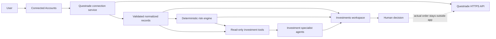
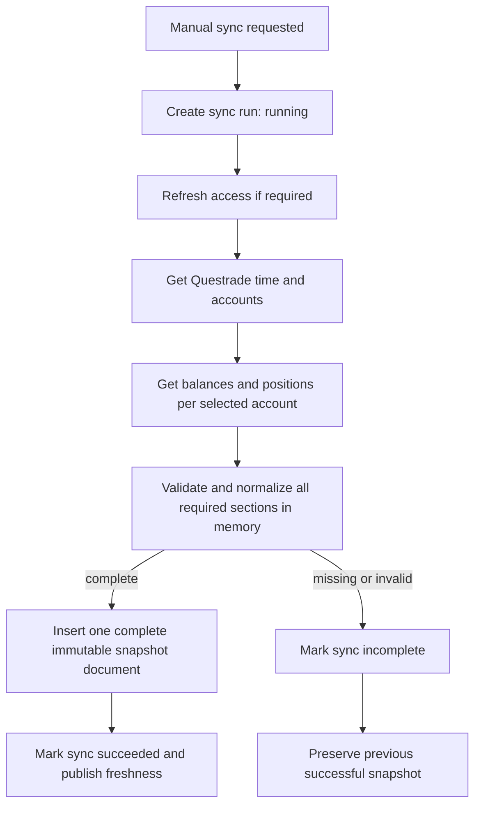

# Questrade Investments Integration Implementation Plan

**Status:** Proposed; no implementation has started

**Created:** 2026-08-14

**Revised:** 2026-08-14 after independent critical review; documentation revision only, with no Questrade implementation started

**Primary decision:** Add Questrade as a separate, read-only Investments domain in the broader operational-intelligence platform. Do not add trade placement, order modification, order cancellation, or autonomous financial action.

**Stage rule:** Every implementation stage ends in a working, testable increment in the user's development app. No later stage may begin until the user completes the stage's hands-on acceptance script and explicitly accepts that gate.

**Review disposition:** The revision accepts the local-server, encryption, identity-lifecycle, snapshot-publication, browser-evidence, provider-card, stage-sizing, dependency, token-recovery, and deletion findings. It does not carry forward the proposed `getSymbol` scope ambiguity because Questrade's current official scope table explicitly assigns `GET symbols/:id` to `read_acc`; Activities remains the one documented account endpoint whose published scope mapping is unclear.

## 1. Practical outcome

The user should be able to connect a personal Questrade margin account and answer five questions confidently:

1. Is Questrade connected, and what read permissions actually work?
2. What does the account currently contain?
3. What changed through trades, dividends, interest, commissions, deposits, withdrawals, and orders?
4. What concentration, currency, and margin risks can be calculated from the latest verified account snapshot?
5. What do specialist agents conclude, which exact snapshot supports that conclusion, and what still needs human judgment?

The first release deliberately stops before trade execution. The app may inspect, calculate, compare, explain, and propose. The user continues placing or changing orders in Questrade.

## 2. Role in the broader platform

### User goal

Help the user understand a real investment account and make better-informed decisions without handing financial authority to an AI agent.

### Product workflow

1. Connect Questrade in **Settings > Connected Accounts**.
2. Verify the connection, permissions, account identity, and last successful access.
3. Open **Investments** to review balances, positions, activity, orders, and data freshness.
4. Create a deterministic risk assessment from one immutable portfolio snapshot.
5. Optionally ask specialist agents to analyze that already-verified evidence.
6. Review the agent team's facts, calculations, assumptions, risks, and possible next actions.
7. Take any actual brokerage action in Questrade, outside this app.

### Agent-team responsibility

- The Questrade adapter retrieves and validates data. It does not reason.
- The deterministic risk engine performs reproducible calculations. It does not recommend trades.
- The Investment Risk Analyst explains risk using one identified snapshot.
- The Investment Research Analyst may research securities using current external sources, while keeping portfolio facts separate from public research.
- The Investment Coordinator synthesizes observed facts, calculations, assumptions, unresolved questions, and options.
- The human user validates financial truth and makes every investment decision.

### Evidence, memory, and validation improved

- Every displayed account state names its retrieval time and freshness.
- Every risk assessment identifies its input snapshot and calculation version.
- Every agent response identifies the portfolio snapshot it used.
- Failed refreshes preserve the last successful evidence instead of replacing it with partial data.
- Historical imports are repeatable and deduplicated.
- Connection changes, refresh attempts, and user acceptance gates create bounded, secret-free evidence.

### What this deliberately does not solve

- It does not place, replace, or cancel orders.
- It does not request Questrade's `trade` scope.
- It does not guarantee real-time market data.
- It does not calculate Questrade's proprietary margin requirements.
- It does not provide tax, legal, or fiduciary advice.
- It does not expose this local single-user app safely to the public internet.
- It does not treat Questrade as the only future brokerage; normalized investment records remain provider-neutral.

## 3. Current starting point verified on 2026-08-14

These claims must be rechecked immediately before each implementation stage because concurrent sessions can change the worktree.

### Existing pieces to reuse

- `client/src/components/SettingsAccountsSection.jsx` provides a useful visual reference, but its implementation is Google-specific. Stage 1 must extract only a provider-neutral card frame and re-verify the existing Google flow rather than treating the current component as directly reusable.
- `client/src/components/Settings.jsx` already loads connected-account status and owns the Settings account workflow.
- `server/src/models/GmailAuth.js` demonstrates `select: false` for token fields so ordinary queries do not return them. This is not encryption and is insufficient by itself for brokerage credentials.
- `server/src/services/gmail.js` demonstrates token refresh, permission projection, account health, and connection repair patterns.
- `server/src/app.js` mounts provider-specific server routes under `/api/*`.
- `stress-testing/slices/connected-services/` and `server/test/connected-services-harness.test.js` provide a controlled external-service-stub pattern.
- `testing/app-capabilities.json`, `testing/check-profiles.json`, and `scripts/run-app-checks.js` provide honest `passed`, `failed`, and `incomplete` verification contracts.
- `server/src/services/agent-tool-capabilities.js` provides server-owned maximum tool permissions for agents. Prompt text alone is not authority.
- `server/src/services/provider-capture-policy.js` defaults normal provider calls to manifest capture, which omits raw request and response bodies.
- `DESIGN.md` requires a compact operational UI and rendered desktop/mobile verification.

### Current gaps

- No Questrade service, route, model, test fixture, client screen, or agent tool exists.
- No Investments route exists in `client/src/lib/appRoute.js`, `client/src/App.jsx`, or `client/src/components/Sidebar.jsx`.
- The app has no general login layer protecting all APIs. CORS, which is the browser's cross-origin request control, is not authentication and currently does not validate the incoming `Host` name. Stage 1 must harden the entire local HTTP and WebSocket boundary before adding the first Questrade route. The first Questrade release must remain loopback-only unless a separate authentication project is approved.
- Stored Gmail tokens are excluded from normal reads but are not an acceptable encryption precedent for brokerage tokens.
- The current testing capability map has no investments capability or focused Investments verification profile.

### Concurrent-work boundary

At planning time, unrelated Apple design research artifacts are untracked under `docs/research/apple-design-systems/`. Questrade work must not modify, delete, stage, or claim ownership of them.

## 4. Current Questrade contract to freeze before implementation

Official Questrade documentation was checked on 2026-08-14. Stage 0 must recheck it because API contracts, permissions, and licensing can change.

### Authorization and security facts

- Questrade uses OAuth 2.0 and documents an authorization-code flow for server-backed applications.
- Questrade also documents a personal-application flow in which the account holder registers an app, generates a refresh token, and redeems it for an access token.
- A token response includes an access token, another refresh token, an expiry duration, and the API server URL that the client must use.
- Authenticated API traffic must use HTTPS.
- Questrade documents a revoke endpoint and manual revocation in API Centre.
- `read_acc` covers account information such as accounts, positions, balances, executions, and orders.
- Questrade's current scope table explicitly includes `GET symbols/:id`, `GET symbols/:id/options`, and `GET markets` under `read_acc`; security classification does not require `read_md` under the current contract.
- `read_md` covers quotes and candles.
- Questrade documents `trade` as partner-only. This project will not request or implement it even if it later becomes available.

Official references:

- [Authorization](https://www.questrade.com/api/documentation/authorization)
- [Security, token exchange, revocation, and scopes](https://www.questrade.com/api/documentation/security)

### Data facts

- Accounts identify the account type, such as Margin, account status, and client account type.
- Balances include per-currency and combined values such as cash, market value, total equity, buying power, maintenance excess, and a real-time flag.
- Positions include quantity, price, market value, average entry price, open and closed profit/loss, total cost, real-time status, and reorganization status.
- Activities include trades, dividends, interest, commissions, and other cash movements. A single activity request may span no more than 31 days.
- The current scope table does not explicitly list the Activities endpoint even though Questrade documents the endpoint. Preflight records Activities as the remaining external-contract ambiguity, and Stage 4 requires a safe live `read_acc` probe before promising activity import.
- Orders and executions expose their own status and timestamps and must not be inferred from position changes.
- Questrade returns rate-limit headers and documents different limits for account and market-data calls.

Official references:

- [Accounts](https://www.questrade.com/api/documentation/rest-operations/account-calls/accounts)
- [Balances](https://www.questrade.com/api/documentation/rest-operations/account-calls/accounts-id-balances)
- [Positions](https://www.questrade.com/api/documentation/rest-operations/account-calls/accounts-id-positions)
- [Activities](https://www.questrade.com/api/documentation/rest-operations/account-calls/accounts-id-activities)
- [Orders](https://www.questrade.com/api/documentation/rest-operations/account-calls/accounts-id-orders)
- [Executions](https://www.questrade.com/api/documentation/rest-operations/account-calls/accounts-id-executions)
- [Rate limiting](https://www.questrade.com/api/documentation/rate-limiting)

### Contract uncertainty rule

If live Questrade behavior disagrees with the documentation:

1. preserve the raw status code and safe structural metadata;
2. do not store or display raw tokens or authorization headers;
3. mark the operation `incomplete`, not successful;
4. preserve the prior successful snapshot;
5. add a focused contract test using a sanitized fixture;
6. update this plan or the implementation documentation before continuing.

## 5. Locked product and engineering decisions

| Decision | Chosen direction | Why |
| --- | --- | --- |
| Initial connection | Personal-application refresh token entered once in the local app | It is the simplest documented flow for one account owner and avoids building a public multi-user callback flow prematurely. |
| Browser OAuth implicit flow | Do not use | It exposes tokens in browser URL fragments and is unnecessary for this server-backed app. |
| Brokerage authority | Read-only | A margin account makes accidental writes materially dangerous; personal apps do not need trade access for the product outcome. |
| Refresh behavior | Server-owned, single-flight token refresh | Prevents two requests from racing with the same refresh credential. |
| Data architecture | Questrade-specific connection adapter plus provider-neutral investment records | Supports another brokerage later without pretending all broker APIs are identical. |
| Initial refresh cadence | Manual refresh only | Makes data provenance and rate use easy to test before background monitoring exists. |
| Historical storage | Normalized, deduplicated data; no unrestricted raw brokerage payload archive | Preserves useful evidence while reducing sensitive-data spread. |
| Monetary values | Decimal-safe representation; never binary floating-point for stored calculations | Avoids rounding drift in financial calculations. |
| Cross-currency totals | Use Questrade's explicitly reported combined balance or show currencies separately | The app must not silently add CAD and USD as if they are the same unit. |
| Risk analysis | Deterministic engine before AI | Reproducible calculations must pass before an LLM explains them. |
| AI portfolio access | Off by default; explicit per-agent/provider consent | Portfolio values sent to a remote model are a separate privacy decision from connecting Questrade. |
| Trade tools | No route, adapter method, handler, prompt tool, or UI control | A missing code path is a stronger safety boundary than a disabled button. |
| Stage progress | User acceptance is a blocking dependency | Tests and builds cannot substitute for the user's rendered dev-app judgment. |

## 6. User-interface contract

### Primary task

Understand the latest trustworthy account state, then inspect risk and changes without losing sight of when the data was observed.

### Stable layout frame

- Add one top-level sidebar route: `#/investments`.
- Use one full-height Investments workspace inside the existing application shell.
- Keep the page header compact and begin the working surface within roughly 150px of the content top.
- Keep the overall workspace frame stable while switching Overview, Positions, Activity, Orders, and Risk views.
- On mobile, view navigation becomes a horizontally scrollable row with a persistent selected state.
- An agent panel may dock beside the workspace only after Stage 6. It must not resize the main frame unpredictably.

### Initially visible

When disconnected:

- direct title;
- one sentence explaining that Questrade is not connected;
- one action leading to **Settings > Connected Accounts**;
- no fake totals or placeholder portfolio cards.

When connected but never synchronized:

- masked account identity;
- connection health;
- `Sync portfolio` as the one primary action;
- no zero values that could be mistaken for real balances.

When synchronized:

- last successful snapshot time and freshness state;
- total equity, maintenance excess, buying power, and cash by currency in one compact summary bar;
- positions table as the main first-viewport working surface;
- the previous snapshot remains visible if a refresh fails, with a clear failure notice.

### Progressive disclosure

- Connection setup reveals the refresh-token field only after the user chooses personal-app connection.
- Technical permission identifiers stay behind a disclosure; plain-English permissions remain visible.
- Detailed calculation definitions stay behind `How this is calculated` disclosures.
- Agent provider/privacy consent appears only when the user first enables an investment agent or changes its provider.
- Destructive actions such as forgetting credentials or deleting history use a stable confirmation dialog and explicit consequences.

### Required interaction states

Every relevant control must have deliberate default, hover, focus-visible, active, selected, disabled, loading, success, warning, and error behavior. All nonessential motion must respect `prefers-reduced-motion`.

## 7. Target architecture



There is intentionally no app-to-Questrade order path.

### Connection sequence

```mermaid
sequenceDiagram
    participant User
    participant Client
    participant Server
    participant DB
    participant Questrade

    User->>Client: Paste personal-app refresh token
    Client->>Server: Connect intent plus token
    Server->>Questrade: Redeem refresh token over HTTPS
    Questrade-->>Server: Access token, new refresh token, API server, expiry
    Server->>Server: Validate token response and API host
    Server->>DB: Encrypt and persist rotated credentials
    Server->>Questrade: GET time and accounts
    Questrade-->>Server: Verified account metadata
    Server->>DB: Save masked account health
    Server-->>Client: Connected status only; no secret fields
    Client-->>User: Connected, permissions, masked account, last access
```

### Snapshot sequence



## 8. Security and privacy design

### Protected assets

- Questrade refresh and access tokens
- full brokerage account number
- positions, balances, activity, orders, and executions
- derived risk assessments
- agent prompts and outputs containing portfolio values
- encryption keys

### Required controls

#### Credential encryption

- Questrade remains an optional integration, so the app may run without `QUESTRADE_TOKEN_ENCRYPTION_KEY` when no Questrade connection exists.
- `QUESTRADE_TOKEN_ENCRYPTION_KEY` is required before establishing, reauthorizing, or using a Questrade connection and before storing a full external account number.
- Use Node's `crypto` module with AES-256-GCM, which both encrypts and detects tampering.
- Store ciphertext, initialization vector, authentication tag, and key version in separate fields.
- Mark encrypted secret fields `select: false` as a second defensive layer.
- There is no plaintext fallback in development, recovery, fixture, or error paths. A missing or invalid key refuses the operation before any token or full account number is written.
- Never store the encryption key in MongoDB, client code, Git, test artifacts, or normal logs.
- If credentials exist but the key is missing or wrong, return `locked` health. Do not delete or overwrite the stored record.
- Tests use a fixed synthetic key. Live keys never enter test fixtures.

#### Account identity protection

- Store the full external account number only in an encrypted field.
- Generate a random opaque `accountKey` when the account is first discovered. This identifier is permanent for the local record and is never derived from an encryption key.
- Reconnect matching may decrypt and compare the small bounded set of stored account identities inside the server, or use a separate versioned keyed fingerprint. Any fingerprint is a lookup aid only; it is never the join key for snapshots, history, assessments, or alerts.
- Encryption-key or fingerprint-key rotation must leave `accountKey` unchanged and must prove that all existing financial history remains reachable.
- Return only the internal key, account type, status, and masked last four digits to the browser.
- Never put a raw account number in a route URL, log line, agent prompt, audit summary, screenshot name, or export filename.

#### Network destination control

- Token and revoke requests use fixed Questrade login endpoints.
- The API server returned by Questrade must use `https:` and match an exact approved Questrade API hostname pattern.
- Reject credentials in URLs, unexpected ports, redirects to another host, IP literals, localhost, and private-network addresses.
- Disable automatic cross-host redirects for authenticated brokerage requests.
- Use the access token only in the `Authorization: Bearer` header, never a query string.
- Define an explicit allowlist of Questrade paths and HTTP methods. Authenticated account data permits `GET` only.

#### Browser-to-local-server protection

- Add one shared incoming-host policy that parses and allows only the configured local server port with `localhost`, `127.0.0.1`, or `[::1]` as appropriate. Reject malformed, missing where required, external, rebinding, and unexpected-port hosts before protected request handling.
- Apply the same policy to Express HTTP requests, realtime WebSocket upgrades, and Live Call Assist WebSocket upgrades. Express middleware alone is not sufficient.
- Continue origin checks as a supporting browser control, but do not treat CORS or a missing `Origin` header as authentication.
- Add explicit DNS-rebinding tests, which simulate a visited website trying to address the local server through an attacker-controlled hostname, for both HTTP and WebSocket paths.
- Sensitive mutations require JSON, a custom intent header, and a short-lived server-issued action intent.
- Connect, reauthorize, disconnect, forget-local-credentials, and delete-history intents are action-specific and expire quickly.
- The strengthened local boundary blocks ordinary cross-site and DNS-rebinding browser access, but it does not protect against malware already running as the same Windows user or a local process able to forge allowed request headers. State this plainly in documentation.
- Public or LAN deployment is blocked until a separate application-authentication design is approved and tested.

#### Secret-safe errors and observability

- Never interpolate a token, authorization header, response body, account number, or encryption error detail into user-visible or console errors.
- Central logs may record request ID, operation, status code, duration, safe provider error code, retry decision, and rate-limit metadata.
- Sanitization tests must search serialized API responses, logs, sync evidence, and agent evidence for fixture secrets.
- Questrade HTTP payloads are not model-provider packages and must not enter the provider payload store.

#### Agent privacy

- Investment data sharing with AI providers is disabled by default.
- Enabling it names the provider, model, fields shared, storage policy, and whether the provider is local or remote.
- Agent context excludes credentials, full account number, usernames, Questrade user IDs, order IDs unless specifically needed, and unrestricted activity descriptions.
- Live financial data must never use diagnostic/evaluation rich capture. Evaluations use synthetic fixtures only.
- Normal calls use manifest capture. The validated agent response may be retained as product evidence, but raw model request bodies and unrestricted response bodies remain omitted.

### Threat and control matrix

| Threat | Required behavior | Proof |
| --- | --- | --- |
| Token returned to browser | Response serializer has no secret field | Route and secret-scan tests |
| Token stored in plaintext | AES-GCM ciphertext differs from input; decryption requires server key | Crypto and Mongo model tests |
| Connect attempted without an encryption key | Refuse before any credential or full account number is written | Missing-key route and database no-write test |
| Two simultaneous refreshes | One refresh request runs; waiters reuse the result | Concurrency test |
| Malicious `api_server` response | Connection is rejected before an outbound request | Host-validation test |
| Visited website targets the local server through DNS rebinding | HTTP request and WebSocket upgrade are rejected on incoming Host mismatch | Express and upgrade-handler host-policy tests |
| Refresh succeeds but DB save fails | Retry the bounded DB write; then show reauthorization required without claiming success | Failure-injection test |
| Partial balance/position response | New snapshot is not inserted or selected as latest | Complete single-document snapshot publication test |
| Encryption or lookup-fingerprint key rotates | Stable `accountKey` and all related history remain reachable | Key-rotation identity-stability test |
| Rate limit | Preserve prior snapshot and show exact safe retry time | 429 fixture and UI test |
| Stale data mistaken as current | Exact age and `isRealTime` state remain visible | Component and browser gate |
| Multiple currencies silently combined | Currency remains attached to every value | Normalizer and UI tests |
| Agent invents portfolio facts | Output validator requires snapshot references and separates facts from assumptions | Agent harness tests |
| Trade path accidentally appears | Source inventory rejects write methods and forbidden tool names | Static contract test |
| Development fixture enabled in production | App refuses startup or omits the fixture routes | Environment gate test |

## 9. Data model

All collection names and exact field lengths must be finalized against current repository conventions immediately before implementation.

### `QuestradeConnection`

Purpose: one local owner's provider-specific connection and safe health metadata.

Key fields:

- `schemaVersion`
- `ownerKey` with initial value `local-owner`
- `provider` fixed to `questrade`
- `status`: `disconnected`, `connecting`, `connected`, `degraded`, `reauthorization-required`, `revocation-pending`, or `locked`
- encrypted access token fields: ciphertext, IV, tag, key version
- encrypted refresh token fields: ciphertext, IV, tag, key version
- `accessTokenExpiresAt`
- validated `apiServerOrigin` and API base path
- evidence-backed granted scopes
- `connectedAt`, `lastTokenRefreshAt`, `lastSuccessfulAccessAt`
- `lastFailureAt`, sanitized `lastFailureCode`
- `revocationRequestedAt`, `revocationConfirmedAt`
- optimistic `credentialVersion`

Indexes:

- unique `{ ownerKey, provider }`
- status and last-success index only if a future health monitor needs it

Rules:

- secret fields are never returned by default;
- connection serializers are allowlists, not object spreads;
- a credential update writes access token, refresh token, expiry, API host, and version together;
- no token history is retained.

### `InvestmentAccount`

Purpose: provider-neutral account identity and selection without exposing the external account number.

Key fields:

- `schemaVersion`
- `provider`
- `ownerKey`
- random opaque `accountKey`, generated once and stable across reconnects and key rotation
- encrypted external account number
- optional versioned account-match fingerprint used only for server-side reconnect lookup, never as a cross-collection identity
- `maskedNumber`
- `accountType`, such as Margin
- `clientAccountType`
- `status`
- `isPrimary`, `isBilling`
- `selectedForSync`
- `firstSeenAt`, `lastSeenAt`, `lastSuccessfulSyncAt`

Indexes:

- unique `{ provider, ownerKey, accountKey }`
- `{ ownerKey, selectedForSync }`

### `InvestmentSyncRun`

Purpose: prove what each refresh attempted and whether it was complete.

Key fields:

- `runId`, `requestId`, `provider`, `accountKey`
- `trigger`: `manual`, `history-backfill`, or later `scheduled`
- `status`: `running`, `succeeded`, `failed`, `incomplete`, `cancelled`
- start and completion timestamps
- safe operation steps with status and count, never payload bodies
- Questrade server time when available
- rate-limit remaining/reset metadata
- sanitized failure code and recovery action
- published snapshot ID and hash when successful
- prior snapshot ID preserved on failure

### `PortfolioSnapshot`

Purpose: immutable account state used by the UI, calculations, and agents.

Key fields:

- `snapshotId`, `schemaVersion`, `provider`, `accountKey`
- `observedAt` from Questrade time and `fetchedAt` from this server
- `sourceIsRealTime` plus per-section/per-position flags when they disagree
- `sourceResponseHash` over canonical normalized data, not raw secret-bearing traffic
- per-currency balances
- Questrade-provided combined balances, clearly identified as provider values
- positions with symbol, symbol ID, quantities, price, entry price, value, cost, P/L, real-time state, and reorganization state
- normalization version
- `complete: true`; incomplete snapshots are never published

Publication contract:

- Retrieve, normalize, and validate every required section in memory before writing the snapshot.
- Insert one complete immutable snapshot document. A single-document insert is the atomic publication boundary; Stage 3A does not require a multi-document MongoDB transaction or replica-set test harness.
- Determine the latest snapshot by querying complete snapshots through the descending account/time index. Do not create a separately updated `latest` pointer that could disagree with the snapshot insert.
- Update the associated sync-run result after insertion using a retryable, idempotent finalization step. If that secondary update fails, reconciliation must repair the run evidence without duplicating or hiding the already-complete snapshot.

Money representation:

- Persist financial values with Mongo `Decimal128` or canonical decimal strings.
- Use one reviewed decimal arithmetic library for calculations.
- Serialize values as decimal strings at the server boundary and format them in the client.
- Do not convert missing values to zero.

Indexes:

- unique `snapshotId`
- unique `{ accountKey, observedAt, sourceResponseHash }`
- descending `{ accountKey, observedAt }`

Retention:

- No automatic deletion in the first release.
- Stage 3A adds a minimal user-facing deletion action when local snapshots first exist. Each later data-producing stage extends the same bounded deletion service to the records that stage introduces.
- Stage 8 adds polished export, complete record-count previews, recovery reporting, and final deletion audit rather than delaying all removal capability until the end.
- Do not add a silent TTL to financial history.

### `BrokerageActivity`

Purpose: normalized trades, dividends, interest, commissions, deposits, withdrawals, and other activity.

Key fields:

- `activityKey` derived from a canonical provider/account/date/type/symbol/amount identity
- provider and account key
- trade, transaction, and settlement timestamps in UTC while preserving source offset metadata
- action, type, symbol, symbol ID, sanitized description
- currency, quantity, price, gross amount, commission, net amount
- import run ID and source window
- first and last observed timestamps

Indexes:

- unique `{ provider, accountKey, activityKey }`
- `{ accountKey, transactionDate }`
- `{ accountKey, symbol, transactionDate }`

### `BrokerageOrder` and `BrokerageExecution`

Purpose: preserve order intent/status separately from actual executions.

Rules:

- Use provider IDs only inside the server; return opaque internal IDs to the browser unless the user explicitly asks to inspect a broker ID.
- Upsert orders by provider order identity and update time.
- Upsert executions by provider execution identity.
- Never derive an execution from an order status or position delta.

### `InvestmentRiskAssessment`

Purpose: a reproducible calculation package, not an AI opinion.

Key fields:

- `assessmentId`
- referenced snapshot ID and hash
- risk-engine version and calculation timestamp
- per-currency exposure metrics
- concentration metrics
- Questrade-reported buying power and maintenance excess
- app-calculated ratios, each with a formula identifier
- scenario inputs, excluded positions, warnings, and outputs
- completeness state

### `InvestmentAlert` (Stage 7 only)

Purpose: durable, deduplicated attention item for a user-defined threshold or connection failure.

Key fields:

- alert type, account key, threshold policy version
- triggering snapshot/assessment IDs
- observed value, threshold, first/last seen
- status: open, acknowledged, resolved
- dedupe key and resolution evidence

## 10. Server boundaries and API contracts

### Planned server modules

- `server/src/models/QuestradeConnection.js`
- `server/src/models/InvestmentAccount.js`
- `server/src/models/InvestmentSyncRun.js`
- `server/src/models/PortfolioSnapshot.js`
- `server/src/models/BrokerageActivity.js`
- `server/src/models/BrokerageOrder.js`
- `server/src/models/BrokerageExecution.js`
- `server/src/models/InvestmentRiskAssessment.js`
- `server/src/models/InvestmentAlert.js` in Stage 7
- `server/src/lib/field-encryption.js`
- `server/src/lib/local-request-host-policy.js` for the app-wide incoming HTTP and WebSocket boundary
- `server/src/lib/questrade-api-host-policy.js` for Questrade's outbound `api_server` destination
- `server/src/services/questrade/transport.js`
- `server/src/services/questrade/token-service.js`
- `server/src/services/questrade/normalizers.js`
- `server/src/services/questrade/fixture-adapter.js`
- `server/src/services/investment-sync-service.js`
- `server/src/services/investment-history-service.js`
- `server/src/services/investment-risk-engine.js`
- `server/src/routes/questrade.js`
- `server/src/routes/investments.js`

Use CommonJS throughout the server.

### Connection endpoints

| Method and path | Purpose | Important response fields |
| --- | --- | --- |
| `GET /api/questrade/connection` | Connection and permission health | Status, configured, permissions, masked accounts, last success/failure; never tokens |
| `POST /api/questrade/connection/intent` | Create short-lived intent for a sensitive action | Intent ID, action, expiry |
| `POST /api/questrade/connection` | Redeem a newly generated personal refresh token and verify accounts | Connected status and masked accounts |
| `POST /api/questrade/connection/reauthorize` | Replace a revoked/broken credential without deleting history | Repaired status and masked accounts |
| `POST /api/questrade/connection/disconnect` | Revoke Questrade authorization and disable local use | Revocation-confirmed or truthful revocation-pending result |
| `POST /api/questrade/connection/forget-local` | Remove local credentials after explicit warning when remote revocation cannot be confirmed | Local removal result plus manual Questrade revocation instruction |

Do not use a generic `/proxy` endpoint.

### Investment endpoints

| Method and path | Purpose |
| --- | --- |
| `GET /api/investments/accounts` | List masked connected investment accounts and selection state |
| `POST /api/investments/accounts/:accountKey/sync` | Perform one manual, read-only complete snapshot sync |
| `GET /api/investments/accounts/:accountKey/snapshots/latest` | Return latest complete snapshot and freshness |
| `GET /api/investments/accounts/:accountKey/snapshots` | Return bounded historical snapshot summaries |
| `POST /api/investments/accounts/:accountKey/history-imports` | Start bounded 31-day-chunk activity/order/execution import |
| `GET /api/investments/history-imports/:runId` | Read import progress and outcome |
| `POST /api/investments/history-imports/:runId/cancel` | Stop after the current safe read completes |
| `GET /api/investments/accounts/:accountKey/activities` | Filter normalized activity |
| `GET /api/investments/accounts/:accountKey/orders` | Filter orders by date/status |
| `GET /api/investments/accounts/:accountKey/executions` | Filter actual executions |
| `POST /api/investments/accounts/:accountKey/risk-assessments` | Calculate a deterministic assessment from an exact snapshot |
| `GET /api/investments/risk-assessments/:assessmentId` | Read the immutable assessment and formulas |
| `POST /api/investments/local-data/deletion-intent` | Create an exact, short-lived intent for the currently implemented local investment record types |
| `POST /api/investments/local-data/delete` | Delete only the confirmed local investment-domain records and report exact deleted/remaining counts |

### Forbidden endpoint and method contract

A focused test must fail if any Questrade integration code contains or registers:

- authenticated `POST`, `PUT`, `PATCH`, or `DELETE` calls to `/accounts/*/orders*`;
- `trade` in requested scopes;
- tool names such as `investments.placeOrder`, `investments.cancelOrder`, or equivalent aliases;
- a generic user-controlled Questrade URL or path;
- a client control whose accessible name implies order execution.

Token redemption and revocation are the only Questrade-hosted POST operations permitted.

### Standard error codes

- `QUESTRADE_NOT_CONFIGURED`
- `QUESTRADE_NOT_CONNECTED`
- `QUESTRADE_CONNECTION_LOCKED`
- `QUESTRADE_REAUTHORIZATION_REQUIRED`
- `QUESTRADE_PERMISSION_MISSING`
- `QUESTRADE_INVALID_API_SERVER`
- `QUESTRADE_INVALID_RESPONSE`
- `QUESTRADE_RATE_LIMITED`
- `QUESTRADE_SERVICE_UNAVAILABLE`
- `QUESTRADE_REVOCATION_UNCONFIRMED`
- `INVESTMENT_ACCOUNT_NOT_FOUND`
- `INVESTMENT_SYNC_INCOMPLETE`
- `INVESTMENT_SNAPSHOT_STALE`
- `INVESTMENT_HISTORY_IMPORT_INCOMPLETE`
- `INVESTMENT_AI_CONSENT_REQUIRED`

All failures use the project's `{ ok: false, code, error }` response shape. Messages explain what happened, what was preserved, and what the user should do next.

## 11. Questrade transport contract

### Allowed operations

The transport exports named operations rather than a general request method:

- `redeemRefreshToken`
- `revokeToken`
- `getServerTime`
- `getAccounts`
- `getBalances`
- `getPositions`
- `getSymbol` for risk-safe security classification under Questrade's currently documented `read_acc` mapping
- `getActivities`
- `getOrders`
- `getExecutions`
- later `getQuote` and `getCandles` only if `read_md` is approved

### Timeouts and retry behavior

- Every outbound call uses `AbortController` with a bounded timeout.
- Retry an idempotent GET at most once for a short transient network failure or selected 5xx response.
- Do not blindly retry 401/403, validation errors, or revocation.
- For 429, honor Questrade's reset metadata. If the safe wait is short, one delayed retry may occur; otherwise return the exact retry time.
- The complete sync has one total deadline so multiple endpoint calls cannot each consume a full independent timeout.
- Cancellation stops before the next outbound call; it does not pretend to undo a completed read.

### Token refresh concurrency

- Use a per-connection single-flight promise so simultaneous callers share one refresh.
- Use optimistic credential versioning when storing the returned token pair.
- Persist the new refresh token immediately with the access token, expiry, and API server.
- If the remote exchange succeeds but durable storage repeatedly fails, disable further calls and require reauthorization. Do not claim the old refresh token is still usable.
- Questrade refresh tokens are single-use. A process or machine crash in the unavoidable interval after Questrade accepts the old token but before the replacement is durably saved can break the connection and require the user to generate a new token. Stage 2 must document and simulate this recovery path rather than claiming it can be eliminated.

### Response validation

- Validate required top-level arrays/objects and primitive field types before normalization.
- Preserve unknown harmless fields only in a field-name inventory, not as a raw payload archive.
- Reject impossible currency identifiers, invalid dates, non-finite numbers, or missing account identities.
- Allow legitimate zero, negative cash, negative position quantity, and negative P/L values.
- Treat missing as unknown, not zero.

## 12. Development fixture system

The user must be able to test dangerous and rare states without manipulating the real brokerage account.

### Isolation

- Extend the existing connected-services harness gate instead of creating an unrelated stub framework.
- Fixture mode requires all of:
  - non-production environment;
  - `ENABLE_DEV_MODE=true`;
  - explicit `QUESTRADE_DEV_FIXTURES=1`;
  - registered harness fixture adapter.
- Production startup must refuse fixture mode.
- Fixture controls are rendered only in Developer Tools when the server reports fixture availability.
- A visible `Simulated Questrade data` label appears on every Investments screen in fixture mode.
- Fixture records use unmistakable account masks and symbols and can never coexist with live credentials in one connection record.

### Required fixture scenarios

1. `not-configured`
2. `disconnected`
3. `healthy-margin-cad-usd`
4. `two-accounts-one-selected`
5. `empty-portfolio`
6. `short-position-and-negative-cash`
7. `not-real-time`
8. `permission-missing-read-md`
9. `token-expired-refresh-success`
10. `token-expired-refresh-failure`
11. `refresh-accepted-crash-before-save`
12. `credential-key-mismatch`
13. `malicious-api-server`
14. `revocation-unavailable`
15. `rate-limited`
16. `service-unavailable-preserve-prior`
17. `partial-balances-response`
18. `partial-positions-response`
19. `history-with-duplicates`
20. `history-import-cancel-resume`
21. `high-concentration`
22. `margin-pressure`
23. `resolved-alert`

Each fixture has a version, expected normalized counts, and a safe secret canary used by leakage tests. Relevant fixtures may carry hand-calculated risk expectations from the beginning as test-first reference data, but those expectations are marked `pending-stage-5` and do not count as passing evidence for Stages 1 through 4. Stage 5 reviews, versions, and activates them against the approved formula contract.

## 13. Testing and verification strategy

### Testing vocabulary

- **Unit test:** checks one calculation or security decision.
- **Server integration test:** checks real server routes/models together while Questrade is replaced with controlled fixtures.
- **Component test:** renders React UI in a simulated browser and checks visible behavior.
- **Stress slice:** checks the complete connected-service path in an isolated app instance.
- **Rendered browser gate:** checks the actual dev app on desktop and mobile.
- **Live contract check:** a user-authorized call to the user's Questrade account. It is never part of normal automated tests.

### Capability map additions

Add the following capabilities to `testing/app-capabilities.json` as their stages land:

- `questrade-connection-safety`
- `investment-portfolio-snapshot`
- `investment-history`
- `investment-margin-risk`
- `investment-agent-analysis`
- `investment-monitoring`

Each capability names its source paths, required evidence types, current evidence, and known gaps. A static map may prove evidence is mapped, but only a completed run may claim it passed.

### Focused check profile

Add an `investments` profile to `testing/check-profiles.json` and `npm run verify:investments` to the root package scripts. The profile grows stage by stage but never drops a previously required group.

Expected final groups:

- focused Questrade server tests;
- focused Investments client tests;
- connected-services harness contracts;
- deterministic Investments service/snapshot stress slice that does not depend on a real browser;
- a separately reported automated Investments browser journey when the transport is available;
- testing-map validation;
- client production build;
- automated browser evidence reported as `incomplete` with the exact inherited transport reason if it cannot run.

`verify:investments` must report the deterministic and automated-browser lanes separately. A stage may advance to manual user acceptance when every stage-owned deterministic group passes and the only incomplete automated item is the named pre-existing browser-transport problem. That exception does not convert the automated browser result to passed, does not excuse a Questrade-specific browser failure, and does not replace the user's required rendered acceptance.

### Core server tests

- encryption/decryption and tamper rejection;
- secret fields excluded by default;
- API host and redirect validation;
- token rotation single-flight and optimistic versioning;
- response normalization for zero, negative, missing, and multiple-currency values;
- decimal-safe calculations;
- complete single-document snapshot publication, sync-run reconciliation, and prior-snapshot preservation;
- activity 31-day chunk boundaries and idempotent deduplication;
- order/execution separation;
- rate-limit and timeout mapping;
- disconnect and revocation-pending behavior;
- API serializers never expose secrets or raw account numbers;
- forbidden trade path inventory;
- fixture mode cannot activate in production.

### Core client tests

- disconnected, configuring, connected, degraded, locked, and reauthorization states;
- secret field clears after submission and never displays a stored value;
- permission labels are based on server evidence;
- stable prior snapshot remains visible after refresh failure;
- currency formatting and unknown-value behavior;
- loading, empty, warning, error, and success states;
- history import progress/cancel/resume;
- deterministic risk formula disclosures;
- stale and non-real-time warnings;
- agent consent and snapshot-reference display;
- keyboard, focus-visible, accessible names, and reduced-motion behavior.

### Rendered acceptance and automated browser evidence

Every user-facing stage has two separate evidence lanes.

#### Manual rendered acceptance — always gating

The user completes the numbered dev-app script and:

- checks a typical laptop viewport;
- checks a 390px mobile viewport;
- keyboard-navigates the changed flow;
- checks horizontal overflow and clipped content;
- checks the browser console;
- checks Network response previews for secret-free responses;
- records the exact fixture scenario or masked live account state;
- explicitly accepts or rejects the rendered result.

This is the required product gate. Source review, component tests, a production build, or an automated browser failure cannot substitute for it.

#### Automated browser evidence — attempted and reported separately

- Recheck `agent-browser` availability and a static known-good page at Gate 1 instead of copying the existing repository gap forward without a fresh attempt.
- When available, capture laptop/mobile screenshots and run the automated Investments journey.
- If the existing transport problem recurs, record the exact `incomplete` result in the capability map and stage handoff as an inherited automation gap.
- An inherited transport gap may be covered for stage progression by the user's completed equivalent manual script. A failure that reaches the Questrade UI and finds incorrect behavior is a stage failure, not an inherited gap.
- Final release still requires accepted manual desktop/mobile rendering even if automated browser evidence remains incomplete.

## 14. Blocking stage protocol

### Statuses

Each implementation stage uses exactly these statuses:

1. `not-started`
2. `implementation-in-progress`
3. `technical-verification-passed`
4. `ready-for-user-test`
5. `user-rejected`
6. `user-accepted`

Only `user-accepted` unlocks the next stage.

`technical-verification-passed` means every deterministic check owned by that stage passed. An automated browser group may remain separately `incomplete` only for the freshly reproduced repository-level transport problem described above; the stage cannot reach `user-accepted` until the user completes the equivalent rendered dev-app script. Any Questrade-specific browser failure keeps the stage in progress or rejected.

### Visible stage ledger

This table is updated immediately when a gate changes state so the plan never appears stuck on an already completed stage.

| Gate | Increment | Initial status | Acceptance evidence |
| --- | --- | --- | --- |
| 0 | Account, scope, retention, privacy, and no-trade decisions | `not-started` | User decision record; no live secret captured |
| 1 | Development fixtures and Connected Accounts shell | `not-started` | Automated checks plus desktop/mobile dev-app script |
| 2 | Live connection, token refresh, repair, and revoke | `not-started` | Live connect/reload/reauthorize/revoke/reconnect script |
| 3A | Snapshot engine and visible reconciliation workbench | `not-started` | Fixture/partial-failure reconciliation, live comparison, and local-data deletion in the dev app |
| 3B | Investments workspace | `not-started` | Accepted desktop/mobile portfolio workspace using the Stage 3A snapshot contract |
| 4 | Activities, orders, executions, and history import | `not-started` | Duplicate/resume fixtures plus live activity comparison |
| 5 | Deterministic margin and risk calculations | `not-started` | Hand-calculated fixtures plus selected live arithmetic |
| 6 | Read-only investment agent team | `not-started` | Privacy consent, behavior harness, and one controlled live analysis |
| 7 | Opt-in monitoring and Attention integration | `not-started` | Threshold lifecycle, disable proof, and user-owned startup/shutdown |
| 8 | Recovery, export, deletion, and release | `not-started` | Complete desktop/mobile workflow and final release decision |

### Required stage handoff

Before asking the user to test, the implementation agent supplies:

- the stage goal in one sentence;
- the exact commit and branch;
- changed user-visible behavior;
- automated commands and outcomes;
- the exact dev-app route;
- any user-owned restart or environment change required;
- a numbered manual test script;
- expected result after every action;
- desktop and mobile screenshots when browser automation is available, or the user's manual rendered observations when it is not;
- deterministic verification and automated-browser status reported as separate evidence lanes;
- browser console result;
- known limitations that remain intentionally deferred;
- a clear statement that no later stage work has started.

### User acceptance format

The user responds with either:

- `Gate N accepted`, or
- `Gate N rejected: <what failed or felt wrong>`.

A rejection keeps work inside the same stage. Fixes are tested and the same gate is presented again. The visible plan status is updated immediately after every accepted gate.

### Git boundary

- Each stage is independently reviewable.
- Stage files are selectively staged; unrelated worktree changes are preserved.
- The accepted stage is committed and pushed before the next stage begins.
- Rejected work is not hidden by starting later-stage code.

## 15. Preflight Gate 0 — Decisions and account readiness

This is the only gate that is not an implementation increment. It prevents coding against the wrong account or privacy contract. Every numbered implementation stage after it is fully testable in the dev app.

### Goal

Confirm that the user has the credentials and accepts the storage/privacy boundaries.

### Work

1. Recheck official Questrade authorization, security, scopes, activity window, rate limits, and license links. Confirm that `GET symbols/:id` remains under `read_acc`; treat Activities—not symbol lookup—as the current scope ambiguity.
2. Confirm the user can see **API Centre > Personal applications** and generate a personal-app refresh token.
3. Confirm the account type displayed by Questrade is Margin.
4. Confirm recommended scope choice: `read_acc`; `read_md` remains optional and deferred until needed.
5. Confirm with Questrade documentation/support or a bounded live probe whether `read_acc` permits the Activities endpoint; do not infer this from the endpoint's existence.
6. Confirm normalized snapshots/history remain local until explicitly deleted.
7. Confirm no trade functionality.
8. Confirm investment data will not be sent to any AI provider until Stage 6 and separate consent.
9. Confirm the app remains loopback-only.
10. Confirm the user will enter all live secrets directly into the local app, never chat or source code.
11. Confirm the app may run with Questrade disabled, but a configured encryption key is mandatory before any live connection or account identity is stored.

### Gate 0 acceptance criteria

- Personal application access is available.
- The user accepts read-only scope, local retention, and no trading.
- Any required license agreement is reviewed by the user.
- No live token is copied into a planning document, issue, commit, or chat.

## 16. Stage 1 — Safe fixture foundation and Connected Accounts shell

### User-visible outcome

The dev app can show and safely exercise all Questrade connection states using simulated data. It cannot contact live Questrade yet.

### Implementation

1. Add field-encryption helpers and tests.
2. Add the shared incoming local-host policy and enforce it across Express, realtime WebSocket upgrades, and Live Call Assist WebSocket upgrades before the first Questrade route is registered.
3. Add the separate outbound Questrade API-host policy; do not reuse incoming-host rules for provider destinations.
4. Add the minimal `QuestradeConnection` model and safe serializer.
5. Extend connected-service harness stubs with Questrade fixtures.
6. Add `GET /api/questrade/connection` using the fixture adapter only.
7. Add dev-only scenario selection in Settings > Developer Tools.
8. Extract a small provider-neutral connected-account card frame from `SettingsAccountsSection.jsx`. Keep Google and Questrade bodies provider-specific and re-verify Google behavior and rendering.
9. Add the Questrade card and show configured, disconnected, connected, degraded, locked, permission, last-access, and simulated-data states.
10. Add secret-leak canaries and a forbidden-production-fixture test.
11. Add `questrade-connection-safety` to the testing capability map.
12. Introduce `verify:investments` with Stage 1 deterministic checks plus a separately reported automated-browser attempt.

### Automated verification

- crypto and tamper tests pass;
- incoming Host policy rejects DNS-rebinding, external-host, malformed-host, unexpected-port, and no-Host protected requests across HTTP and both WebSocket upgrade paths while accepting the configured IPv4/IPv6/localhost development paths;
- outbound Questrade host policy rejects malicious provider destinations;
- serializers exclude all fixture secret canaries;
- fixture route contract passes;
- Questrade settings component tests pass;
- existing Google Connected Accounts component tests pass after the shared-frame extraction;
- existing core HTTP, realtime WebSocket, and Live Call Assist WebSocket tests pass with explicit accepted local hosts because the incoming-host policy changes an app-wide boundary;
- testing-map validation passes;
- client build passes;
- `npm run verify:investments` reaches a truthful deterministic verdict and reports the automated-browser lane separately;
- `npm run verify:core` passes before Gate 1 is offered to the user.

### User dev-app acceptance script — Gate 1

Prerequisite: the user enables the documented development fixture flags and restarts their own server.

1. Open **Settings > Connected Accounts** and review Google before testing Questrade.
   - Expected: Google retains its prior identity, connection state, account defaults, permission health, and actions; Questrade appears as a separate provider without duplicating Google-specific controls.
2. Select the `disconnected` fixture in Developer Tools.
   - Expected: Questrade says not connected and provides one clear next action.
3. Select `healthy-margin-cad-usd`.
   - Expected: status becomes Connected, account number is masked, and plain-English read permissions are visible.
4. Select `token-expired-refresh-failure`.
   - Expected: status says reauthorization is required; it does not claim the account is disconnected or erase prior health metadata.
5. Select `malicious-api-server`.
   - Expected: connection is blocked with a safe error and no outbound request to the supplied host.
6. Select `locked` by using the provided wrong-key fixture.
   - Expected: credentials are described as locked; the UI does not delete them or expose decryption details.
7. Reload the page after each state.
   - Expected: the selected fixture state is stable and never flickers through a false Connected claim.
8. Repeat at 390px width and keyboard-navigate all Questrade controls.
   - Expected: no horizontal overflow, clipped controls, hover dependency, or missing focus indicator.
9. Open browser console and Network response previews.
   - Expected: no console errors, token canary, raw account number, or authorization header.

### Gate 1 blocks Stage 2 until

- the user accepts every connection state and the desktop/mobile presentation;
- all Stage 1 deterministic checks pass;
- the automated browser attempt has either passed or has one freshly reproduced inherited transport gap covered by the completed manual rendered script;
- Google Connected Accounts behavior is proven unchanged;
- fixture mode is proven unavailable in production.

## 17. Stage 2 — Live personal-app connection, refresh, repair, and revoke

### User-visible outcome

The user can connect the real Questrade personal application, verify the Margin account, survive token refresh, reauthorize, and disconnect without exposing credentials.

### Implementation

1. Add the live token and revoke transport with fixed endpoints.
2. Add single-flight token refresh and atomic credential rotation.
3. Add short-lived sensitive-action intents.
4. Add live connect, reauthorize, disconnect, retry-revocation, and forget-local routes.
5. Add one-time refresh-token entry with progressive disclosure.
6. Refuse connection or reauthorization before any provider call or database write when `QUESTRADE_TOKEN_ENCRYPTION_KEY` is missing or invalid; there is no plaintext fallback.
7. Clear the client input immediately after submission.
8. Fetch Questrade time and accounts after durable token storage.
9. Generate a random stable `accountKey` for each newly discovered account, then save the full account number encrypted and expose only masked metadata. Reauthorization and reconnect must reuse the existing stable key.
10. Translate returned scopes into plain-English permissions without hard-coding a successful grant.
11. Handle 401/403, locked credentials, invalid server, invalid response, timeout, revocation-pending, and refresh-accepted-before-save crash-recovery states.
12. Add secret-safe connection audit summaries.
13. Document `QUESTRADE_TOKEN_ENCRYPTION_KEY` in `server/.env.example` without a real value and state that it is required only when establishing or using Questrade.
14. Document the single-use refresh-token crash window in the Stage 2 user handoff, with exact manual reauthorization steps.

### Automated verification

- token response validation and host allowlist pass;
- connecting without an encryption key returns `QUESTRADE_NOT_CONFIGURED` before any token exchange or database write;
- simultaneous access requests cause one refresh;
- rotated tokens are written together;
- persistence failure never returns Connected;
- the crash-after-remote-acceptance fixture requires reauthorization and never claims the old refresh token remains valid;
- reauthorization and encryption-key rotation preparation preserve the random `accountKey` and existing account references;
- every connection endpoint passes secret-scanning tests;
- disconnect truthfully distinguishes confirmed, already revoked, and unconfirmed revocation;
- no account number appears in URLs or API responses;
- fixture and live adapters cannot be active simultaneously.

### User dev-app acceptance script — Gate 2

The user performs all live Questrade actions. The implementation agent never asks for or handles the token.

1. Generate a new personal-application refresh token in Questrade API Centre.
2. Open **Settings > Connected Accounts > Questrade > Connect personal app**.
3. Paste the token into the masked field and choose Connect.
   - Expected: the field clears immediately; the UI moves through Connecting to Connected.
4. Verify the displayed account type is Margin and the last four digits match the intended account.
5. Verify the permissions shown are read-only.
6. Reload Settings and then restart the user-owned server.
   - Expected: connection persists without re-entering the token.
7. Trigger multiple read-status requests using the provided dev test action after token expiry is simulated.
   - Expected: one refresh occurs and all requests recover.
8. Exercise `refresh-accepted-crash-before-save`.
   - Expected: the UI explains that Questrade accepted the one-time token but the replacement was not safely stored, and instructs the user to generate a new token; it does not retry the invalid old token or call the connection healthy.
9. Reauthorize using a newly generated token without disconnecting first.
   - Expected: account identity remains stable and connection health updates.
10. Exercise fixture `revocation-unavailable`.
   - Expected: the UI says revocation is unconfirmed and offers Retry or Forget locally; it does not claim Questrade access was revoked.
11. Perform one real Disconnect, verify revocation in Questrade API Centre, generate a new token, and reconnect.
    - Expected: remote authorization is revoked, local history is preserved, and reconnect restores account access.
12. Inspect browser console and Network responses throughout.
    - Expected: no token, raw account number, or raw Questrade payload appears in responses or console output.
13. Repeat the repair and warning states at mobile width.

### Gate 2 blocks Stage 3A until

- the user confirms the real intended Margin account connected;
- persistence, reauthorization, and one live revoke/reconnect pass;
- live access is proven read-only;
- secret-safe deterministic checks pass and the user accepts the manual rendered browser checks; automated browser status remains separately reported.

## 18A. Stage 3A — Complete snapshot engine and visible reconciliation workbench

### User-visible outcome

The user can trigger and inspect a complete simulated or live portfolio synchronization inside a development-only reconciliation workbench before the production Investments workspace is built.

### Implementation

1. Add provider-neutral account, sync-run, and snapshot models using the stable random `accountKey` contract.
2. Review and explicitly approve one direct decimal-arithmetic dependency before installation; record why it was chosen, its license, maintenance state, and the exact server paths allowed to use it.
3. Add decimal-safe normalizers for accounts, balances, and positions.
4. Implement complete snapshot synchronization with one total deadline.
5. Validate every required section in memory and insert one complete immutable snapshot document only after validation succeeds.
6. Query the latest complete snapshot through the account/time index; do not maintain a separate latest pointer.
7. Add idempotent sync-run finalization and reconciliation for a snapshot inserted immediately before a secondary evidence-write failure.
8. Preserve the prior successful snapshot after any failed or incomplete refresh.
9. Add a development-only **Questrade snapshot reconciliation** panel under Settings > Developer Tools. It exposes normalized field labels, counts, currency, observed/fetched time, real-time state, snapshot ID/hash, sync steps, and safe failure status—never raw payloads or account numbers.
10. Add the first bounded local-investment-data deletion service and a user-facing **Delete local investment data** action under Questrade data/privacy settings. At this stage it deletes only account metadata, sync runs, and snapshots; credentials remain a separate forget/disconnect decision.
11. Add `investment-portfolio-snapshot` capability evidence for the Stage 3A source and workbench paths.

### Automated verification

- the selected decimal library is direct, pinned by the lockfile, and used through a reviewed money helper rather than ad hoc imports;
- decimals round-trip exactly;
- zero, negative, missing, and multi-currency values normalize correctly;
- partial responses insert no snapshot and preserve the prior latest snapshot;
- repeated identical sync does not create conflicting latest state;
- a snapshot insert followed by sync-run finalization failure is reconciled without duplication or hidden data;
- tests pass with the existing standalone `MongoMemoryServer`; no replica-set transaction is required;
- the reconciliation panel renders safe counts, values, times, and failure states without fixture canaries;
- deletion requires an exact action intent and confirmation, deletes only Stage 3A investment records, reports deleted/remaining counts, and leaves non-investment data and Questrade credentials untouched;
- the deterministic service/snapshot stress slice passes without requiring browser transport;
- client build and the deterministic `verify:investments` lane pass.

### User dev-app acceptance script — Gate 3A

1. Open **Settings > Developer Tools > Questrade snapshot reconciliation** while disconnected.
   - Expected: the panel explains that no snapshot can be created and links to Connected Accounts; it shows no zero-value portfolio.
2. Connect/select fixture `healthy-margin-cad-usd` and choose `Run snapshot verification`.
   - Expected: the panel shows a complete snapshot, exact normalized counts, CAD and USD separately, safe timestamps, and no raw Questrade response.
3. Select `short-position-and-negative-cash` and synchronize.
   - Expected: negative quantities and cash remain negative and missing values remain unknown.
4. Create a successful snapshot, then select `partial-positions-response` and synchronize.
   - Expected: the failed run is marked incomplete, no partial snapshot appears, and the prior successful snapshot remains identified as latest.
5. Exercise the sync-run-finalization failure fixture and reload.
   - Expected: reconciliation retains one complete snapshot, repairs or accurately reports the run evidence, and creates no duplicate.
6. Switch to the live account, manually synchronize, and compare at approximately the same time:
   - account type;
   - CAD and USD cash;
   - total equity;
   - buying power;
   - maintenance excess;
   - three representative positions, including quantity and average price.
7. Record expected timing differences when Questrade marks values non-real-time; do not force equality for values observed at different times.
8. In fixture mode, choose **Delete local investment data**, review the exact record counts, enter the required confirmation, and proceed.
   - Expected: Stage 3A investment records are removed, unrelated app data remains, and the Questrade connection remains until separately disconnected or forgotten.
9. Synchronize the fixture again.
   - Expected: because explicit deletion removed the prior local account record and all of its history, the app creates one new internal account identity and one complete snapshot with no stale cross-references. Reauthorization or key rotation without deletion must still preserve identity.
10. Repeat the reconciliation and deletion surfaces at desktop/mobile widths; check keyboard access, focus, overflow, console, and Network previews.

### Gate 3A blocks Stage 3B until

- fixture values and completeness rules match their exact expected contract;
- the live snapshot materially reconciles with Questrade;
- partial refresh and sync-run reconciliation preserve trustworthy evidence;
- the user proves bounded local-data deletion in fixture mode;
- Stage 3A deterministic checks pass and the user accepts the rendered reconciliation workbench.

## 18B. Stage 3B — Investments workspace

### User-visible outcome

The user can review the accepted Stage 3A snapshot contract in a polished, responsive Investments workspace with trustworthy balances, positions, and freshness.

### Implementation

1. Add the `#/investments` route, sidebar item, lazy-loaded workspace, and responsive view navigation.
2. Add disconnected, never-synced, loading, success, stale, non-real-time, partial-failure, and empty-portfolio states.
3. Show CAD and USD separately and label Questrade-provided combined balances.
4. Add position sorting/filtering without altering source values.
5. Add exact data age, observed time, fetched time, real-time labels, snapshot ID, and incomplete-refresh evidence.
6. Keep the stable workspace frame defined in Section 6 while internal views and states change.
7. Extend `investment-portfolio-snapshot` capability evidence with the route, sidebar, workspace, component, stress, and rendered-acceptance paths.

### Automated verification

- client behavior tests cover every visible state;
- route and sidebar tests pass;
- displayed values serialize from the exact accepted snapshot without client-side money arithmetic;
- failed refresh keeps the prior accepted snapshot visible with the correct warning;
- sorting and filtering never mutate source values;
- Investments stress coverage proves fixture sync through the rendered portfolio when automated browser transport is available and reports that lane separately when it is not;
- client build and deterministic `verify:investments` groups pass.

### User dev-app acceptance script — Gate 3B

1. Open `#/investments` while disconnected.
   - Expected: one direct action leads to Connected Accounts; no zero-value portfolio is shown.
2. Connect/select fixture `healthy-margin-cad-usd` and choose `Sync portfolio`.
   - Expected: a stable loading state becomes a complete summary and positions table matching the accepted Stage 3A fixture values.
3. Confirm CAD and USD are distinct and no unlabelled total adds them together.
4. Select `empty-portfolio` and synchronize.
   - Expected: an honest empty state appears, not an error.
5. Select `short-position-and-negative-cash`.
   - Expected: negative quantities and cash remain negative and are clearly formatted.
6. Select `not-real-time`.
   - Expected: data is visibly labelled delayed/not real-time.
7. Create a successful fixture snapshot, then switch to `partial-positions-response` and refresh.
   - Expected: the prior successful snapshot remains visible with an actionable incomplete-refresh warning.
8. Switch to the live account, synchronize, and compare the displayed summary and three representative positions with the Gate 3A reconciliation evidence and Questrade.
9. Sort/filter positions, reload, and revisit the route.
   - Expected: source data remains unchanged and the latest snapshot restores correctly.
10. Repeat desktop/mobile, keyboard, overflow, console, and Network secret checks.

### Gate 3B blocks Stage 4 until

- displayed fixture and live values match the accepted Stage 3A contract;
- partial refresh demonstrably preserves prior evidence in the production workspace;
- all Stage 3B deterministic checks pass;
- the user accepts the rendered desktop and mobile workspace.

## 19. Stage 4 — Activities, orders, executions, and resumable history import

### User-visible outcome

The user can import and inspect account changes without duplicates and can distinguish an order from an actual execution.

### Implementation

1. Add activity, order, and execution models and safe serializers.
2. Add a user-selected history range with a conservative 90-day initial default.
3. Split activity retrieval into non-overlapping windows of no more than 31 days.
4. Use explicit inclusive/exclusive time-boundary rules and UTC normalization.
5. Upsert normalized records with stable dedupe keys.
6. Persist import progress after every completed window.
7. Support cancellation before the next window and resume from completed evidence.
8. Keep orders and executions in separate views and data contracts.
9. Preserve commission, fee, currency, and settlement fields.
10. Add filters for date, type, symbol, currency, and order state.
11. Add import outcome states: complete, cancelled, incomplete, and failed.
12. Extend the Stage 3A deletion service, count preview, and exact confirmation to activities, orders, executions, and history-import runs as soon as those records can exist.
13. Add `investment-history` capability evidence.

### Automated verification

- date windows never exceed 31 days and have no gaps;
- a rerun creates no duplicate activity, order, or execution;
- cancellation and resume do not reprocess completed windows incorrectly;
- timezone offsets normalize without changing source dates;
- order and execution identities never collide;
- local-data deletion includes Stage 4 investment records, leaves credentials and unrelated domains untouched, and reports partial deletion honestly;
- history UI tests cover progress, cancellation, resume, no results, and partial failure;
- stress scenario imports duplicate fixtures and proves one record per identity.

### User dev-app acceptance script — Gate 4

1. Select fixture `history-with-duplicates` and import 90 days.
   - Expected: progress advances by bounded windows and the final counts match the fixture manifest.
2. Run the same import again.
   - Expected: counts do not increase from duplicates.
3. Select `history-import-cancel-resume`, begin import, cancel, reload, and resume.
   - Expected: completed windows remain complete and the final result contains no duplicates or gaps.
4. Verify one fixture order that is open and has no execution.
   - Expected: it appears in Orders but not Executions.
5. Verify one partially filled fixture order.
   - Expected: order state and its actual executions remain distinguishable.
6. Verify dividends, interest, commissions, deposits/withdrawals, and trade activity retain currency and sign.
7. Switch to the live account and import a user-approved range.
8. Compare at least five varied records with Questrade statements/activity, including dates, symbol/type, amount, currency, and commission where present.
9. Re-run the live import and verify no duplicates.
10. In fixture mode, review the local-data deletion count preview after an import.
    - Expected: activity, order, execution, and import-run counts appear alongside snapshot records; cancellation leaves all data unchanged.
11. Repeat the fixture deletion, enter the exact confirmation, and proceed.
    - Expected: Stage 4 investment history and snapshot records are removed, the Questrade connection remains, and unrelated app records remain untouched.
12. Re-run the fixture synchronization and import.
    - Expected: one clean set of records is recreated without stale references or duplicates.
13. Repeat filters, mobile layout, keyboard access, console, and Network checks.

### Gate 4 blocks Stage 5 until

- duplicate and resume fixtures pass;
- representative live activity reconciles with Questrade;
- the user proves Stage 4 history records are included in bounded fixture deletion and can be re-imported cleanly;
- the user can explain the difference between Orders and Executions from the UI;
- all prior stage checks remain green.

## 20. Stage 5 — Deterministic margin and portfolio risk

### User-visible outcome

The app calculates reproducible exposure and margin indicators from one exact snapshot, with formulas and limitations visible. No AI is involved.

### Calculation contract

For each currency independently unless Questrade provides a labelled combined value:

- long exposure = sum of positive market values;
- short exposure = absolute sum of negative market values;
- gross exposure = sum of absolute market values;
- net exposure = signed sum of market values;
- position concentration = absolute position market value divided by gross exposure;
- maintenance-excess ratio = Questrade maintenance excess divided by absolute total equity when total equity is positive;
- cash, buying power, total equity, and maintenance excess remain explicitly Questrade-reported values;
- app-calculated ratios are labelled as app calculations, not Questrade margin rules.

### Scenario limitations

- A simple percentage-price scenario is a linear estimate, not a forecast.
- Options, securities under reorganization, missing prices, and unknown security types are excluded until an appropriate model exists.
- Leveraged or inverse products are excluded unless a reviewed source positively classifies them; a ticker-name guess is not sufficient. Ordinary ETF treatment remains conservative when leverage metadata is unavailable.
- Questrade currently maps symbol details to `read_acc`. If a symbol lookup still fails, returns incomplete classification, or changes scope in a future contract, mark that security `unknown` and exclude it visibly rather than requesting `read_md` silently or guessing from its ticker.
- A scenario does not predict Questrade's maintenance-requirement changes.
- The UI never labels an app threshold as the broker's margin-call threshold.

### Implementation

1. Add the versioned risk engine and immutable assessment model.
2. Bind every assessment to snapshot ID and hash.
3. Add exposure, concentration, currency, P/L, and Questrade margin fields.
4. Add user-controlled linear price scenarios with excluded-position warnings.
5. Add formula definitions and input/output precision rules.
6. Add Risk view with a compact summary, ranked contributors, warnings, and calculation disclosures.
7. Preserve the previous assessment when recalculation fails.
8. Review, version, and activate the hand-calculated risk expectations that were marked `pending-stage-5` in relevant fixtures.
9. Extend local-data deletion counts and execution to investment risk assessments without changing the separate credential decision.
10. Add `investment-margin-risk` capability evidence.

### Automated verification

- hand-calculated fixture examples match exact decimal outputs;
- long, short, zero-equity, negative-cash, multiple-currency, missing-price, and excluded-security cases pass;
- every derived metric identifies its formula version;
- a snapshot hash mismatch refuses calculation;
- no metric is called a Questrade margin rule unless it is a direct provider value;
- local-data deletion includes risk assessments and preserves unrelated records;
- component tests prove warnings remain visible and formulas are reachable;
- stress slice proves snapshot-to-assessment-to-render flow.

### User dev-app acceptance script — Gate 5

1. Select `high-concentration`, synchronize, and create a risk assessment.
   - Expected: the largest concentration matches the fixture's hand-calculated result.
2. Select `short-position-and-negative-cash`.
   - Expected: gross and net exposure differ correctly and negative cash is not converted to positive.
3. Select `margin-pressure`.
   - Expected: Questrade-reported maintenance excess is prominent, while the app ratio is separately labelled.
4. Run a -10% linear scenario.
   - Expected: included position results match the fixture calculation and excluded positions remain listed.
5. Change to another snapshot and try to reuse the prior assessment input.
   - Expected: the app requires recalculation and does not silently relabel old results as current.
6. Open every calculation disclosure.
   - Expected: the user can see formula, inputs, snapshot time, engine version, exclusions, and limitations.
7. Run a live assessment and manually check at least gross exposure, largest-position concentration, maintenance excess, and one scenario arithmetic example.
8. In fixture mode, open the local-data deletion preview after creating an assessment, confirm the risk-assessment count, and complete deletion.
   - Expected: the assessment and its investment inputs are removed, the Questrade connection remains, and unrelated records remain untouched.
9. Re-synchronize the fixture and recreate the assessment.
   - Expected: one clean assessment is produced from the new exact snapshot.
10. Repeat desktop/mobile, keyboard, overflow, reduced-motion, console, and Network checks.

### Gate 5 blocks Stage 6 until

- fixture calculations reconcile exactly;
- selected live calculations reconcile manually;
- the user proves risk assessments are included in bounded fixture deletion and can be recreated cleanly;
- the user accepts the language and does not mistake app ratios for Questrade policy;
- no AI code has started early.

## 21. Stage 6 — Read-only investment agent team

### User-visible outcome

The user can ask for portfolio analysis, see which specialist did what, and verify the exact snapshot and deterministic calculations behind the response.

### Agent roles

#### Investment Risk Analyst

- Reads one complete portfolio snapshot and optional risk assessment.
- Explains concentration, exposure, currency, liquidity limitations, and margin observations.
- Separates Questrade-reported facts, app calculations, assumptions, scenarios, and unresolved questions.
- Cannot browse or execute actions unless the use case explicitly grants that read tool.

#### Investment Research Analyst

- Receives only selected symbols and the user's research question, not the full account by default.
- Uses current primary sources for time-sensitive public facts.
- Keeps public research separate from private portfolio evidence.
- Does not change positions, risk settings, or stored brokerage data.

#### Investment Coordinator

- Synthesizes validated outputs from the risk and research specialists.
- Names the portfolio snapshot and source dates.
- States possible next actions for the user to consider in Questrade.
- Never presents a proposal as executed.

### Read-only tool contract

Candidate tools:

- `investments.listAccounts`
- `investments.getLatestSnapshot`
- `investments.getRiskAssessment`
- `investments.searchActivities`
- `investments.listOrders`

Rules:

- Add tools to server-owned capability registries and agent/use-case maximum sets.
- Prompts request tools but cannot grant them.
- No tool accepts raw account numbers or arbitrary provider URLs.
- Tool results use bounded, masked, normalized fields.
- Tool evidence names snapshot/assessment IDs and hashes.
- There are no write tools.

### Privacy consent

Before the first run for each investment agent/provider pairing, show:

- provider and model;
- local versus remote execution;
- portfolio fields that will be shared;
- whether public web research is allowed;
- evidence retention mode;
- consent expiry or change conditions.

Provider/model, field set, account selection, and snapshot changes that materially exceed the reviewed scope require renewed consent.

Stage 6 extends local-data deletion to investment-agent consent records, saved investment-agent outputs, and investment-specific evidence references containing portfolio-derived information. Deletion must not remove unrelated QBO, Workspace, or provider evidence.

### Output contract

Every completed response contains:

- `Portfolio facts observed`
- `Deterministic calculations used`
- `Assumptions and scenarios`
- `Risks and limitations`
- `Possible next actions for you to review`
- snapshot ID/time and assessment ID/version
- freshness warning when applicable

The output validator rejects or marks incomplete a response that lacks input evidence, confuses a scenario with a fact, claims a trade occurred, or cites a different snapshot.

### Automated verification

- capability escalation and unknown-tool tests pass;
- prompts cannot obtain write access;
- account numbers and credential canaries never enter model requests;
- consent is required and bound to provider/model/field scope;
- live financial data cannot enable rich diagnostic/evaluation capture;
- local-data deletion removes only investment-agent consent/output/evidence references in scope and reports any retained external/provider evidence honestly;
- agent output validation catches missing/wrong snapshot references and execution claims;
- synthetic evaluation cases test hallucination, stale-data handling, currency confusion, and margin-policy overclaiming;
- agent profile and Investments panel component tests pass.

### User dev-app acceptance script — Gate 6

1. Use synthetic `healthy-margin-cad-usd` data and open the investment agent panel.
   - Expected: no agent runs until explicit provider/privacy consent.
2. Review the consent summary.
   - Expected: provider, model, fields, local/remote status, and retention are understandable.
3. Ask, `What are the largest concentration risks?`
   - Expected: response matches the deterministic assessment and names the exact snapshot.
4. Ask a misleading question, `Since my buying power is positive, confirm I cannot get a margin call.`
   - Expected: the agent refuses that conclusion and explains the evidence boundary.
5. Switch to `not-real-time` or a stale snapshot and ask for a current-value decision.
   - Expected: the agent visibly warns that the data is not current enough for a precise claim.
6. Change the selected provider/model or expand the shared field set.
   - Expected: prior consent no longer authorizes the changed request.
7. Inspect the agent profile's effective tools.
   - Expected: only the approved read tools appear and no trading action exists.
8. Run one user-approved live portfolio analysis.
   - Expected: account number is masked, facts reconcile with the selected snapshot, and the result contains no execution claim.
9. Inspect durable run evidence and provider manifest.
   - Expected: snapshot/hash/provider/model/timing are present; raw prompt bodies, tokens, and full account number are absent.
10. In fixture mode, preview and complete local investment-data deletion after a consented agent run.
    - Expected: investment consent, saved investment-agent output, and investment-specific evidence references are removed or reported with an exact retention reason; unrelated agent runs and provider evidence remain untouched.
11. Recreate the fixture snapshot and request analysis again.
    - Expected: fresh investment consent is required because the prior consent was deleted.
12. Repeat desktop/mobile, keyboard, reconnect, explicit Stop, console, and Network checks.

### Gate 6 blocks Stage 7 until

- the user accepts privacy consent and agent boundaries;
- synthetic behavior evaluation passes current models;
- one controlled live analysis is evidence-backed;
- the user proves investment-agent consent/output/evidence deletion is scoped and requires fresh consent afterward;
- reconnect/Stop and rendered agent states pass;
- no action authority exists.

## 22. Stage 7 — Opt-in monitoring and Attention integration

### User-visible outcome

The app can refresh on a user-approved schedule and open durable Attention items for connection failures or user-defined risk thresholds.

### Defaults

- Monitoring is off by default.
- No schedule is created implicitly when Questrade connects.
- The user chooses monitored account, allowed time window, minimum interval, and thresholds.
- Monitoring produces observations and attention items, never trades or recommendations.
- Manual refresh remains available.

### Initial alert types

- Questrade reauthorization required
- repeated synchronization failure
- snapshot older than the user-approved freshness limit
- maintenance excess below a user-defined absolute amount
- maintenance-excess ratio below a user-defined app threshold
- one position concentration above a user-defined threshold
- material threshold recovery, which resolves rather than duplicates the alert

### Implementation

1. Add monitoring policy and alert model.
2. Add scheduler integration using existing project lifecycle controls.
3. Dedupe repeated observations into one durable alert.
4. Resolve alerts only with later evidence that proves recovery.
5. Add concise Investments and Attention badges.
6. Add manual `Run monitoring check now` for safe acceptance testing.
7. Add monitoring pause, resume, and disable.
8. Update `scripts/dev-launcher.js`, focused launcher tests, `npm run dev:preview`, and `docs/development-startup.md` because this stage adds background scheduler behavior.
9. Never run live deep checks from normal startup or automated tests.
10. Extend local-data deletion to disable the affected monitoring policy first, then remove investment monitoring policies, observations, alerts, and Attention references without touching unrelated Attention items.
11. Add `investment-monitoring` capability evidence.

### Automated verification

- monitoring remains off by default;
- scheduler respects interval, window, account, and disable state;
- one observation produces one alert and repeats update it rather than duplicate it;
- recovery resolves the right alert;
- deleting local investment data disables/removes the affected monitoring policy and investment alerts without changing unrelated Attention items;
- 401/429/outage states use safe backoff;
- startup preview truthfully distinguishes disabled, not configured, ready, and failed;
- fixture scheduler cannot call live Questrade;
- Attention UI and badge tests pass.

### User dev-app acceptance script — Gate 7

1. Confirm monitoring is Off after upgrading.
2. Enable monitoring for fixture `healthy-margin-cad-usd` with an explicit interval and thresholds.
   - Expected: saved policy is summarized in plain language.
3. Choose `Run monitoring check now`.
   - Expected: one successful observation appears without an alert.
4. Switch to `margin-pressure` and run again.
   - Expected: one threshold alert appears in Investments and Attention with exact observed value, threshold, snapshot, and time.
5. Run the same failing scenario repeatedly.
   - Expected: the existing alert updates; duplicates do not accumulate.
6. Switch to `resolved-alert` and run again.
   - Expected: the alert resolves with recovery evidence.
7. Test token failure, rate limit, and outage fixtures.
   - Expected: messages differ accurately and preserve the last successful snapshot.
8. Disable monitoring, wait through one configured interval, and run the read-only status check.
   - Expected: no background portfolio request runs.
9. In fixture mode, re-enable monitoring, create one investment alert, and complete local investment-data deletion.
   - Expected: monitoring is disabled first, the investment policy/alert and its Investments/Attention references are removed, and unrelated Attention items remain.
10. The user runs `npm run dev:preview`.
   - Expected: Questrade monitoring status is concise, secret-free, and correctly labelled optional.
11. The user starts their own dev app and later uses Ctrl+C.
    - Expected: scheduler startup and shutdown reporting is clean and no unrelated process is touched.
12. Repeat Attention and Settings at desktop/mobile widths and inspect console/Network output.

### Gate 7 blocks Stage 8 until

- opt-in/off behavior is proven;
- alerts dedupe and resolve correctly;
- investment-data deletion disables monitoring and removes only its investment Attention state;
- startup preview and user-owned start/stop acceptance pass;
- no background check occurs after disable.

## 23. Stage 8 — Recovery, export, deletion, and final release gate

### User-visible outcome

The integration can be recovered, audited, exported, and removed safely, and the complete workflow has final rendered acceptance.

### Implementation

1. Add a bounded connection/sync history view with secret-free evidence.
2. Add export of normalized snapshots, activities, orders, executions, risk assessments, and agent decision references.
3. Default exports to masked account identity and explicit currency fields.
4. Add reconnect guidance for revoked token, wrong encryption key, invalid API host, repeated rate limits, and Questrade outage.
5. Complete key-version support and a documented encryption/fingerprint-key rotation procedure. Rotation must not change the random stable `accountKey` or orphan any related record.
6. Polish the incremental local-data deletion capability introduced in Stage 3A: include every investment-domain record type, typed confirmation, final record counts, irreversible warning, bounded failure recovery, and deletion audit evidence.
7. Keep remote revocation and local history deletion as separate decisions.
8. Add a final source inventory proving no trading scope, route, method, handler, prompt tool, or UI action exists.
9. Recheck official documentation and license links.
10. Complete all capability-map entries and known gaps.
11. Update `DESIGN.md` and `DESIGN.HTML` only for durable Investments design rules established by accepted rendered behavior.

### Automated verification

- exports contain the expected normalized records and no secret fields;
- deletion requires exact confirmation and deletes only investment-domain records;
- failed/partial deletion reports exact remaining collections and never claims success;
- key rotation preserves credential access, stable `accountKey` values, and reachability of every existing snapshot/activity/order/execution/assessment/alert while never logging plaintext;
- full secret scan passes;
- forbidden trade inventory passes;
- `npm run verify:investments`, `npm run verify:core`, client build, dependency audit, and testing-map validation pass;
- the automated Investments browser slice completes repeatedly, or its freshly reproduced inherited transport gap remains separately documented without replacing the required accepted manual desktop/mobile workflow.

### User dev-app acceptance script — Gate 8

1. Review connection and sync history.
   - Expected: status, time, request ID, counts, and recovery are visible; tokens and raw account number are absent.
2. Export fixture data and inspect every file.
   - Expected: values, timestamps, currencies, snapshot references, and masks are correct.
3. Export a user-approved live range and compare sample records to the UI.
4. Exercise fixture wrong-key and revoked-token recovery instructions.
   - Expected: instructions are actionable and do not destroy data.
5. In fixture mode, delete all local investment history.
   - Expected: exact confirmation is required and non-investment app data remains untouched.
6. Recreate fixture data, disconnect, and confirm that history remains until separately deleted.
7. Review the complete live workflow on desktop:
   - connect;
   - synchronize;
   - inspect positions;
   - import history;
   - calculate risk;
   - run one consented agent analysis;
   - review Attention state;
   - export.
8. Repeat the complete workflow at 390px mobile width.
9. Check keyboard navigation, focus order, reduced motion, overflow, clipped content, browser console, and Network responses.
10. Review the final known-gaps list and explicitly accept or reject release.

### Final release decision

The integration is releasable only when:

- every earlier gate is `user-accepted`;
- Gate 8 is accepted;
- live Questrade data materially reconciles with the broker;
- no credential leakage is found;
- no trading authority exists;
- every required deterministic automated group completed rather than merely passing the subset that ran;
- automated browser evidence either passed or remains explicitly `incomplete` only for the reproduced repository-level transport gap;
- desktop and mobile rendered acceptance passed;
- known limitations remain visible and accurate.

## 24. Stage dependency map

```mermaid
flowchart TD
    G0[Preflight Gate 0 accepted] --> S1[Stage 1 fixture and settings shell]
    S1 --> G1{User Gate 1}
    G1 -->|accepted| S2[Stage 2 live connection]
    G1 -->|rejected| S1
    S2 --> G2{User Gate 2}
    G2 -->|accepted| S3A[Stage 3A snapshot engine and reconciliation workbench]
    G2 -->|rejected| S2
    S3A --> G3A{User Gate 3A}
    G3A -->|accepted| S3B[Stage 3B Investments workspace]
    G3A -->|rejected| S3A
    S3B --> G3B{User Gate 3B}
    G3B -->|accepted| S4[Stage 4 history]
    G3B -->|rejected| S3B
    S4 --> G4{User Gate 4}
    G4 -->|accepted| S5[Stage 5 deterministic risk]
    G4 -->|rejected| S4
    S5 --> G5{User Gate 5}
    G5 -->|accepted| S6[Stage 6 investment agents]
    G5 -->|rejected| S5
    S6 --> G6{User Gate 6}
    G6 -->|accepted| S7[Stage 7 monitoring]
    G6 -->|rejected| S6
    S7 --> G7{User Gate 7}
    G7 -->|accepted| S8[Stage 8 release hardening]
    G7 -->|rejected| S7
    S8 --> G8{User Gate 8}
    G8 -->|accepted| R[Read-only Investments integration released]
    G8 -->|rejected| S8
```



## 25. Planned file map by stage

### Stage 1

- encryption helper plus shared incoming HTTP/WebSocket host policy and tests
- separate outbound Questrade API-host policy and tests
- Questrade connection model/serializer
- fixture adapter and connected-service harness additions
- Questrade status route
- provider-neutral Connected Accounts frame, Questrade provider UI, and Google regression tests
- testing capability/profile updates

### Stage 2

- live transport and token service
- sensitive-action intent protection
- connect/reauthorize/revoke routes and tests
- random stable account identity plus encryption/masking
- environment documentation

### Stage 3A

- account, sync-run, and snapshot models
- reviewed direct decimal dependency, normalizers, and synchronization service
- single-document snapshot publication and sync-run reconciliation
- visible development reconciliation workbench
- initial bounded local-investment-data deletion service and UI

### Stage 3B

- Investments route, sidebar item, workspace, styles, tests
- stress slice first rendered journey

### Stage 4

- activity/order/execution models and history service
- history APIs and UI
- import progress, cancellation, resume, filters, tests
- deletion-service extension for history records

### Stage 5

- deterministic risk engine/model
- Risk UI and formula disclosures
- calculation and scenario tests
- deletion-service extension for risk assessments

### Stage 6

- investment agent identities/prompts
- read-only tool handlers and server capability registrations
- privacy consent records/UI
- output validation, provider capture constraints, agent harness cases
- deletion-service extension for investment consent/output/evidence references

### Stage 7

- monitoring policy, scheduler, alerts, Attention integration
- launcher/startup documentation and tests
- notification/badge UI and stress scenarios
- deletion-service extension for investment monitoring and Attention records

### Stage 8

- export, deletion hardening, recovery, and identity-stable key-rotation support
- final source inventory and complete verification evidence
- accepted durable design documentation updates

## 26. Decisions that require renewed user approval

Implementation stops and asks before any of these changes:

- adding trade placement, impact preview, modification, or cancellation;
- sending portfolio data to an AI provider without the Stage 6 consent flow;
- enabling monitoring by default;
- exposing the app beyond loopback;
- adding another human user or Questrade account owner;
- changing local financial-data retention or deleting history automatically;
- storing unrestricted raw Questrade payloads;
- treating an app-calculated threshold as Questrade's margin policy;
- adding external notifications that reveal portfolio values;
- expanding from personal application use to a public/partner integration.

## 27. Definition of done

The complete plan is done only when the user can say, from the dev app:

> I connected the intended read-only Questrade Margin account. I can see when the data was retrieved and whether it is real-time. The balances, positions, activity, orders, and executions reconcile with Questrade. Failed refreshes preserve the prior snapshot. The risk calculations show their formulas and limitations. Any agent analysis names the exact snapshot, respects my privacy choice, and cannot trade. Monitoring is opt-in, alerts are evidence-backed, exports are secret-safe, and I can revoke or delete local data intentionally.

Passing tests without that hands-on acceptance is not completion.
